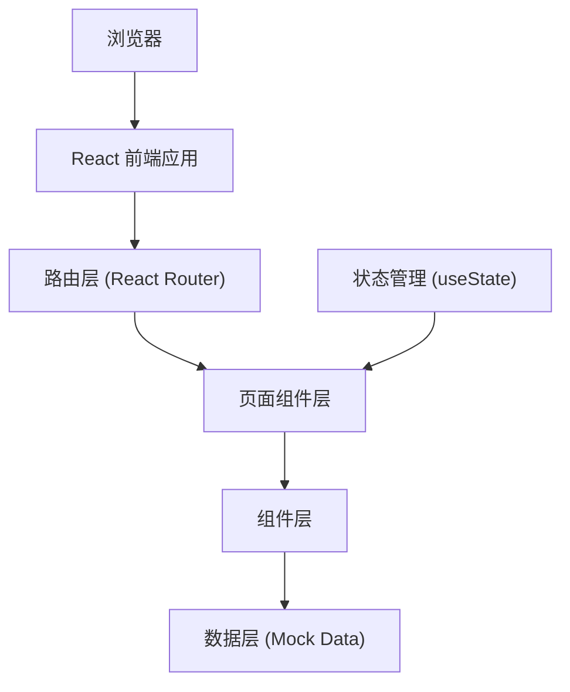

## 1. 架构设计



## 2. 技术描述

- **前端框架**：React 18 + TypeScript
- **构建工具**：Vite 5.x
- **路由管理**：React Router DOM 6.x
- **图标库**：React Icons（用户指定）
- **提示组件**：React Hot Toast（用户指定）
- **样式方案**：CSS Modules + CSS Variables（实现动画和主题色）
- **拖拽实现**：原生 HTML5 Drag & Drop API（无需额外库）
- **数据模拟**：TypeScript 类型定义 + Mock 数据

## 3. 路由定义

| Route | 页面组件 | 功能说明 |
|-------|----------|----------|
| `/` | StatsPanel | 个人主页 - 统计概览和作品网格 |
| `/work/:id` | WorkDetail | 作品详情页 - 步骤展示和评论 |
| `/create` | CreateWork | 作品创建页 - 表单和步骤管理 |

## 4. 数据模型定义

### 4.1 类型定义

```typescript
type Category = 'ceramic' | 'woodwork' | 'weaving' | 'leather' | 'paper';

interface WorkStep {
  id: string;
  order: number;
  image: string;
  description: string;
  duration: number; // 分钟
}

interface Comment {
  id: string;
  workId: string;
  author: string;
  avatarColor: string;
  rating: number; // 1-5
  content: string;
  createdAt: string;
}

interface Work {
  id: string;
  name: string;
  category: Category;
  coverImage: string;
  steps: WorkStep[];
  createdAt: string;
  favorites: number;
  comments: Comment[];
}
```

### 4.2 类别配置

```typescript
const categoryConfig: Record<Category, { name: string; color: string }> = {
  ceramic: { name: '陶艺', color: '#D2B48C' },
  woodwork: { name: '木工', color: '#DEB887' },
  weaving: { name: '编织', color: '#8FBC8F' },
  leather: { name: '皮艺', color: '#8B4513' },
  paper: { name: '纸艺', color: '#F5F5DC' },
};
```

### 4.3 Mock 数据规范
- 10 个作品数据，每个作品至少 4 个步骤
- 20 条评论数据，按作品关联分布
- 步骤图片使用占位图服务或本地 SVG 占位
- 评论者头像使用随机生成的 HSL 颜色值

## 5. 文件组织结构

```
d:\Pro\tasks\auto58\
├── package.json
├── vite.config.ts
├── tsconfig.json
├── index.html
├── src\
│   ├── App.tsx                    # 主应用组件，路由配置
│   ├── main.tsx                   # 应用入口
│   ├── index.css                  # 全局样式和CSS变量
│   ├── types\
│   │   └── index.ts               # TypeScript类型定义
│   ├── data\
│   │   └── mockData.ts            # Mock数据
│   ├── components\
│   │   ├── WorkCard.tsx           # 作品卡片组件
│   │   ├── WorkDetail.tsx         # 作品详情组件
│   │   ├── StatsPanel.tsx         # 统计面板组件
│   │   ├── CreateWork.tsx         # 创建作品组件
│   │   ├── StepCard.tsx           # 步骤卡片组件
│   │   ├── CommentCard.tsx        # 评论卡片组件
│   │   ├── StarRating.tsx         # 星级评分组件
│   │   └── CategoryBadge.tsx      # 类别标签组件
│   └── hooks\
│       ├── useRipple.ts           # 水波纹动画hook
│       ├── useDragSort.ts         # 拖拽排序hook
│       └── useCountUp.ts          # 数字递增动画hook
```

## 6. 性能优化策略

### 6.1 渲染性能
- 使用 `React.memo` 优化列表项组件渲染
- 图片使用 `loading="lazy"` 懒加载
- 动画使用 CSS transforms 和 opacity 避免重排重绘
- 数字动画使用 `requestAnimationFrame` 确保 60fps

### 6.2 首屏优化
- FCP 目标 < 800ms
- 组件按需加载，避免过大 bundle
- CSS 内联关键样式
- 使用 Vite 构建优化（代码分割、tree shaking）

### 6.3 交互响应
- 点击/悬停反馈延迟 < 100ms
- 使用 `will-change` 优化动画性能
- 避免在动画中执行复杂计算
- 所有过渡使用 CSS transitions 而非 JS 动画

## 7. 动画实现规范

### 7.1 CSS Variables
```css
:root {
  --easing-standard: cubic-bezier(0.4, 0, 0.2, 1);
  --duration-fast: 0.2s;
  --duration-normal: 0.3s;
  --duration-slow: 0.4s;
  --shadow-card: 0px 8px 24px rgba(0,0,0,0.08);
  --radius-card: 16px;
  --padding-card: 24px;
}
```

### 7.2 关键动画实现
- **步骤拖拽**：`transform: rotate(2deg) scale(1.05)` + 动态 box-shadow
- **卡片发光**：`box-shadow: 0 0 6px var(--category-color)` 在 hover 时过渡
- **水波纹**：伪元素 + `transform: scale(0)` → `scale(4)` 配合 opacity 动画
- **评论滑入**：`transform: translateX(100%)` → `translateX(0)` 配合 stagger 延迟
