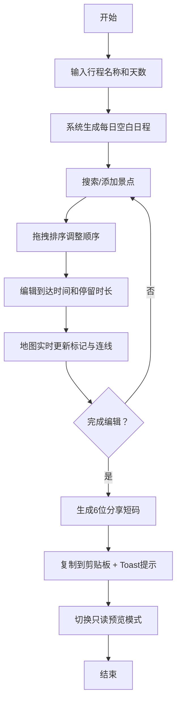

## 1. 产品概述
自助旅行路线规划与行程分享应用，让用户可视化创建、编辑和分享个性化旅行行程。
- 面向自助旅行爱好者，解决行程规划复杂、信息分散的痛点
- 通过直观的拖拽编辑和地图可视化，提升行程规划效率与体验

## 2. 核心功能

### 2.1 用户角色
| 角色 | 注册方式 | 核心权限 |
|------|----------|----------|
| 普通用户 | 无需注册 | 创建、编辑、预览、分享行程 |

### 2.2 功能模块
1. **行程创建模块**：行程命名、天数设置、自动生成日程框架
2. **景点管理模块**：景点搜索、添加、拖拽排序、时间编辑
3. **地图可视化模块**：景点标记、路线连线、天数渐变色区分
4. **行程分享模块**：短码生成、一键复制、只读预览

### 2.3 页面详情
| 页面名称 | 模块名称 | 功能描述 |
|----------|----------|----------|
| 主页面 | 行程创建区 | 输入行程名称、选择天数（1-14天）、创建按钮 |
| 主页面 | 路线编辑器 | 瀑布流布局展示每日行程卡片，支持景点搜索添加 |
| 主页面 | 景点卡片 | 显示景点名称、简介、时间标签，支持拖拽、编辑、删除 |
| 主页面 | 地图视图 | Leaflet地图展示所有景点标记和路线连线 |
| 主页面 | 分享工具栏 | 生成分享短码、预览只读模式 |

## 3. 核心流程
用户首先创建行程（名称+天数），系统自动生成每日空白日程。用户从景点库搜索添加景点到对应日期，通过拖拽调整景点顺序。点击编辑按钮设置到达时间和停留时长，地图实时更新标记和连线。完成后生成6位分享短码并复制，可切换只读预览模式查看毛玻璃风格行程展示。

## 4. 用户界面设计

### 4.1 设计风格
- **主色调**：深蓝 #2C3E50（导航/头部）、暖灰 #ECF0F1（背景）
- **辅助色**：14天渐变色数组（#FF6B6B → #FFC857 → #4ECDC4 等循环）
- **卡片样式**：白色背景，圆角12px，阴影 0 2px 8px rgba(0,0,0,0.08)
- **字体**：现代无衬线字体，标题16px medium，正文14px，辅助12px
- **动效**：所有切换0.2-0.3s过渡，添加滑入、拖拽缩放、Toast提示

### 4.2 页面设计概述
| 页面名称 | 模块名称 | UI元素 |
|----------|----------|--------|
| 主页面 | 顶部栏 | 深蓝背景，白色标题，分享操作按钮组 |
| 主页面 | 创建区 | 输入框+天数选择器+创建按钮，卡片容器内 |
| 主页面 | 日程列表 | 瀑布流布局，天数分组标题浅蓝底纹+左竖条 |
| 主页面 | 景点卡片 | 左侧彩色圆点+中间名称简介+右侧时间标签+编辑按钮 |
| 主页面 | 地图区 | 右半屏（桌面）/底部300px（移动端），Leaflet样式 |
| 主页面 | 分享Toast | 底部绿色提示，0.3s滑入动画 |

### 4.3 响应式
- **桌面优先（>1200px）**：左侧卡片列表，右侧地图，各占约50%
- **平板（768px-1200px）**：自适应布局，卡片列表与地图宽度动态调整
- **移动端（<768px）**：卡片占满顶部，地图固定底部300px高度
- **触摸优化**：拖拽区扩大点击热区，输入框适合触摸操作

### 4.4 只读预览模式
- 毛玻璃效果：backdrop-filter: blur(8px)，背景半透明白色
- 圆角12px，阴影 0 4px 15px rgba(0,0,0,0.1)
- 隐藏所有编辑相关按钮
- 地图视图切换为不可交互模式
