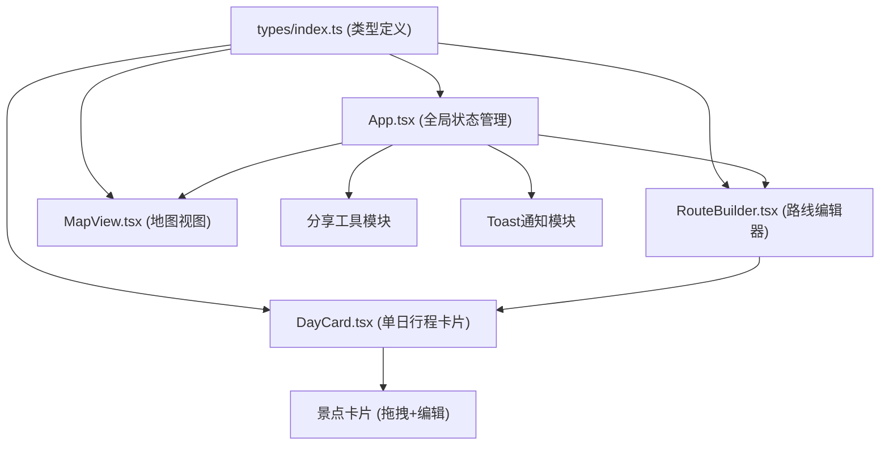

## 1. 架构设计



## 2. 技术说明
- **前端**：React 18 + TypeScript 5 + Vite 5
- **构建工具**：Vite 5，使用 @vitejs/plugin-react
- **地图**：Leaflet + react-leaflet（地图标记与路线）
- **图标**：react-icons（编辑、操作按钮图标）
- **提示**：react-hot-toast（操作反馈 Toast）
- **状态管理**：React useState/useReducer（组件本地状态），无额外状态库
- **性能优化**：React.memo + useMemo + useCallback

## 3. 项目结构
```
.
├── package.json              # 依赖配置与启动脚本
├── vite.config.ts            # Vite React 构建配置
├── tsconfig.json             # TypeScript 严格模式配置
├── index.html                # 应用入口 HTML
└── src/
    ├── types/
    │   └── index.ts          # 行程、景点、交通节点等类型定义
    ├── components/
    │   ├── RouteBuilder.tsx  # 路线编辑主组件，管理景点列表和拖拽排序
    │   ├── DayCard.tsx       # 单日行程卡片，显示景点和换乘建议
    │   └── MapView.tsx       # 简易地图组件，显示景点标记和路线连线
    ├── App.tsx               # 应用入口，组合组件并管理全局状态
    └── main.tsx              # React 渲染入口
```

## 4. 类型定义（types/index.ts）
```typescript
// 景点（预设库中的景点）
interface Attraction {
  id: string;
  name: string;
  description: string;
  lat: number;       // 纬度
  lng: number;       // 经度
}

// 行程中的景点实例（带时间信息）
interface TripSpot {
  id: string;              // 实例唯一ID
  attractionId: string;    // 关联预设景点
  name: string;
  description: string;
  lat: number;
  lng: number;
  arrivalTime: string;     // "HH:mm" 格式
  duration: number;        // 停留时长（小时）
  dayIndex: number;        // 所属天数（0-based）
  order: number;           // 当天内排序
  isNew?: boolean;         // 新添加标记（用于动画）
}

// 单日行程
interface DaySchedule {
  dayIndex: number;
  spots: TripSpot[];
}

// 完整行程
interface Trip {
  id: string;
  name: string;
  days: number;
  schedules: DaySchedule[];
  shareCode?: string;
  createdAt: number;
}

// 预设景点库（至少10个国内知名景点）
const PRESET_ATTRACTIONS: Attraction[] = [
  { id: 'gugong', name: '故宫博物院', description: '明清两代皇家宫殿，世界文化遗产', lat: 39.9163, lng: 116.3972 },
  { id: 'xihu', name: '杭州西湖', description: '三面云山一面城，人间天堂', lat: 30.2587, lng: 120.1305 },
  { id: 'zhangjiajie', name: '张家界国家森林公园', description: '阿凡达取景地，奇峰异石', lat: 29.3247, lng: 110.4358 },
  // ... 更多景点
];

// 天数渐变色数组（14种）
const DAY_COLORS = [
  '#FF6B6B', '#FFC857', '#4ECDC4', '#95E1D3', '#F38181',
  '#AA96DA', '#FCBAD3', '#A8E6CF', '#88D8B0', '#FFEAA7',
  '#74B9FF', '#A29BFE', '#FD79A8', '#E17055'
];
```

## 5. 核心组件职责

### 5.1 App.tsx
- 管理全局状态：当前行程 Trip、预览模式 isPreviewMode
- 提供：创建行程、添加景点、移动景点、编辑时间、生成分享码等操作方法
- 布局：顶部工具栏 + 主体（RouteBuilder + MapView）
- Toast 容器挂载

### 5.2 RouteBuilder.tsx
- 行程创建表单（名称输入、天数选择）
- 瀑布流布局渲染 DayCard 列表
- 景点搜索框（搜索预设景点库）
- 景点添加目标天数选择

### 5.3 DayCard.tsx
- 渲染单日标题（左竖条+浅蓝底纹）
- 管理单日景点列表的 HTML5 Drag and Drop
- 渲染 TripSpot 卡片（彩色圆点+名称简介+时间标签+编辑按钮）
- 编辑时间的弹窗（到达时间下拉、停留时长选择）
- 添加景点动效（右侧滑入 0.3s ease-out）
- 拖拽动效（缩小+透明度 0.2s，释放弹性归位 0.3s cubic-bezier）

### 5.4 MapView.tsx
- 初始化 Leaflet 地图（中心点：中国地理中心）
- 渲染所有 TripSpot 的圆形标记（按天数着色）
- 标记点击弹出浮层（缩放进入 0.25s，圆角）
- 渲染跨景点折线（颜色 #4A90D9，线宽 3px，虚线动画）
- 使用 React.memo 包装，useMemo 计算标记与连线数据
- 只读模式下禁用交互

## 6. 性能优化策略

| 优化点 | 方案 |
|--------|------|
| 地图重绘 | MapView 使用 React.memo，标记/连线数据用 useMemo 深比较 |
| 拖拽渲染 | 拖拽状态独立管理，仅更新必要 DOM 样式，避免全量重渲染 |
| 动画性能 | 所有动画使用 CSS transform/opacity，避免触发 layout |
| 景点库搜索 | 用 useMemo 缓存搜索结果，输入防抖（150ms） |
| 列表渲染 | DayCard 和景点卡片使用稳定 key（唯一 ID） |
| 内存占用 | 拖拽结束及时清理事件监听器和临时状态 |

## 7. 关键交互实现要点

### 7.1 HTML5 Drag and Drop
- `dragstart`：设置 dragData = `${dayIndex}:${spotId}`，添加拖拽样式类（scale(0.95), opacity 0.6, 0.2s）
- `dragover`：preventDefault，计算目标位置，显示插入占位线
- `drop`：读取 dragData，调用移动方法，移除拖拽样式
- `dragend`：清理所有临时样式，执行弹性归位（0.3s cubic-bezier(0.34, 1.56, 0.64, 1)）

### 7.2 地图虚线动画
```css
@keyframes dashmove {
  to { stroke-dashoffset: -20; }
}
.route-polyline {
  stroke-dasharray: 8, 8;
  animation: dashmove 0.8s linear infinite;
}
```

### 7.3 分享短码生成
```typescript
function generateShareCode(): string {
  const chars = 'ABCDEFGHJKLMNPQRSTUVWXYZ23456789';
  let code = '';
  for (let i = 0; i < 6; i++) {
    code += chars[Math.floor(Math.random() * chars.length)];
  }
  return code;
}
```

## 8. 响应式断点
- **≥1200px**：主容器 `display: flex`，卡片区 `flex: 1 1 50%`，地图区 `flex: 1 1 50%`，高度 100vh
- **768px–1199px**：同 flex 布局，比例动态调整
- **<768px**：主容器 `flex-direction: column`，地图 `height: 300px; order: 2`，卡片 `order: 1`
