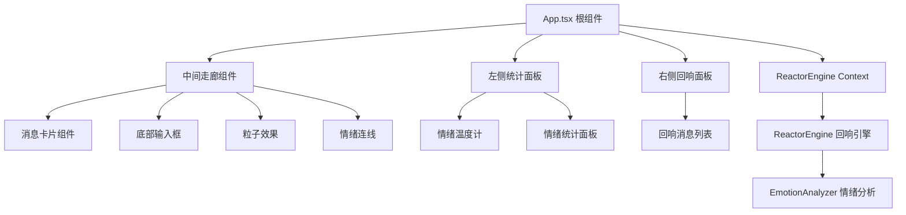

## 1. 架构设计



## 2. 技术说明

- **前端框架**：React@18 + TypeScript
- **构建工具**：Vite
- **状态管理**：React Context + useReducer
- **样式方案**：原生 CSS（CSS Modules 风格，内联样式 + 动画关键帧）
- **提示库**：react-hot-toast
- **ID 生成**：uuid

## 3. 目录结构

```
src/
├── App.tsx                     # 根组件，三列布局，全局状态管理
├── modules/
│   ├── reactor/
│   │   └── ReactorEngine.ts    # 情绪回响引擎，匹配算法
│   ├── services/
│   │   └── EmotionAnalyzer.ts  # 情绪分析服务，关键字匹配
│   └── ui/
│       ├── EmotionCorridor.tsx # 主走廊组件，虚拟滚动
│       ├── MessageCard.tsx     # 消息卡片组件
│       └── SidePanel.tsx       # 回响详情面板
```

## 4. 数据模型

### 4.1 消息类型
```typescript
interface Message {
  id: string;
  content: string;
  emoji: string;
  emotionType: 'positive' | 'negative' | 'neutral';
  intensity: number; // 1-5
  timestamp: number;
  anonymousName: string;
  echoCount: number;
  echoIds: string[];
}
```

### 4.2 全局状态
```typescript
interface AppState {
  messages: Message[];
  anonymousName: string;
  selectedMessageId: string | null;
  isSidePanelOpen: boolean;
  overallEmotionIndex: number; // 0-100
  stats: {
    positive: number;
    negative: number;
    neutral: number;
  };
}
```

## 5. 核心模块说明

### 5.1 EmotionAnalyzer 情绪分析服务
- `analyze(text: string): { emotionType, intensity }`
- 基于关键词和表情符号匹配
- 支持正面/负面/中性三分类
- 强度等级 1-5

### 5.2 ReactorEngine 回响引擎
- `analyzeAndMatch(newMessage, messageList): { updatedMessage, affectedIds }`
- 匹配规则：同情绪类型 + 时间差 < 60秒
- 计算语义相似度（关键词重叠度）
- 更新回响计数和回响ID列表

### 5.3 EmotionCorridor 走廊组件
- 虚拟滚动渲染（可视区域前后各10条）
- 消息卡片展开动画
- 情绪连线渲染
- 粒子效果管理

### 5.4 MessageCard 消息卡片
- 情绪色背景渐变
- 毛玻璃效果
- 回响数显示与动画
- 点击展开侧边面板

## 6. 性能优化

- 虚拟滚动：只渲染可视区域前后各10条消息
- CSS 动画优先：使用 transform 和 opacity 触发 GPU 加速
- 防抖/节流：滚动事件处理
- 按需更新：仅更新受影响的消息卡片
