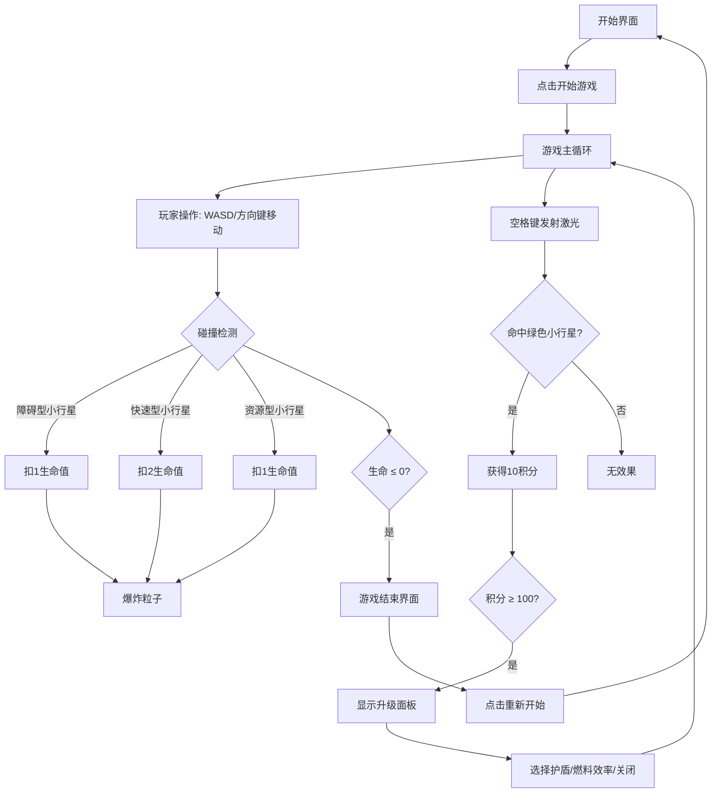

## 1. 产品概述
微型太空采矿车模拟游戏，玩家操控采矿车在小行星带中采集资源、躲避障碍物并升级车辆部件。

- 目标用户：休闲游戏玩家，科幻爱好者
- 产品价值：提供简短有趣的太空采矿体验，结合操作、策略和成长元素

## 2. 核心功能

### 2.1 功能模块
1. **游戏主界面**：Canvas 游戏画面、HUD 信息展示
2. **玩家控制系统**：WASD/方向键移动、空格键发射采矿激光
3. **小行星系统**：随机生成三种类型小行星（障碍型、资源型、快速型）
4. **碰撞与粒子系统**：圆形包围盒碰撞检测、爆炸粒子动画
5. **积分与升级系统**：采集矿石获得积分，积分达标后触发升级面板
6. **UI 界面**：开始界面、游戏结束界面、升级面板

### 2.2 功能详情

| 页面名称 | 模块名称 | 功能描述 |
|---------|---------|---------|
| 游戏主界面 | Canvas 渲染 | 400x400 像素星域，径向渐变背景，星空点，玩家飞船，小行星，激光，粒子 |
| 游戏主界面 | HUD 信息 | 左上角生命值（红色心形），右上角积分，下方燃料条 |
| 游戏主界面 | 玩家控制 | WASD/方向键移动采矿车，六边形飞船外观，粒子拖尾效果 |
| 游戏主界面 | 小行星系统 | 三种类型：灰色障碍（扣1血）、绿色资源（可采矿+10分）、红色快速（2倍速，扣2血） |
| 游戏主界面 | 采矿激光 | 空格键发射蓝色激光，命中绿色小行星获得矿石 |
| 游戏主界面 | 碰撞系统 | 圆形包围盒检测，碰撞后爆炸粒子（8个粒子，0.3秒消失） |
| 升级面板 | 升级选项 | 积分≥100时从下方滑入，提供护盾（50分，免撞一次）和燃料效率（30分，延长激光续航） |
| 游戏结束界面 | 结束界面 | 生命归零时显示半透明遮罩，重新开始按钮（悬停缩放1.1倍，0.2秒过渡） |

## 3. 核心流程

玩家打开游戏 → 显示开始界面 → 点击开始 → 进入游戏 → 控制采矿车移动/采集/躲避 → 积分达标显示升级面板 → 选择升级或关闭 → 生命归零 → 显示游戏结束界面 → 点击重新开始 → 重新进入游戏

## 4. 用户界面设计

### 4.1 设计风格
- 主色调：深空色 #0B0C10 到 #1F2833 径向渐变背景
- 强调色：飞船主体 #66FCF1，边缘 #45A29E；生命心形 #FF2A2A；燃料条 #00B4D8 到 #03045E；HUD 文字 #C5C6C7
- 小行星颜色：灰色（障碍型）、绿色（资源型）、红色（快速型）
- 字体：等宽字体
- 动画风格：简洁流畅，升级面板滑入（0.4秒 ease-out），按钮悬停缩放（0.2秒过渡）

### 4.2 界面设计概览

| 页面名称 | 模块名称 | UI 元素 |
|---------|---------|---------|
| 游戏主界面 | 星空背景 | 径向渐变，白色随机小点（亮度80%） |
| 游戏主界面 | 玩家飞船 | 六边形（边长15px），青蓝色主体，粒子拖尾（最近5帧位置半透明圆点） |
| 游戏主界面 | 小行星 | 不规则多边形（4-8顶点），各自旋转（0.02-0.05弧度/帧） |
| 游戏主界面 | HUD | 等宽字体，左上红色心形，右上积分，下方蓝色燃料条 |
| 升级面板 | 面板 | 从下方滑入（0.4s ease-out），两项升级按钮 |
| 游戏结束 | 遮罩层 | 半透明黑色，重新开始按钮（悬停1.1倍缩放，0.2s过渡） |

### 4.3 响应式
- 固定尺寸 400x400 像素画布，居中显示
- 桌面端优先，支持键盘操作

## 5. 性能要求
- 帧率：稳定 60FPS，最低不低于 55FPS
- 粒子数量上限：60个
- 碰撞检测：圆形包围盒简化计算
- 小行星最大数量：15个（初始5个，每5秒新增1个）
