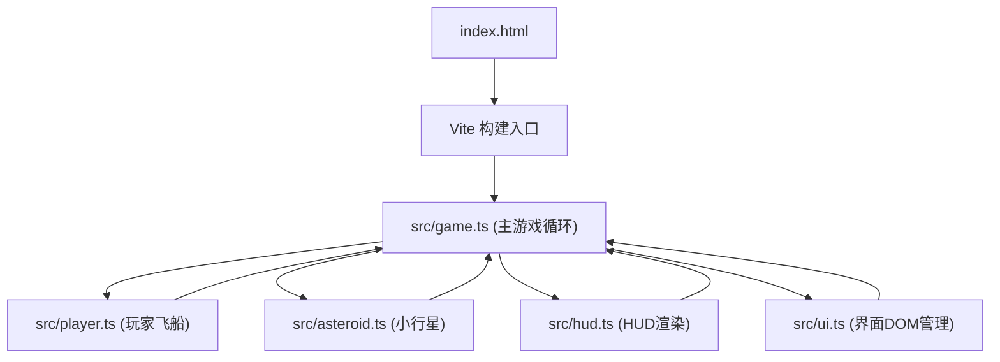

## 1. 架构设计



## 2. 技术描述
- 前端：TypeScript + Canvas API + Vite
- 初始化工具：Vite vanilla-ts 模板
- 后端：无
- 数据库：无

## 3. 文件结构

| 文件路径 | 用途 |
|---------|------|
| package.json | 项目依赖与脚本（typescript, vite, @typescript-eslint/*） |
| vite.config.js | Vite 基础配置 |
| tsconfig.json | TypeScript 严格模式配置 |
| index.html | 入口页面，包含 Canvas 容器与 DOM UI |
| src/game.ts | 主游戏循环，帧更新、碰撞检测、渲染调度 |
| src/player.ts | 玩家飞船类：移动、采矿激光、升级逻辑 |
| src/asteroid.ts | 小行星类：生成、运动、资源属性、碰撞 |
| src/hud.ts | HUD 渲染：分数、生命值、燃料、升级面板 Canvas 绘制 |
| src/ui.ts | DOM 界面管理：开始界面、游戏结束界面 |

## 4. 核心类型定义

```typescript
// 小行星类型
type AsteroidType = 'obstacle' | 'resource' | 'fast';

// 向量
interface Vector2D {
  x: number;
  y: number;
}

// 粒子
interface Particle {
  x: number;
  y: number;
  vx: number;
  vy: number;
  life: number;
  maxLife: number;
  color: string;
  size: number;
}

// 激光
interface Laser {
  x: number;
  y: number;
  vx: number;
  vy: number;
  active: boolean;
}

// 玩家状态
interface PlayerState {
  x: number;
  y: number;
  vx: number;
  vy: number;
  health: number;
  maxHealth: number;
  score: number;
  fuel: number;
  maxFuel: number;
  shieldCount: number;
  fuelEfficiency: number;
  trail: Vector2D[];
  laser: Laser | null;
}

// 小行星状态
interface AsteroidState {
  x: number;
  y: number;
  vx: number;
  vy: number;
  type: AsteroidType;
  radius: number;
  rotation: number;
  rotationSpeed: number;
  vertices: Vector2D[];
  health: number;
}

// 升级类型
type UpgradeType = 'shield' | 'fuel';
```

## 5. 游戏主循环流程

1. 初始化：创建 Canvas、初始化玩家、生成5个小行星、初始化粒子池
2. 输入监听：键盘事件（WASD/方向键移动，空格发射激光）
3. 帧更新（约每16.6ms）：
   - 更新玩家位置与拖尾
   - 更新激光位置
   - 更新所有小行星位置与旋转
   - 更新所有粒子生命值
   - 碰撞检测（玩家 vs 小行星、激光 vs 小行星）
   - 生成新小行星（每5秒，上限15个）
   - 检查升级触发条件（积分≥100）
   - 检查游戏结束条件（生命≤0）
4. 渲染：
   - 绘制星空背景
   - 绘制小行星
   - 绘制玩家与拖尾
   - 绘制激光
   - 绘制粒子
   - 绘制 HUD

## 6. 性能优化策略
- 对象池模式复用粒子对象，避免频繁 GC
- 圆形包围盒碰撞检测，计算量 O(n)
- 限制最大小行星数量（15）与粒子数量（60）
- Canvas 单次重绘，避免多次 DOM 操作
- 使用 requestAnimationFrame 实现稳定 60FPS
