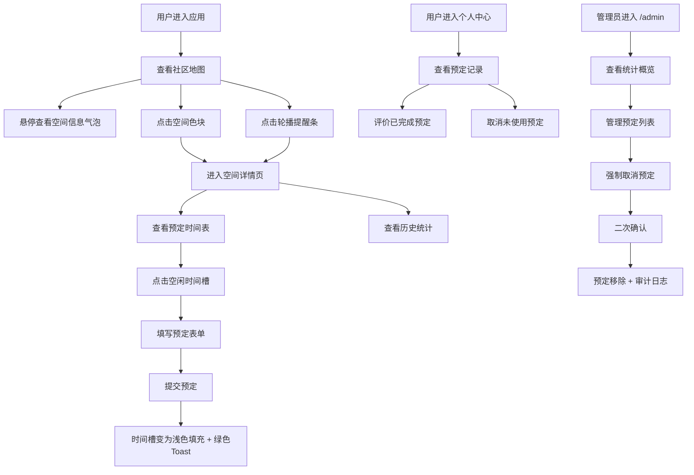

## 1. 产品概述

社区公共空间共享微应用——帮助市民记录和分享所在社区公共空间使用情况，解决社区中公共空间（社区花园、健身角、阅读亭、闲置空房）常被浪费或无人知晓，居民想借用却找不到渠道，居委会想安排活动却信息不通的问题。

- 目标用户：社区居民（普通用户）和居委会管理员
- 核心价值：提升社区公共空间利用率，打通居民与空间的信息壁垒

## 2. 核心功能

### 2.1 用户角色

| 角色 | 注册方式 | 核心权限 |
|------|----------|----------|
| 普通居民 | 自动分配用户代号 | 浏览地图、预定空间、查看个人记录、评价已完成预定 |
| 居委会管理员 | 通过 /admin 路径访问 | 查看统计概览、管理预定、强制取消预定、审计日志 |

### 2.2 功能模块

1. **首页（社区地图）**：模拟社区微缩地图，彩色块标记公共空间位置，悬停气泡，轮播提醒条
2. **空间详情页**：空间模拟照片、预定时间表（天视图/30分钟槽）、历史使用统计（柱状图+饼图）
3. **个人中心**：预定记录卡片列表、评价功能、取消功能
4. **管理面板（/admin）**：统计概览（数字卡片）、可折叠预定列表、强制取消、审计日志

### 2.3 页面详情

| 页面名称 | 模块名称 | 功能描述 |
|----------|----------|----------|
| 首页 | 社区微缩地图 | 彩色块标记空间位置，按类别区分颜色（花园绿#A8E6CF、健身角橙#FFD3B6、阅读亭紫#D4A5A5、闲置空房灰#B0B0B0），悬停弹出毛玻璃气泡（空间名称、状态、半小时内使用人数） |
| 首页 | 轮播提醒条 | 无预定时显示，循环展示"有意思"活动，点击跳转详情 |
| 空间详情页 | 空间照片区 | 模拟占位图+类别图标 |
| 空间详情页 | 预定时间表标签 | 天视图，30分钟时间槽，已预定用类别色填充+使用者代号，悬停显示时段和备注，点击空闲槽发起预定（开始/结束时间、目的限50字，单次最多2小时），提交后浅色填充+绿色toast |
| 空间详情页 | 历史统计标签 | 柱状图（7天每天使用次数，柱条从底部0.3s依次升起）、饼图（使用目的分布，扇形展开0.4s） |
| 个人中心 | 预定记录列表 | 卡片列表按时间倒序，显示空间名/时段/状态，已完成→评价（1-5星+评语，星标从左飞入闪烁0.5s），未使用→取消（0.4s fadeOut） |
| 管理面板 | 统计概览 | 总空间数/今日总预定/当前活跃预定（数字变化0.2s缩放闪烁） |
| 管理面板 | 预定列表 | 默认展开前10条，可展开全部，每条显示用户代号/空间名/时段/状态，强制取消需二次确认（确认后fadeOut移除），操作记录存入审计日志 |

## 3. 核心流程

## 4. 用户界面设计

### 4.1 设计风格

- 主色：#F5E6CC（温暖米色）
- 辅色：#D4A574（暖棕）
- 强调色：#2E8B57（海绿色）
- 空间类别色：花园#A8E6CF、健身角#FFD3B6、阅读亭#D4A5A5、闲置空房#B0B0B0
- 字体：系统字体堆栈（-apple-system, BlinkMacSystemFont, "Segoe UI", Roboto, sans-serif）
- 卡片/面板：圆角12px + 轻微box-shadow
- 交互悬停：0.2s轻微升空/放大
- 预定成功Toast：从底部弹入 + 轻微震动（translateY 0.3s ease-out）
- 标签切换：0.3s水平滑动
- 页面切换：0.3s淡入淡出过渡
- 气泡弹出：毛玻璃背景，从下方0.2s滑入
- 柱状图：柱条从底部0.3s依次升起
- 饼图：扇形展开0.4s
- 星标评价：逐颗从左飞入闪烁0.5s
- 卡片取消：0.4s fadeOut
- 数字变化：0.2s缩放闪烁

### 4.2 页面设计概览

| 页面名称 | 模块名称 | UI元素 |
|----------|----------|--------|
| 首页 | 社区地图 | 模拟微缩地图，彩色色块，悬停毛玻璃气泡，顶部轮播提醒条 |
| 首页 | 轮播提醒条 | 全宽横条，循环滚动，点击跳转 |
| 空间详情页 | 照片区 | 占位图+类别图标叠加 |
| 空间详情页 | 预定时间表 | 天视图时间网格，彩色时间槽，预定表单弹窗 |
| 空间详情页 | 历史统计 | 柱状图+饼图，带动画 |
| 个人中心 | 预定记录 | 卡片列表，评价面板，取消按钮 |
| 管理面板 | 统计概览 | 三个数字卡片 |
| 管理面板 | 预定列表 | 可折叠列表，强制取消确认弹窗 |

### 4.3 响应式设计

- **手机端（<768px）**：社区地图缩放到容器宽度，色块变为全宽可点击卡片，标签页变为可横向滚动长条，个人中心卡片堆叠式
- **平板端（768px-1024px）**：地图和详情页并排布局变为上下布局
- **桌面端（>1024px）**：默认布局

### 4.4 性能要求

- 地图初始加载 ≤ 2秒（懒加载）
- 预定提交响应 ≤ 500ms
- 列表滚动帧率 ≥ 55fps
