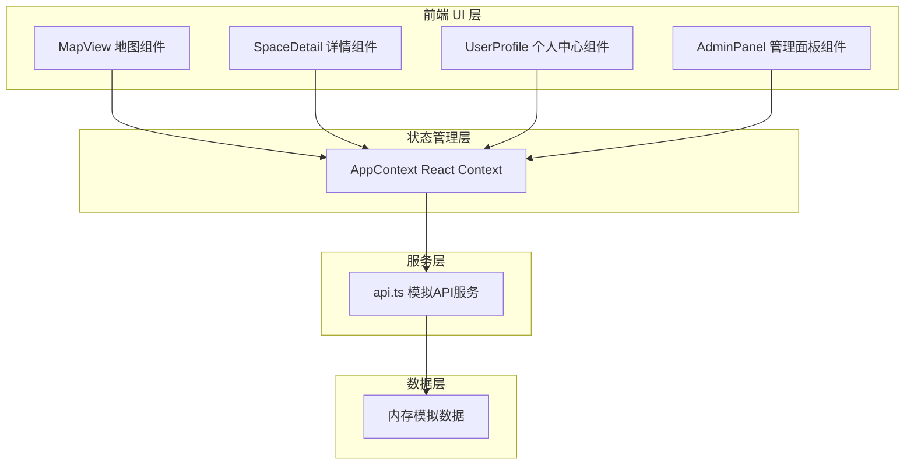
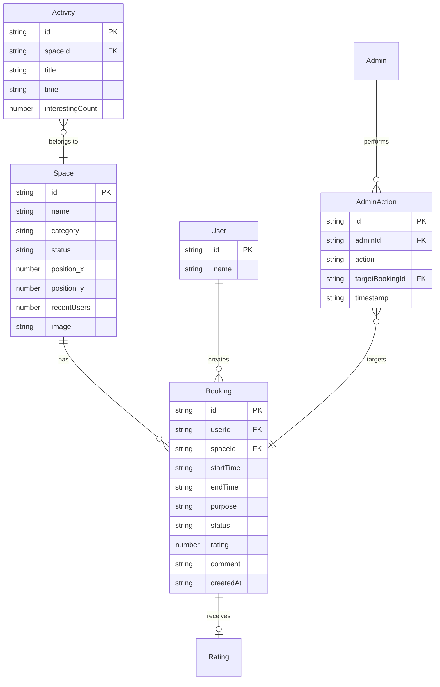

## 1. 架构设计



## 2. 技术说明

- 前端：React 18 + TypeScript + Vite
- 样式：CSS Modules / 内联样式（不使用 Tailwind，遵循用户要求）
- 状态管理：React Context（useContext + useReducer）
- 路由：react-router-dom v6
- 图表：自定义 SVG 实现（柱状图、饼图）
- 提示：react-hot-toast
- 图标：react-icons
- 初始化工具：vite-init（react-ts 模板）
- 后端：无（纯前端，模拟 API）
- 数据库：无（内存模拟数据，刷新重置）

## 3. 路由定义

| 路由 | 用途 |
|------|------|
| / | 首页，社区微缩地图 + 轮播提醒条 |
| /space/:id | 空间详情页，预定时间表 + 历史统计 |
| /profile | 个人中心，预定记录管理 |
| /admin | 管理面板，统计概览 + 预定管理 |

## 4. API 定义

### 模拟 API 函数（src/services/api.ts）

所有函数使用 setTimeout 100ms 延迟模拟异步：

| 函数名 | 参数 | 返回值 | 说明 |
|--------|------|--------|------|
| fetchSpaces | 无 | Space[] | 获取所有空间列表 |
| fetchSpaceById | id: string | Space | 获取单个空间详情 |
| fetchBookings | 无 | Booking[] | 获取所有预定 |
| fetchBookingsByUser | userId: string | Booking[] | 获取用户预定 |
| fetchBookingsBySpace | spaceId: string | Booking[] | 获取空间预定 |
| createBooking | booking: CreateBookingDTO | Booking | 创建预定（单次≤2小时） |
| cancelBooking | bookingId: string | void | 取消预定 |
| forceCancelBooking | bookingId: string, adminId: string | AdminAction | 强制取消预定 |
| rateBooking | bookingId: string, rating: number, comment: string | Booking | 评价预定 |
| fetchInterestingActivities | 无 | Activity[] | 获取"有意思"活动列表 |
| fetchAuditLog | 无 | AdminAction[] | 获取审计日志 |

### TypeScript 类型定义

```typescript
type SpaceCategory = 'garden' | 'fitness' | 'reading' | 'vacant';

type SpaceStatus = 'available' | 'occupied' | 'maintenance';

type BookingStatus = 'pending' | 'active' | 'completed' | 'cancelled';

interface Space {
  id: string;
  name: string;
  category: SpaceCategory;
  status: SpaceStatus;
  position: { x: number; y: number };
  recentUsers: number;
  image: string;
}

interface Booking {
  id: string;
  userId: string;
  spaceId: string;
  startTime: string;
  endTime: string;
  purpose: string;
  status: BookingStatus;
  rating?: number;
  comment?: string;
  createdAt: string;
}

interface User {
  id: string;
  name: string;
}

interface AdminAction {
  id: string;
  adminId: string;
  action: string;
  targetBookingId: string;
  timestamp: string;
}

interface Activity {
  id: string;
  spaceId: string;
  spaceName: string;
  title: string;
  time: string;
  interestingCount: number;
}

interface CreateBookingDTO {
  userId: string;
  spaceId: string;
  startTime: string;
  endTime: string;
  purpose: string;
}
```

## 5. 数据模型



## 6. 文件结构

```
├── package.json
├── vite.config.ts
├── tsconfig.json
├── index.html
├── src/
│   ├── main.tsx
│   ├── App.tsx
│   ├── types/
│   │   └── index.ts
│   ├── services/
│   │   └── api.ts
│   ├── store/
│   │   └── AppContext.tsx
│   └── components/
│       ├── MapView.tsx
│       ├── SpaceDetail.tsx
│       ├── UserProfile.tsx
│       └── AdminPanel.tsx
```
