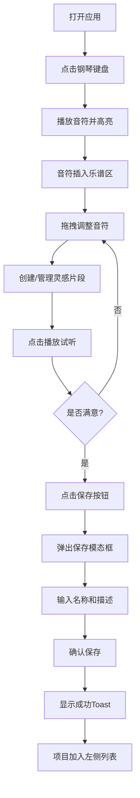

## 1. 产品概述

微型个人音乐创作灵感捕捉器，面向音乐创作者，提供快速记录脑海中旋律片段、和弦进行或节奏型的工具。通过内置虚拟钢琴键盘快速试听和调整，最终将灵感片段组合成完整的乐谱草稿。

- 核心价值：随时随地捕捉音乐灵感，降低创作门槛
- 目标用户：音乐创作者、作曲爱好者、音乐学生

## 2. 核心功能

### 2.1 用户角色

| 角色 | 注册方式 | 核心权限 |
|------|----------|----------|
| 普通用户 | 无需注册，本地存储 | 创建、编辑、保存、加载音乐项目 |

### 2.2 功能模块

1. **虚拟钢琴键盘**：16键（两排八度），点击播放音符、高亮反馈、插入音符到乐谱
2. **乐谱编辑区**：横向排列音符、不同音高纵向区分、音符标记圆点显示、拖拽调整音高和时值
3. **灵感片段管理**：多片段创建、命名、展开/折叠、时长显示、片段分割线
4. **全局控制面板**：播放、暂停、停止、清除所有音符
5. **项目管理**：保存项目（名称+描述）、项目列表、加载项目、Toast提示

### 2.3 页面详情

| 页面名称 | 模块名称 | 功能描述 |
|----------|----------|----------|
| 主页面 | 项目列表区 | 左侧展示已保存项目，按保存时间倒序，点击加载 |
| 主页面 | 乐谱编辑区 | 中央核心区域，展示音符标记和灵感片段 |
| 主页面 | 虚拟钢琴键盘 | 底部区域，两排16键，点击发声并记录音符 |
| 主页面 | 控制面板 | 右侧区域，播放/暂停/停止/清除按钮 |
| 主页面 | 工具栏 | 顶部区域，保存按钮触发保存模态框 |
| 模态框 | 保存对话框 | 输入项目名称（必填）和描述（选填） |

## 3. 核心流程

用户打开页面 → 点击虚拟钢琴键盘录制音符 → 音符出现在乐谱编辑区 → 拖拽调整音符音高和时值 → 创建多个灵感片段组织内容 → 点击播放试听整体效果 → 满意后点击保存 → 输入项目名称和描述 → 保存成功显示Toast提示 → 项目出现在左侧列表

## 4. 用户界面设计

### 4.1 设计风格

- 主题色：深色主题
  - 背景色：#1E1E2E
  - 卡片背景：#2B2B3B
  - 文字色：#E0E0F0
- 功能色：
  - 播放按钮：绿色 #50B86C
  - 暂停按钮：橙色 #F5A623
  - 停止/清除按钮：红色 #E74C3C
  - 低音区音符：蓝色 #4A90D9
  - 中音区音符：橙色 #F5A623
  - 高音区音符：紫色 #9B59B6
  - 键盘高亮：黄色
- 键盘区域：深蓝 #1A1A2E 到深紫 #16213E 渐变背景
- 乐谱编辑区：#16161F 背景，20px间距淡灰色网格线
- 按钮：圆角矩形，悬停上浮阴影效果（0.2s ease-out）
- 字体：现代无衬线字体
- 图标风格：简洁线性图标

### 4.2 页面设计概览

| 页面名称 | 模块名称 | UI元素 |
|----------|----------|--------|
| 主页面 | 项目列表区 | 卡片式列表，项目名称、描述缩略、保存时间 |
| 主页面 | 乐谱编辑区 | 横向滚动区域，网格背景，片段卡片，音符圆点 |
| 主页面 | 虚拟钢琴键盘 | 白键50px宽、黑键30px宽，真实钢琴配色，悬停/按下效果 |
| 主页面 | 控制面板 | 垂直排列按钮组，图标+文字 |
| 主页面 | 工具栏 | 顶部保存按钮 |
| 模态框 | 保存对话框 | 输入框、确认/取消按钮 |

### 4.3 响应式设计

- 桌面端（≥768px）：三栏布局（左侧项目列表、中间编辑区+键盘、右侧控制面板）
- 移动端（<768px）：纵向堆叠布局，项目列表顶部折叠，编辑区+键盘垂直排列，控制面板底部固定

### 4.4 动画与交互

- 键盘按键高亮：黄色高亮，0.15s渐变回原色
- 音符播放：0.02s淡入，0.1s淡出，持续0.3s正弦波
- Toast提示：从顶部滑入，0.3s ease-out，左侧滑入沙漏图标
- 按钮悬停：0.2s ease-out 上浮阴影效果
- 全局过渡：所有交互 0.2-0.3s 过渡动画
- 片段展开/折叠：平滑高度过渡
