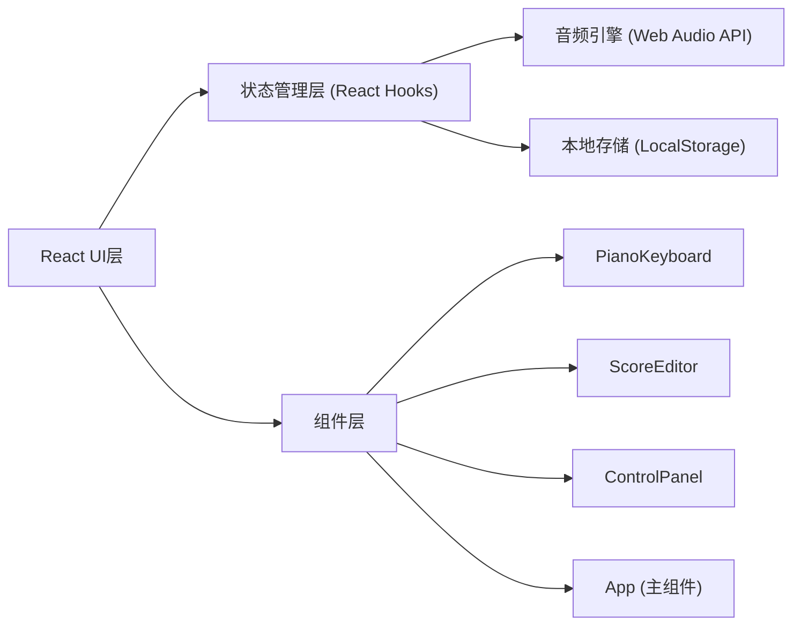
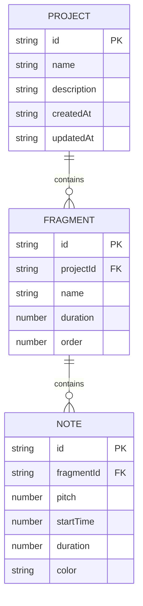

## 1. 架构设计



## 2. 技术说明

- 前端：React 18 + TypeScript 5 + Vite 5
- 样式：原生 CSS（深色主题、CSS变量、响应式布局）
- 音频：Web Audio API（原生，无需额外库）
- 状态管理：React Hooks（useState、useEffect、useRef、useCallback）
- 图标库：react-icons
- Toast提示：react-hot-toast
- 数据持久化：浏览器 LocalStorage
- 构建工具：Vite

## 3. 路由定义

本项目为单页应用（SPA），无需路由配置。

| 路由 | 用途 |
|------|------|
| / | 主应用页面 |

## 4. 数据模型

### 4.1 数据模型定义



### 4.2 TypeScript 类型定义

```typescript
// src/types/index.ts

export interface Note {
  id: string;
  pitch: number;      // MIDI音高编号
  startTime: number;  // 起始时间（拍）
  duration: number;   // 时值（拍），最短1/8拍
}

export interface Fragment {
  id: string;
  name: string;       // 最多12字符
  notes: Note[];
  expanded: boolean;
}

export interface Project {
  id: string;
  name: string;
  description: string;
  fragments: Fragment[];
  createdAt: number;  // 时间戳
  updatedAt: number;
}
```

## 5. 项目文件结构

```
auto65/
├── package.json
├── vite.config.ts
├── tsconfig.json
├── index.html
└── src/
    ├── types/
    │   └── index.ts          # 类型定义
    ├── components/
    │   ├── PianoKeyboard.tsx # 虚拟钢琴键盘
    │   ├── ScoreEditor.tsx   # 乐谱编辑区
    │   └── ControlPanel.tsx  # 控制面板
    ├── App.tsx               # 主应用组件
    ├── styles.css            # 全局样式
    └── main.tsx              # 入口文件
```

## 6. 组件职责

### PianoKeyboard.tsx
- 渲染16键虚拟钢琴键盘（两排八度）
- 使用Web Audio API播放音符（正弦波，0.3s，0.02s淡入，0.1s淡出）
- 按键点击高亮反馈（黄色，0.15s渐变）
- 触发添加音符到当前片段

### ScoreEditor.tsx
- 渲染乐谱编辑区，网格背景
- 渲染多个灵感片段卡片，浅灰色分割线
- 渲染音符圆点（按音区分色）
- 拖拽音符调整音高（垂直）和时值（水平）
- 展开/折叠片段

### ControlPanel.tsx
- 播放整个乐谱（绿色按钮）
- 暂停播放（橙色按钮）
- 停止播放（红色按钮）
- 清除所有音符（红色按钮+确认弹窗）

### App.tsx
- 全局状态管理（当前项目、项目列表、播放状态）
- 项目保存模态框
- Toast提示
- 左侧项目列表（按保存时间倒序）
- 组件组合与布局

## 7. 性能指标

- 页面加载可交互时间：≤ 1秒
- 键盘点击响应延迟：≤ 50ms
- 同时播放4个音符：无音频卡顿
- 动画流畅度：60fps
