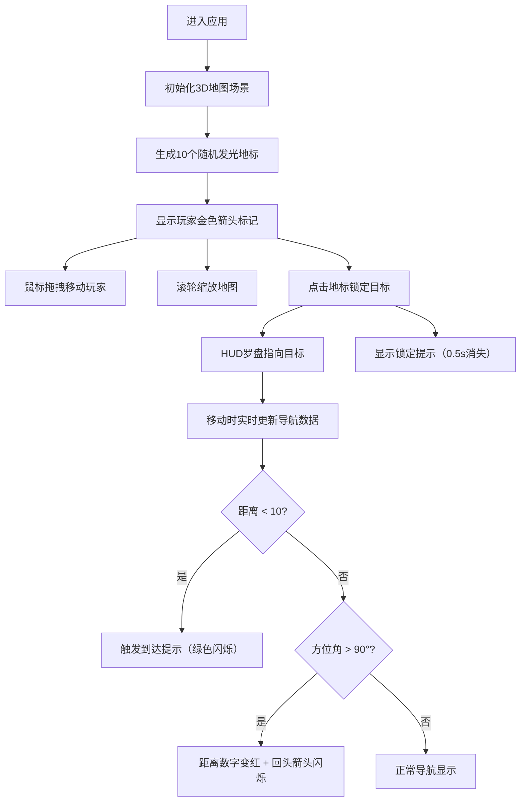

## 1. 产品概述

开放世界导航与空间感知辅助工具（HUD增强应用），为开放世界游戏玩家提供直观的空间感知和导航辅助，解决玩家在游戏中方向感差、探索效率低的问题。

- 核心目标：通过三维地图和HUD界面，让玩家实时感知自身位置、朝向与目标地标之间的空间关系
- 目标用户：开放世界游戏玩家、需要空间导航辅助的用户
- 产品价值：提升探索效率、增强方向感、降低认知负荷

## 2. 核心功能

### 2.1 功能模块

1. **3D地图场景模块**：俯视视角的缩小地形图，支持鼠标拖拽移动和滚轮缩放
2. **HUD覆盖层模块**：全屏半透明毛玻璃风格的导航信息展示
3. **导航罗盘模块**：动态旋转的圆形罗盘，指示目标方向
4. **距离指示模块**：显示与目标点的距离和高度差
5. **地标管理模块**：管理随机分布的发光地标，支持点击锁定目标

### 2.2 页面详情

| 页面名称 | 模块名称 | 功能描述 |
|---------|---------|---------|
| 主界面 | 3D地图场景 | 200x200单位平面地图，10个随机分布的发光地标，金色箭头标记玩家位置和朝向，鼠标拖拽移动，滚轮缩放 |
| 主界面 | 导航罗盘 | 左上角120px直径罗盘，渐变细线圆环，N方向标记，箭头指向目标，0.3s缓动旋转动画 |
| 主界面 | 距离指示器 | 右下角圆角矩形毛玻璃卡片，显示距离(m)和高度差(m)，数字变化脉冲动画0.2s |
| 主界面 | 目标锁定提示 | 点击地标后从顶部滑出"已锁定目标！"提示，0.5s后消失 |
| 主界面 | 到达提示 | 距离目标<10单位时全屏绿色光晕闪烁，0.5s闪烁3次 |
| 主界面 | 背对提示 | 方位角>90°时距离数字变红，罗盘边缘红色"回头"箭头闪烁，0.5s循环 |

## 3. 核心流程

用户进入应用 → 查看3D地图和随机分布的地标 → 鼠标拖拽移动玩家位置 / 滚轮缩放地图 → 点击地标锁定目标 → HUD显示导航罗盘和距离 → 移动时罗盘持续跟踪、距离实时刷新 → 到达目标时触发到达提示

## 4. 用户界面设计

### 4.1 设计风格

- **主色调**：深色系背景，半透明毛玻璃效果（backdrop-filter: blur(12px)）
- **强调色**：金色（玩家标记）、暖色系渐变（地标）、绿色（到达提示）、红色（背对警告）
- **字体**：导航数字使用monospace等宽字体，标题使用无衬线字体
- **视觉风格**：科技感、游戏HUD风格、半透明毛玻璃质感
- **动效风格**：平滑缓动过渡（ease-in-out）、脉冲动画、闪烁效果

### 4.2 页面设计概览

| 页面名称 | 模块名称 | UI元素 |
|---------|---------|-------|
| 主界面 | 3D地图场景 | 俯视平面、发光地标球体、金色玩家箭头、地形网格 |
| 主界面 | 导航罗盘 | 渐变细线圆环、N/S/E/W方向标记、中心指向箭头、毛玻璃背景 |
| 主界面 | 距离指示器 | 圆角矩形卡片、距离数值、高度差数值、monospace字体 |
| 主界面 | 锁定提示 | 顶部下滑横幅、"已锁定目标！"文字、0.5s自动消失 |
| 主界面 | 到达提示 | 全屏绿色光晕、脉冲闪烁3次、0.5s完成 |
| 主界面 | 背对提示 | 红色距离数字、罗盘边缘红色箭头、0.5s循环闪烁 |

### 4.3 响应式设计

- 桌面端优先设计
- 屏幕宽度 < 600px 时：
  - 罗盘直径缩小为80px
  - 距离指示器字体缩小
  - 保持布局位置（左上角罗盘、右下角距离）
- 触摸设备支持：触摸拖拽移动、双指缩放

### 4.4 3D场景指引

- **环境**：俯视视角的简化地形平面，深色背景
- **光照**：环境光 + 点光源，地标球体自发光效果
- **相机**：正交或透视俯视相机，支持缩放
- **构图**：玩家位于视野中心，地标分布在周围
- **交互**：鼠标拖拽平移地图、滚轮缩放、点击地标准确
- **性能**：保持60fps，使用requestAnimationFrame同步渲染
