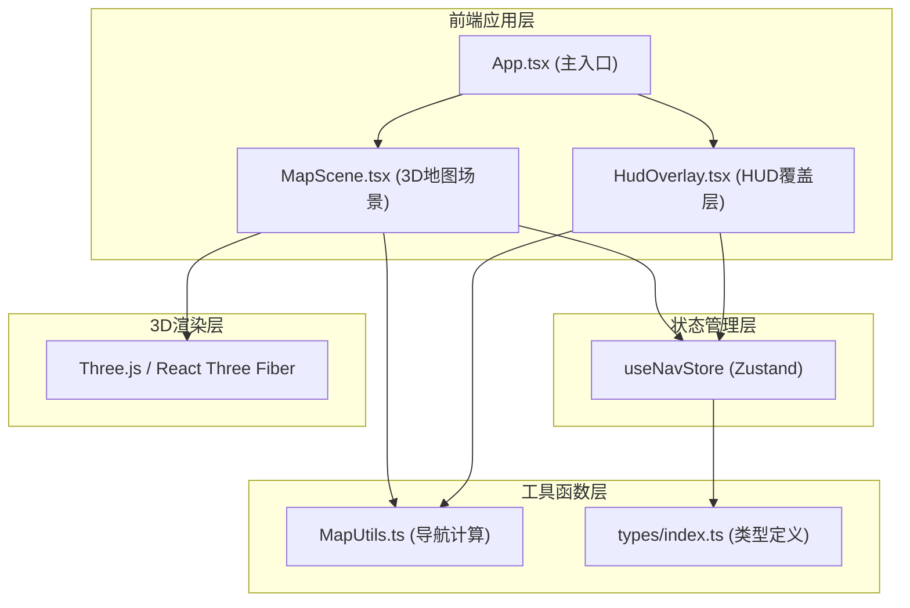
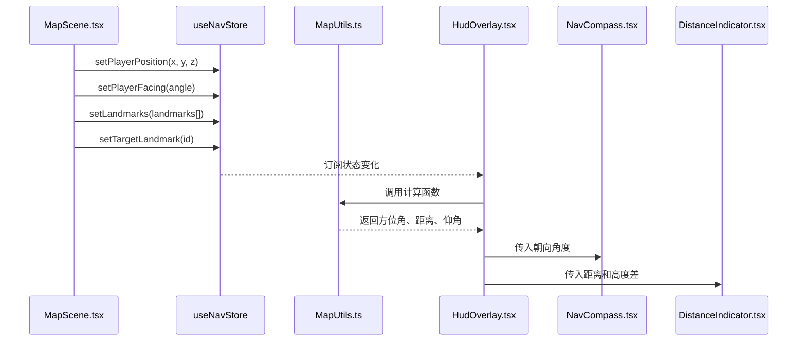

## 1. 架构设计



## 2. 技术描述

- **前端框架**：React 18 + TypeScript
- **构建工具**：Vite 5 + @vitejs/plugin-react
- **3D引擎**：Three.js + @react-three/fiber + @react-three/drei
- **状态管理**：Zustand（共享导航状态）
- **图标库**：react-icons
- **样式方案**：CSS Modules / 内联样式 + CSS动画
- **开发模式**：纯前端，无后端依赖

## 3. 目录结构

```
src/
├── map/                      # 地图处理模块
│   ├── MapScene.tsx          # 3D地图场景组件
│   └── MapUtils.ts           # 地图工具函数（方位角、距离、仰角计算）
├── hud/                      # HUD渲染模块
│   ├── HudOverlay.tsx        # HUD覆盖层主组件
│   ├── NavCompass.tsx        # 导航罗盘子组件
│   └── DistanceIndicator.tsx # 距离指示器子组件
├── types/                    # 共享类型定义
│   └── index.ts              # 地标、玩家、导航数据类型
├── store/                    # 状态管理
│   └── useNavStore.ts        # Zustand导航状态store
├── App.tsx                   # 应用主组件
├── main.tsx                  # 应用入口
└── index.css                 # 全局样式
```

## 4. 模块调用关系与数据流向

### 4.1 数据流向图



### 4.2 模块职责

| 模块 | 职责 | 依赖 |
|------|------|------|
| MapScene.tsx | 3D地图渲染、玩家控制、地标渲染、点击交互 | types, useNavStore, MapUtils, @react-three/fiber |
| MapUtils.ts | 方位角计算、距离计算、仰角计算、导航指示值生成 | types |
| HudOverlay.tsx | HUD容器布局、状态订阅、动画触发、子组件组装 | types, useNavStore, MapUtils, NavCompass, DistanceIndicator |
| NavCompass.tsx | 罗盘渲染、旋转动画、方向标记、背对提示 | types |
| DistanceIndicator.tsx | 距离显示、高度差显示、脉冲动画、颜色变化 | types |
| types/index.ts | 共享类型定义：Landmark, PlayerState, NavData | 无 |
| useNavStore.ts | 全局状态管理：玩家位置、朝向、地标、目标 | types |

## 5. 类型定义

### 5.1 地标类型

```typescript
interface Landmark {
  id: string;
  name: string;
  position: { x: number; y: number; z: number };
  color: string;
}
```

### 5.2 玩家状态类型

```typescript
interface PlayerState {
  position: { x: number; y: number; z: number };
  facing: number; // 朝向角度（弧度）
}
```

### 5.3 导航数据类型

```typescript
interface NavData {
  azimuth: number;      // 方位角（弧度）
  distance: number;     // 水平距离（单位）
  elevation: number;    // 仰角（弧度）
  heightDiff: number;   // 高度差（单位）
  isFacingAway: boolean; // 是否背对目标
  isNearTarget: boolean; // 是否接近目标
}
```

## 6. 性能约束实现

- **渲染频率控制**：使用 requestAnimationFrame 同步渲染，HUD组件通过 useState + useRef 限制重渲染不超过60fps
- **状态更新优化**：Zustand 状态采用浅比较，避免不必要的重渲染
- **3D场景优化**：使用 Three.js 实例化渲染，地标使用 InstancedMesh
- **动画性能**：CSS transition 和 CSS animation 处理UI动画，不占用JS主线程
- **内存管理**：组件卸载时清理事件监听器和动画帧

## 7. 配置文件

- **package.json**：包含所有依赖和开发脚本
- **vite.config.ts**：React + Three.js 构建配置
- **tsconfig.json**：TypeScript 严格模式配置
- **index.html**：应用入口HTML
