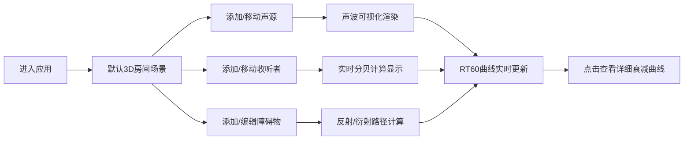

## 1. 产品概述

室内声波传播3D交互模拟工具，帮助建筑师和室内设计师在规划阶段直观感受房间内不同位置的声学效果，通过可视化方式展示声波传播路径与混响特性，支持调整家具布局和墙面材质来优化声学表现。

- **核心价值**：将抽象的声学概念转化为直观的3D可视化交互，降低声学设计门槛，提升设计决策效率
- **目标用户**：建筑师、室内设计师、声学工程师、空间规划师
- **应用场景**：室内空间声学规划、会议室/音乐厅/家庭影院声学设计、教室声学优化

## 2. 核心特性

### 2.1 用户角色
| 角色 | 注册方式 | 核心权限 |
|------|----------|----------|
| 设计师用户 | 无需注册 | 使用全部声学模拟功能，调整参数，查看分析结果 |

### 2.2 功能模块
1. **3D场景交互模块**：房间渲染、声源/收听者放置、障碍物编辑、相机控制
2. **声波可视化模块**：声波球面扩散、反射线、衍射线、能量衰减效果
3. **声学计算引擎**：声线追踪、反射/衍射计算、分贝值实时计算、RT60混响时间计算
4. **数据分析面板**：实时分贝计、RT60频率响应曲线、详细衰减曲线查看
5. **参数控制面板**：障碍物尺寸调节、材质选择、房间参数设置

### 2.3 页面详情
| 页面名称 | 模块名称 | 功能描述 |
|----------|----------|----------|
| 主应用页 | 3D场景区域 | 8x6x3米房间渲染，声源（黄色呼吸小球）、收听者（蓝色小人）、障碍物（可调长方体）的交互放置与编辑 |
| 主应用页 | 声波可视化 | 绿色同心球面波扩散（0.4s周期，间距随距离增大）、白色虚线反射（持续0.5s）、淡蓝色弧形衍射（持续0.3s） |
| 主应用页 | 分贝计显示 | 收听者位置实时分贝值，响应延迟<20ms，数字滚动动画（0.15s ease-out），考虑遮挡与反射衍射路径 |
| 主应用页 | 控制面板 | 障碍物长宽高调节滑块、材质下拉选择（混凝土/玻璃/地毯）、参数分组卡片 |
| 主应用页 | RT60曲线图 | 右下角实时曲线（125Hz-4kHz，0-5s，15Hz刷新率），点击查看详细衰减曲线（二阶指数拟合+置信区间） |

## 3. 核心流程

用户进入应用后，在默认8x6x3米房间场景中：
1. 拖拽添加声源（黄色小球），声源持续发出可见绿色声波
2. 拖拽放置收听者（蓝色小人），实时显示该位置分贝值
3. 添加障碍物（最多6个），拖拽调整位置和尺寸，选择材质
4. 观察声波遇到障碍物时的反射和衍射效果
5. 查看右下角RT60混响时间曲线，点击查看详细衰减数据
6. 通过调整障碍物布局和材质，优化房间声学表现

## 4. 用户界面设计

### 4.1 设计风格
- **主题**：深色科技风，主背景 `#1A1A2E`
- **主色**：声波绿 `#00FF88`、声源黄 `#FFD700`、收听者蓝 `#4A9EFF`
- **辅助色**：反射白 `#FFFFFF`、衍射淡蓝 `#87CEEB`、混响曲线紫 `#9B59B6`
- **面板**：毛玻璃效果 `backdrop-filter: blur(12px)`，背景 `rgba(30,30,60,0.85)`，圆角卡片
- **字体**：数值显示使用 Fira Code 等宽字体，UI文字使用现代无衬线字体
- **交互**：卡片悬停背景从 `rgba(255,255,255,0.05)` 变为 `0.08`，0.2s过渡
- **性能**：主循环帧率>50FPS，声波计算每帧<1.2ms

### 4.2 页面设计概述
| 页面名称 | 模块名称 | UI元素 |
|----------|----------|--------|
| 主应用页 | 3D场景区域 | 占75%宽度，默认房间8x6x3米，支持旋转/平移/缩放，相机靠近障碍物时半透明剖面淡入（0.25s ease-out） |
| 主应用页 | 右侧控制面板 | 固定宽度280px，毛玻璃背景，分组圆角卡片，参数滑块，材质下拉选择 |
| 主应用页 | 分贝计显示 | 悬浮于收听者上方，Fira Code字体，数字滚动动画 |
| 主应用页 | RT60曲线图 | 右下角Canvas 2D绘制，可点击放大查看详情 |

### 4.3 响应式设计
- 桌面端优先，自适应不同屏幕分辨率
- 3D场景区域随窗口大小实时调整
- 控制面板保持280px固定宽度
- 触摸设备支持手势操作

### 4.4 3D场景指导
- **环境**：深色室内空间，环境光+方向光组合，营造科技感
- **光照**：环境光强度0.4，方向光强度0.8，位置(5, 8, 5)，投射柔和阴影
- **相机**：默认位置(6, 4, 8)，看向场景中心，PerspectiveCamera fov=50
- **相机控制**：旋转灵敏度0.12，右键平移速度0.15m/s，滚轮缩放0.3-10倍
- **后期处理**：轻微泛光效果，增强声波可视化的发光感
- **性能优化**：声波对象池化，障碍物检测空间分区，计算防抖
