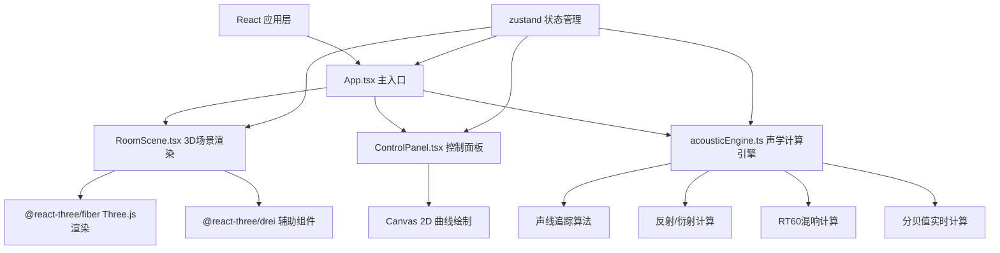

## 1. 架构设计



## 2. 技术描述

- **前端框架**：React 18 + TypeScript 5
- **构建工具**：Vite 5 + @vitejs/plugin-react
- **3D渲染**：Three.js 0.160 + @react-three/fiber 8.15 + @react-three/drei 9.92
- **状态管理**：zustand 4.4
- **样式方案**：CSS Modules + CSS Variables
- **类型安全**：严格模式 TypeScript，`jsx: 'react-jsx'`

## 3. 目录结构

```
src/
├── App.tsx              # 主入口组件，场景+UI布局
├── acousticEngine.ts    # 声学计算核心引擎
├── RoomScene.tsx        # 3D场景渲染组件
├── ControlPanel.tsx     # 右侧控制面板组件
├── store/
│   └── useAcousticStore.ts  # zustand状态管理
├── types/
│   └── acoustic.ts      # 类型定义
└── utils/
    └── mathUtils.ts     # 数学计算工具函数
```

## 4. 核心数据模型

### 4.1 类型定义

```typescript
// 三维向量
interface Vector3 {
  x: number;
  y: number;
  z: number;
}

// 声源
interface SoundSource {
  id: string;
  position: Vector3;
  radius: number;      // 0.15m
  frequency: number;   // 1000Hz 默认
  power: number;       // 100dB 默认
}

// 收听者
interface Listener {
  id: string;
  position: Vector3;
  dbValue: number;     // 实时分贝值
}

// 障碍物材质
type MaterialType = 'concrete' | 'glass' | 'carpet';

interface MaterialProps {
  color: string;
  transparent: boolean;
  opacity: number;
  absorption: number;  // 吸音系数
  reflection: number;  // 反射系数
}

// 障碍物
interface Obstacle {
  id: string;
  position: Vector3;
  size: Vector3;        // 长宽高
  material: MaterialType;
}

// 声波环
interface SoundWave {
  id: string;
  sourceId: string;
  startTime: number;
  radius: number;
  opacity: number;
}

// 反射线
interface ReflectionLine {
  id: string;
  start: Vector3;
  end: Vector3;
  normal: Vector3;
  startTime: number;
  duration: number;     // 0.5s
}

// 衍射弧
interface DiffractionArc {
  id: string;
  center: Vector3;
  radius: number;
  startAngle: number;
  endAngle: number;
  normal: Vector3;
  startTime: number;
  duration: number;     // 0.3s
}

// RT60数据点
interface RT60DataPoint {
  frequency: number;
  rt60: number;
  confidence: [number, number];  // 置信区间
}

// 声学引擎状态
interface AcousticState {
  roomSize: Vector3;              // 默认 8x6x3
  soundSources: SoundSource[];
  listeners: Listener[];
  obstacles: Obstacle[];
  soundWaves: SoundWave[];
  reflectionLines: ReflectionLine[];
  diffractionArcs: DiffractionArc[];
  rt60Data: RT60DataPoint[];
  selectedObjectId: string | null;
  addSoundSource: (pos: Vector3) => void;
  moveSoundSource: (id: string, pos: Vector3) => void;
  removeSoundSource: (id: string) => void;
  addListener: (pos: Vector3) => void;
  moveListener: (id: string, pos: Vector3) => void;
  removeListener: (id: string) => void;
  addObstacle: (pos: Vector3, size: Vector3, material: MaterialType) => void;
  updateObstacle: (id: string, updates: Partial<Obstacle>) => void;
  removeObstacle: (id: string) => void;
  update: (deltaTime: number) => void;
}
```

## 5. 核心算法

### 5.1 声线追踪算法
- 从声源向各个方向发射声线（每帧N条）
- 检测声线与障碍物/墙面的碰撞
- 计算反射方向：`R = V - 2(V·N)N`
- 计算衍射路径：在障碍物边缘产生弧形波前
- 能量衰减模型：`dB = sourcePower - 20*log10(distance) - absorption*reflectionCount`

### 5.2 RT60计算（Sabine公式）
```
RT60 = 0.161 * V / A
其中:
  V = 房间体积
  A = Σ(表面面积 × 吸音系数)
```
针对不同频率（125Hz, 250Hz, 500Hz, 1kHz, 2kHz, 4kHz）计算对应的RT60值。

### 5.3 分贝值计算
考虑直射路径、反射路径、衍射路径的叠加，以及障碍物遮挡导致的衰减。

## 6. 性能优化策略

1. **声波对象池**：预分配声波环、反射线、衍射弧对象，避免频繁GC
2. **空间分区**：使用八叉树加速障碍物碰撞检测
3. **计算防抖**：RT60曲线15Hz刷新率，与主渲染循环分离
4. **LOD策略**：远处声波环降低细分精度
5. **增量更新**：仅更新位置变化的声源/收听者的分贝计算
