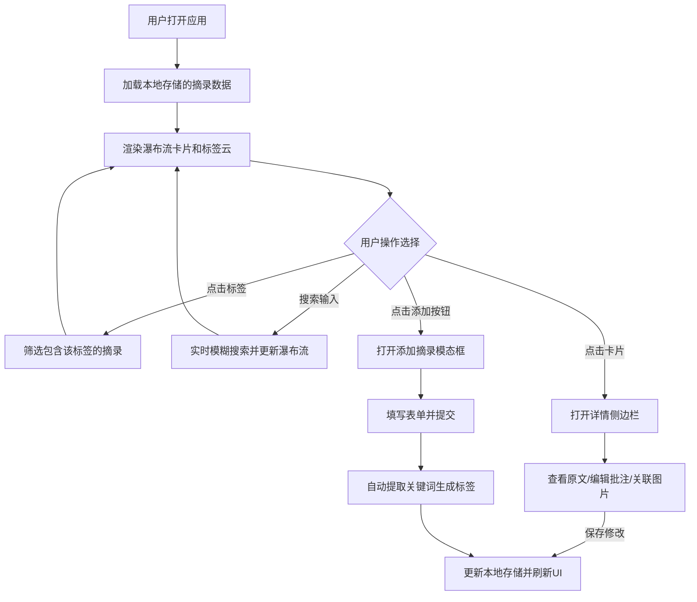

## 1. 产品概述
书摘阁是一款个人书摘与阅读灵感收集器，帮助用户快速记录阅读时的金句摘录、随想批注，并通过智能关联探索不同书籍之间的主题关联。

- 核心用户：热爱阅读、希望系统化管理阅读笔记的知识工作者与学生
- 核心价值：提供优雅、高效的阅读摘录体验，通过关键词标签和关联度算法帮助用户发现阅读内容之间的隐藏联系

## 2. 核心功能

### 2.1 功能模块
1. **首页（摘录瀑布流）**：书摘卡片瀑布流展示、标签云筛选、搜索栏、添加摘录按钮
2. **摘录详情侧边栏**：原文全貌展示、批注编辑、关联摘录推荐、图片管理
3. **添加/编辑摘录模态框**：表单输入、关键词自动提取、类别选择
4. **图片灯箱**：全屏图片查看、缩放动画

### 2.2 页面详情
| 页面名称 | 模块名称 | 功能描述 |
|-----------|-------------|---------------------|
| 首页 | 顶部导航栏 | 应用名称、搜索栏、筛选/排序按钮 |
| 首页 | 标签云区域 | 按频率展示标签，点击筛选摘录 |
| 首页 | 瀑布流卡片区 | 三列自适应瀑布流展示书摘卡片 |
| 首页 | 浮动添加按钮 | 右下角圆形按钮，点击打开添加模态框 |
| 详情侧边栏 | 原文展示区 | 带行号的全文展示 |
| 详情侧边栏 | 批注区 | 批注输入框，支持保存和删除 |
| 详情侧边栏 | 关联推荐区 | 横向滚动卡片展示匹配度>50%的相关摘录 |
| 详情侧边栏 | 图片管理区 | 最多5张关联图片的网格缩略图展示 |
| 添加模态框 | 表单区 | 书名、作者、原文、批注输入，类别选择 |

## 3. 核心流程

用户打开应用 → 浏览瀑布流中的书摘卡片 → 通过标签云或搜索栏筛选摘录 → 点击卡片查看详情 → 编辑批注或管理关联图片 → 点击添加按钮创建新摘录 → 系统自动提取关键词并生成标签

## 4. 用户界面设计

### 4.1 设计风格
- **设计理念**：极简温暖的阅读氛围，模拟纸质书籍的质感
- **主色调**：暖白色 #F9F9F5 背景，纯白卡片，蓝色 #4A90D9 作为主强调色
- **色板系统**：5个书籍类别（文学/科技/历史/哲学/心理），每个类别3种柔和色调，共15种颜色
- **字体**：应用名称使用手写风格字体（Ma Shan Zheng），正文使用系统优雅衬线字体
- **布局**：固定顶部导航（64px高度）+ 主内容区瀑布流 + 右下角浮动按钮
- **动效**：所有过渡动画保持60fps，卡片悬停上浮、侧边栏滑入、模态框淡入等均采用缓动曲线

### 4.2 页面设计概述
| 页面名称 | 模块名称 | UI元素 |
|-----------|-------------|-------------|
| 首页 | 导航栏 | 手写体Logo、居中圆角搜索框（带放大镜）、右侧筛选按钮 |
| 首页 | 标签云 | 标签字体大小14-28px随频率变化，选中时放大1.2倍+跳动动画 |
| 首页 | 瀑布流卡片 | 圆角12px、1px淡灰边框、悬停translateY(-4px)+阴影、底部随机色块条 |
| 首页 | 浮动按钮 | 圆形#4A90D9、白色加号、悬停放大1.1倍 |
| 详情侧边栏 | 滑入面板 | 右侧滑入0.4s cubic-bezier、原文带行号、横向滚动关联推荐卡片 |
| 添加模态框 | 表单 | 圆角输入框、验证错误红边框+抖动动画0.3s |
| 图片灯箱 | 全屏查看 | 半透明黑色遮罩、右上角白色圆形关闭按钮、zoom in动画0.3s |

### 4.3 响应式设计
- **移动端（<768px）**：瀑布流单列，侧边栏全屏覆盖
- **平板（768-1024px）**：瀑布流两列
- **桌面（>1024px）**：瀑布流三列
- 触摸优化：按钮最小点击区域44x44px，支持触控滑动
