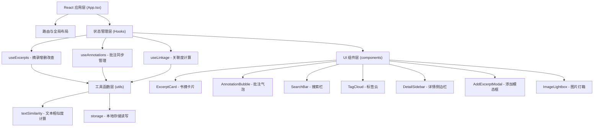

## 1. 架构设计



## 2. 技术描述
- **前端框架**：React 18 + TypeScript（严格模式）
- **构建工具**：Vite 5 + @vitejs/plugin-react
- **路由**：react-router-dom v6
- **图标库**：react-icons
- **消息提示**：react-hot-toast
- **数据持久化**：localStorage（无需后端）

## 3. 路由定义
| 路由 | 用途 |
|-------|---------|
| / | 首页 - 摘录瀑布流展示（主应用页面） |

## 4. 数据模型

### 4.1 TypeScript 类型定义

```typescript
// 书籍类别
type BookCategory = '文学' | '科技' | '历史' | '哲学' | '心理';

// 摘录实体
interface Excerpt {
  id: string;
  bookTitle: string;
  author: string;
  content: string;          // 摘录原文（最多500字）
  annotation: string;       // 随想批注（可选）
  category: BookCategory;
  tags: string[];           // 自动提取的关键词（前5个）
  images: string[];         // 关联图片URL（最多5张）
  color: string;            // 卡片主色（从色板随机选取）
  createdAt: number;
  updatedAt: number;
}

// 关联匹配结果
interface LinkedExcerpt {
  excerpt: Excerpt;
  similarity: number;       // 匹配度 0-100
}
```

### 4.2 数据存储结构
```
localStorage key: 'shuzhaige_excerpts'
value: JSON string of Excerpt[]
```

## 5. 文件结构
```
auto70/
├── package.json
├── index.html
├── vite.config.ts
├── tsconfig.json
└── src/
    ├── App.tsx                 # 主路由与全局布局
    ├── main.tsx                # 应用入口
    ├── index.css               # 全局样式
    ├── components/             # UI组件
    │   ├── ExcerptCard.tsx     # 书摘卡片
    │   ├── AnnotationBubble.tsx# 批注气泡
    │   ├── SearchBar.tsx       # 搜索栏
    │   ├── TagCloud.tsx        # 标签云
    │   ├── DetailSidebar.tsx   # 详情侧边栏
    │   ├── AddExcerptModal.tsx # 添加/编辑模态框
    │   └── ImageLightbox.tsx   # 图片灯箱
    ├── hooks/                  # 自定义 Hooks
    │   ├── useExcerpts.ts      # 摘录管理
    │   ├── useAnnotations.ts   # 批注同步
    │   └── useLinkage.ts       # 关联度计算
    ├── utils/                  # 工具函数
    │   ├── textSimilarity.ts   # 文本相似度与关键词提取
    │   └── storage.ts          # 本地存储封装
    └── types/
        └── index.ts            # 全局类型定义
```

## 6. 核心算法设计

### 6.1 关键词提取算法
1. 将原文文本按中英文分词
2. 过滤停用词（常见中文停用词表 + 英文停用词表）
3. 统计词频，取频率最高的前5个词作为标签

### 6.2 文本相似度算法
- 基于 Jaccard 相似度：计算两个摘录标签集合的交集/并集比率
- 相似度 > 50% 的摘录作为关联推荐

### 6.3 瀑布流布局算法
- CSS columns 实现响应式多列布局
- 移动端 1 列，平板 2 列，桌面 3 列
- 列间距 16px，卡片 break-inside: avoid

## 7. 性能优化策略
1. **搜索防抖**：300ms 防抖，避免频繁渲染
2. **图片懒加载**：使用原生 loading="lazy" 属性
3. **组件优化**：使用 React.memo 包裹卡片组件，避免不必要重渲染
4. **CSS 动画**：所有动画使用 transform 和 opacity，保证 60fps
5. **本地存储**：读写操作使用 debounce，减少磁盘 IO
