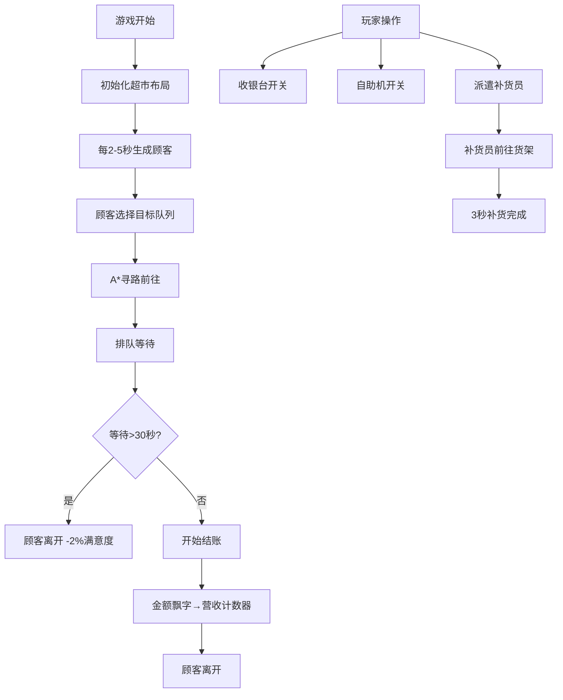

## 1. 产品概述
超市收银台模拟策略游戏，玩家通过调整收银台开放数量、引导顾客分流、安排员工补货来最大化单位时间营业额。
- 目标用户：策略游戏爱好者、模拟经营游戏玩家
- 市场价值：轻量级策略模拟，高可玩性，适合碎片化时间娱乐

## 2. 核心功能

### 2.1 用户角色
| 角色 | 注册方式 | 核心权限 |
|------|---------|---------|
| 玩家 | 无需注册，浏览器直接访问 | 操作收银台开关、自助结账机、派遣补货员 |

### 2.2 功能模块
1. **超市平面图渲染**：俯视视角，货架、收银台、自助结账机、入口出口可视化
2. **顾客AI系统**：自动生成、路径寻路、排队选择、不耐烦机制、满意度影响
3. **收银台管理**：开放/关闭切换、收银员速率成长、排队人数显示
4. **自助结账机管理**：启用/停用切换、单人使用限制
5. **货架补货系统**：库存监控、低库存预警、补货员路径、补货动画
6. **数据统计面板**：营收、平均等待时间、满意度、吞吐量折线图
7. **底部操作栏**：快速控制收银台/自助机状态、一键补货

### 2.3 页面详情
| 页面名称 | 模块名称 | 功能描述 |
|---------|---------|----------|
| 游戏主界面 | 超市平面图 | Canvas/HTML绘制俯视视角超市，含货架、收银台、自助机、入口出口 |
| 游戏主界面 | 顾客渲染 | 圆形+朝向箭头的顾客小人，显示商品数量、表情、交易金额飘字 |
| 游戏主界面 | 信息面板 | 半透明黑色面板，显示今日营收、满意度、等待时间、折线图 |
| 游戏主界面 | 操作栏 | 深蓝色底部栏，收银台开关按钮、自助机开关、快速补货按钮 |

## 3. 核心流程
顾客从入口进入 → 选择最近空闲收银台/自助机 → A*寻路沿最短路径行走 → 排队等待 → 结账（显示金额飘字） → 从出口离开。玩家实时调整收银台数量、自助机状态，发现低库存货架时点击派遣补货员补货。

## 4. 用户界面设计

### 4.1 设计风格
- **主色调**：暖木色#F5DEB3背景、深蓝色#1A1A2E操作栏、蓝色#4A90D9收银台、绿色#50B86C自助机、浅灰色#E0E0E0货架
- **按钮风格**：圆角按钮，开关状态切换时缩放动画0.2s ease
- **字体**：像素风格标题字体，现代无衬线正文字体
- **布局**：全屏布局（100vh），顶部标题+主游戏区+底部操作栏+右上角信息面板浮动
- **动效**：数字跳动放大1.1倍+金色闪光、Cubic Bezier顾客行走缓动、霓虹光晕标题动画、毛玻璃面板

### 4.2 页面设计概览
| 页面名称 | 模块名称 | UI元素 |
|---------|---------|--------|
| 主界面 | 标题区 | 像素字体、蓝金渐变、霓虹光晕动画、左上角定位 |
| 主界面 | 超市平面图 | 暖木色背景、#D2B48C网格线、货架/收银台/自助机按坐标绘制、入口浅绿色箭头、浅灰色虚线路径线 |
| 主界面 | 信息面板 | #00000080半透明、圆角12px、毛玻璃、营收数字+闪光、满意度渐变色折线图 |
| 主界面 | 操作栏 | #1A1A2E深蓝底、60px高度、圆角上边缘、收银台图标开关、自助机图标、快速补货按钮 |

### 4.3 响应式设计
- 桌面优先，支持1280x720~1920x1080分辨率
- 使用相对单位（vw/vh/%）保证布局自适应
- 游戏画布按窗口比例缩放，保持俯视视角比例

## 4. 性能要求
- 游戏循环稳定30FPS+
- 同屏最多80个顾客同时移动
- A*寻路单次<5ms，使用缓存优化
