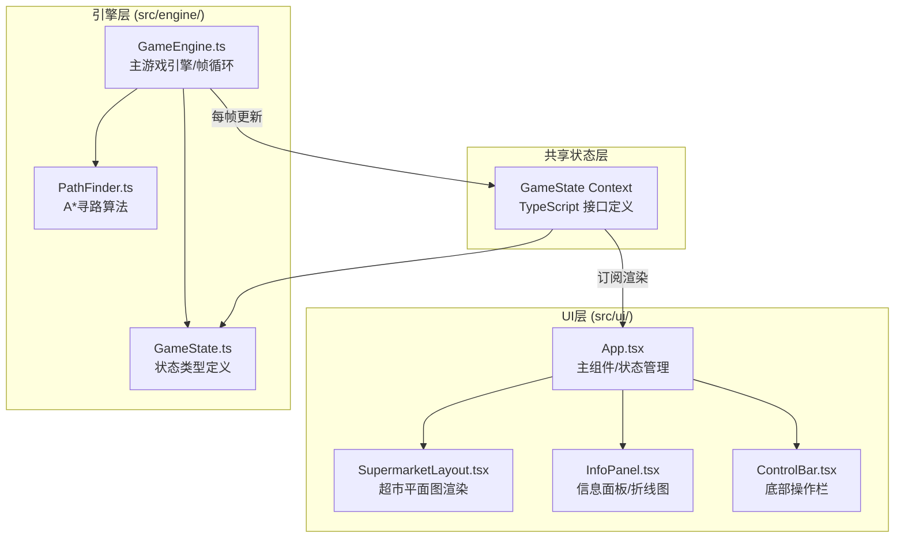

## 1. 架构设计



## 2. 技术描述
- **前端框架**: React 18 + TypeScript 5
- **构建工具**: Vite 5
- **UI渲染**: HTML5 Canvas + CSS3 (顾客/UI用DOM绝对定位+transform，路径/网格用Canvas绘制)
- **图标库**: react-icons
- **状态管理**: 引擎内部状态 + React useState/useRef 快照同步（每帧），避免频繁re-render问题
- **无后端**：纯前端模拟游戏

## 3. 文件组织

```
src/
├── engine/
│   ├── GameState.ts      # 类型定义：顾客、收银台、货架、游戏状态接口
│   ├── PathFinder.ts     # A*寻路算法 + 路径缓存
│   └── GameEngine.ts     # 主引擎：帧循环、顾客生成、排队、结算、补货、统计
└── ui/
    ├── App.tsx           # React根组件，初始化引擎，状态桥接
    ├── SupermarketLayout.tsx  # 俯视图组件（Canvas+DOM混合渲染）
    ├── InfoPanel.tsx     # 右上方面板（营收、满意度、折线图）
    ├── ControlBar.tsx    # 底部操作栏（按钮交互）
    └── index.css         # 全局样式/动画定义
```

## 4. 核心数据模型

### 4.1 GameState 接口

```typescript
// 顾客状态枚举
enum CustomerState { ENTERING = 'entering', CHOOSING = 'choosing', WALKING = 'walking', 
  QUEUEING = 'queueing', CHECKOUT = 'checkout', LEAVING = 'leaving', ANGRY = 'angry' }

interface Customer {
  id: number
  x: number; y: number           // 像素坐标
  targetX: number; targetY: number
  path: Array<{x:number, y:number}>
  pathIndex: number
  state: CustomerState
  items: number                  // 商品数量1-15
  waitTime: number               // 等待秒数
  checkoutTargetId?: number      // 目标收银台/自助机ID
  checkoutTargetType?: 'cashier' | 'self'
  checkoutStartTime?: number
  angry: boolean
  rotation: number               // 朝向角度
}

interface Cashier {
  id: number
  gridX: number; gridY: number   // 网格坐标
  open: boolean
  rate: number                   // 件/秒，0.5起步，每10客+0.05，上限1.5
  customersServed: number
  queue: Customer[]
  currentCustomer?: Customer
  checkoutProgress: number       // 0-1
}

interface SelfCheckout {
  id: number
  gridX: number; gridY: number
  enabled: boolean
  inUse: boolean
  currentCustomer?: Customer
}

interface Shelf {
  id: number
  gridX: number; gridY: number
  width: number; height: number  // 占用网格数
  stock: number                  // 0-100%
  emptyTimer: number             // 空置秒数
  restocking: boolean
  restockProgress: number        // 0-1
}

interface Restocker {
  id: number
  x: number; y: number
  path: Array<{x:number, y:number}>
  pathIndex: number
  targetShelfId?: number
  state: 'idle' | 'moving' | 'restocking'
  restockTimer: number
}

interface FloatText {
  id: number
  x: number; y: number
  text: string
  color: string
  life: number  // 剩余帧数
}

interface StatsPoint {
  time: number
  avgWait: number
  throughput: number
  satisfaction: number
}

interface GameState {
  time: number                    // 游戏运行秒数
  customers: Customer[]
  cashiers: Cashier[]
  selfCheckouts: SelfCheckout[]
  shelves: Shelf[]
  restockers: Restocker[]
  revenue: number
  satisfaction: number            // 0-100
  avgWaitTime: number
  throughput: number              // 总完成结算人数
  statsHistory: StatsPoint[]      // 最近30个数据点
  floatTexts: FloatText[]
  gridWidth: number
  gridHeight: number
  cellSize: number                // 每格像素
  entryPoint: {x:number, y:number}
  exitPoint: {x:number, y:number}
  warehousePoint: {x:number, y:number}
}
```

## 5. 性能优化策略

### 5.1 渲染层
- **Canvas + DOM 混合**：静态网格、货架、路径使用Canvas绘制；顾客、浮动文字使用绝对定位DOM元素（便于CSS动画）
- **requestAnimationFrame** 统一驱动，UI节流渲染（引擎30FPS，React渲染跟随rAF）
- **顾客元素复用**：离开的顾客从DOM中移除，避免内存泄漏

### 5.2 引擎层
- **A*缓存**：PathFinder维护LRU缓存（key=`${startX},${startY}-${endX},${endY}`），命中直接返回
- **顾客路径缓存**：同一队列的后续顾客复用队首顾客的路径
- **帧循环 deltaTime**：所有运动基于时间差计算，避免帧率波动影响游戏速度

### 5.3 React优化
- 引擎状态通过useRef持有副本，每帧仅调用一次setState触发浅渲染
- 子组件使用React.memo + 精细化props，避免不必要重渲染
- SupermarketLayout内部使用Canvas ref直接绘制，不走React虚拟DOM

## 6. 地图网格设计

```
网格尺寸: 24列 × 16行
网格单元: 可配置（默认40px）
图例:
  .  空地 (0)
  #  货架 (1) - 障碍物
  C  收银台 (1) - 障碍物，顾客在前方排队
  S  自助结账机 (1) - 障碍物
  E  入口 (0)
  X  出口 (0)
  W  仓库 (0)

布局示意:
  E . . . . . . . . . . . . . . . . . . . . . . X
  . . . . . . . . . . . . . . . . . . . . . . . .
  . ###### ###### ###### ###### ###### ###### .
  . ###### ###### ###### ###### ###### ###### .
  . ###### ###### ###### ###### ###### ###### .
  . . . . . . . . . . . . . . . . . . . . . . . .
  . ###### ###### ###### ###### ###### ###### .
  . ###### ###### ###### ###### ###### ###### .
  . ###### ###### ###### ###### ###### ###### .
  . . . . . . . . . . . . . . . . . . . . . . . .
  . . . . . . . . . . . . . . . . . . . . . . . .
  . C C C C C          S S S S                 .
  . . . . . . . . . . . . . . . . . . . . . . . .
  . . . . . . . . . . . . . . . . . . . . . . . .
  W . . . . . . . . . . . . . . . . . . . . . . .
```
