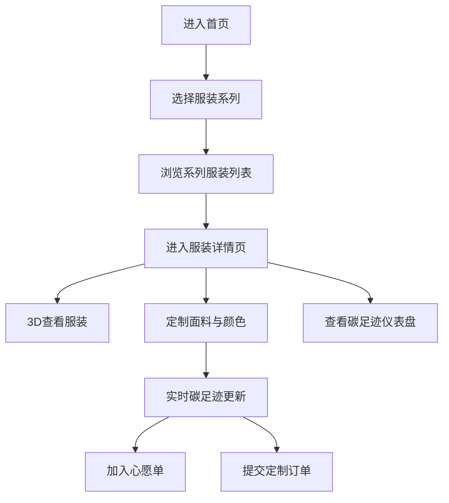

## 1. 产品概述
可持续时尚虚拟展厅是一个面向环保-conscious消费者的线上定制平台，用户可以浏览3D虚拟服装系列、查看碳足迹评分、定制面料与颜色，并生成独一无二的环保礼服。

- 核心目标：让用户直观了解服装的环境影响，通过沉浸式3D体验提升定制乐趣，推动可持续时尚消费
- 目标用户：关注环保、追求个性化时尚的中高端消费者
- 市场价值：填补可持续时尚领域的3D定制体验空白，建立设计师工作室的数字品牌形象

## 2. 核心功能

### 2.1 用户角色
| 角色 | 注册方式 | 核心权限 |
|------|----------|----------|
| 普通用户 | 无需注册（本地存储） | 浏览系列、3D查看、定制、心愿单、提交订单 |

### 2.2 功能模块
1. **首页**：系列展示、导航、浮动碳足迹仪表盘入口
2. **系列列表页**：瀑布流服装展示、碳足迹星级、设计师信息
3. **服装详情页**：3D模型渲染、定制面板、实时碳足迹更新、心愿单
4. **心愿单页面**：保存的定制方案网格展示
5. **订单提交页**：表单填写、提交动画
6. **碳足迹仪表盘**：累计节省量、环保服装数量、面料使用饼图

### 2.3 页面详情
| 页面名称 | 模块名称 | 功能描述 |
|----------|----------|----------|
| 首页 | 系列卡片展示 | 3个系列卡片（春季花园、都市极简、海岸晚风），3D缩略图，悬停动效 |
| 系列列表页 | 瀑布流服装列表 | 响应式4/3/2列布局，服装卡片含名称、设计师头像、碳足迹星级 |
| 服装详情页 | 3D模型渲染 | @react-three/fiber实现，支持自动旋转、拖拽、缩放，主题色渐变材质 |
| 服装详情页 | 定制面板 | 4种面料选择、多色板、实时颜色切换动画、碳足迹趋势图 |
| 服装详情页 | 碳足迹进度条 | 0-10评分，数字跳动，颜色从绿到红渐变 |
| 心愿单页面 | 定制方案网格 | 展示保存的缩略图和关键参数，点击可重新定制 |
| 订单提交页 | 表单与提交 | 姓名/邮箱/日期校验，loading动画，成功对勾效果 |
| 全局 | 碳足迹仪表盘 | 浮动绿叶图标，累计节省量、饼图、面料筛选 |

## 3. 核心流程
用户进入首页 → 选择服装系列 → 浏览系列服装列表 → 点击服装进入详情页 → 3D查看并定制面料/颜色 → 实时查看碳足迹变化 → 加入心愿单或提交订单 → 查看全局碳足迹统计

## 4. 用户界面设计

### 4.1 设计风格
- **主色调**：环保绿 #2E8B57、米白 #F5F5DC、深海蓝 #1A5276
- **字体**：Playfair Display（标题，优雅衬线）+ Lato（正文，现代无衬线）
- **按钮风格**：圆角8px，悬浮时背景加深或内阴影
- **布局风格**：卡片式布局，毛玻璃效果，柔和阴影，充足留白
- **视觉元素**：叶片纹理背景，渐变色彩，微光边缘，微动画过渡

### 4.2 页面设计概述
| 页面名称 | 模块名称 | UI元素 |
|----------|----------|--------|
| 首页 | 系列卡片 | 3D缩略图（透明背景+微光边缘）、悬停上浮4px、毛玻璃信息条从底部升起 |
| 系列列表页 | 瀑布流卡片 | 悬停放大1.05倍、阴影变色、圆形设计师头像、渐变星级 |
| 服装详情页 | 3D视口 | 左侧70%宽度，自动旋转（0.01 rad/s），悬停暂停，缩放0.8-2.0 |
| 服装详情页 | 定制面板 | 右侧30%宽度（<900px时底部），毛玻璃背景，滑入0.3s ease-out |
| 服装详情页 | 颜色选择器 | 圆形色块30px，选中时白色内圈3px，光晕扩散0.1s |
| 全局 | 浮动图标 | 旋转绿叶1.5s/圈，点击弹出仪表盘（0.2s缩放） |
| 全局 | Toast提示 | 底部中间弹出，横向滑入0.4s cubic-bezier |
| 全局 | 滚动条 | 6px浅绿色，悬停加深 |

### 4.3 响应式设计
- **桌面端**（≥1200px）：瀑布流4列，详情页左右布局
- **平板端**（768-1199px）：瀑布流3列，详情页左右布局
- **手机端**（<768px）：瀑布流2列，定制面板置于底部，全屏3D视图

### 4.4 3D场景设计
- **环境**：透明背景，柔和环境光 + 方向光
- **光照**：双光源配置，主光45°角，补光填充阴影，突出服装褶皱
- **相机**：PerspectiveCamera，fov 50，默认距离2.5，target为模型中心
- **后处理**：轻微Bloom效果增强边缘微光，抗锯齿
- **动画**：默认自动旋转0.01 rad/s，颜色切换0.5s ease-in-out过渡
- **性能**：模型使用LOD，压缩纹理，目标FPS ≥ 30

## 5. 性能约束
- 3D模型加载 ≤ 2秒
- 颜色/面料更新时 FPS ≥ 30
- 碳足迹计算 ≤ 50ms
- 列表滚动保持 60fps
