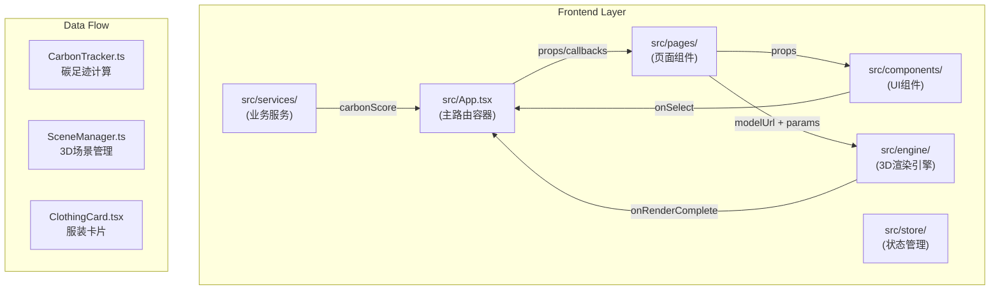
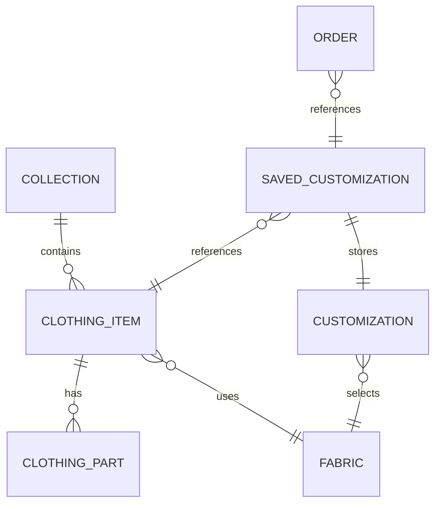

## 1. 架构设计



## 2. 技术描述

- **前端框架**：React 18 + TypeScript 5
- **构建工具**：Vite 5 + @vitejs/plugin-react 4
- **3D渲染**：Three.js 0.160 + @react-three/fiber 8 + @react-three/drei 9
- **路由管理**：React Router DOM 6
- **状态管理**：Zustand 4
- **UI组件**：Tailwind CSS 3 + React Icons 5
- **Toast提示**：React Hot Toast 2
- **图表**：Recharts 2（碳足迹趋势图、饼图）

## 3. 目录结构

```
src/
├── App.tsx                 # 主应用容器，路由配置，全局状态
├── main.tsx                # 应用入口
├── index.css               # 全局样式，Tailwind配置
├── components/             # UI组件模块
│   ├── ClothingCard.tsx       # 服装展示卡片
│   ├── CollectionCard.tsx     # 系列展示卡片
│   ├── CarbonRating.tsx       # 碳足迹星级组件
│   ├── CarbonProgress.tsx     # 碳足迹进度条
│   ├── ColorPicker.tsx        # 颜色选择器
│   ├── FabricSelector.tsx     # 面料选择器
│   ├── CarbonTrendChart.tsx   # 碳足迹趋势图
│   ├── CarbonPieChart.tsx     # 面料使用饼图
│   ├── FloatingLeaf.tsx       # 浮动绿叶图标
│   ├── CarbonDashboard.tsx    # 碳足迹仪表盘
│   └── OrderForm.tsx          # 订单表单
├── engine/                 # 3D渲染模块
│   ├── SceneManager.ts        # 3D场景管理类
│   ├── ClothingModel.tsx      # 3D服装模型组件
│   └── ModelLoader.ts         # 模型加载器（LOD+压缩）
├── services/               # 业务服务模块
│   ├── CarbonTracker.ts       # 碳足迹计算服务
│   └── OrderService.ts        # 订单服务
├── pages/                  # 页面组件
│   ├── HomePage.tsx           # 首页
│   ├── CollectionPage.tsx     # 系列列表页
│   ├── DetailPage.tsx         # 服装详情页
│   ├── WishlistPage.tsx       # 心愿单页面
│   └── CheckoutPage.tsx       # 订单提交页
├── store/                  # 状态管理
│   └── useAppStore.ts         # Zustand全局状态
├── types/                  # 类型定义
│   └── index.ts               # 所有TypeScript类型
├── data/                   # Mock数据
│   ├── collections.ts         # 系列数据
│   └── clothing.ts            # 服装数据
└── utils/                  # 工具函数
    ├── animations.ts          # 动画常量
    └── colors.ts              # 颜色工具函数
```

## 4. 数据流向与调用关系

### 4.1 模块间数据流

```
App.tsx (状态管理中心)
  │
  ├──→ HomePage (系列列表)
  │     └──→ CollectionCard (接收collection对象)
  │           └── onClick → 路由跳转 /collection/:id
  │
  ├──→ CollectionPage (服装列表)
  │     ├──→ useAppStore (获取当前系列服装)
  │     └──→ ClothingCard (接收clothing对象)
  │           ├──→ CarbonRating (接收carbonScore)
  │           └── onClick → 路由跳转 /detail/:id
  │
  ├──→ DetailPage (3D详情+定制)
  │     ├──→ useAppStore (获取当前服装)
  │     ├──→ ClothingModel (3D组件，接收modelUrl + customization)
  │     │     ├──→ SceneManager (接收颜色/面料参数)
  │     │     └── onRenderComplete → 更新App状态
  │     ├──→ FabricSelector (接收fabrics列表)
  │     │     └── onSelect → CarbonTracker.calculate()
  │     ├──→ ColorPicker (接收colors + selectedColor)
  │     │     └── onSelect → 更新3D模型颜色
  │     ├──→ CarbonProgress (接收实时score)
  │     └──→ CarbonTrendChart (接收history数组)
  │
  ├──→ CarbonTracker (服务)
  │     ├── calculate(fabric, complexity) → score
  │     └── onUpdate → App.tsx更新展示
  │
  └──→ CarbonDashboard (全局组件)
        ├──→ useAppStore (累计数据)
        └──→ CarbonPieChart (面料使用比例)
```

### 4.2 核心调用关系

| 调用方 | 被调用方 | 传递数据 | 返回数据 |
|--------|----------|----------|----------|
| App.tsx | CarbonTracker.calculate | fabricType, complexity | carbonScore (0-10) |
| DetailPage | SceneManager.setColor | colorHex, partName | void |
| DetailPage | SceneManager.setFabric | fabricTexture, roughness | void |
| ClothingCard | CarbonTracker.getRating | clothingId | stars (1-5) |
| OrderForm | OrderService.submit | orderData | {success, orderId} |

## 5. 路由定义

| 路由路径 | 页面组件 | 用途 |
|----------|----------|------|
| `/` | HomePage | 首页，展示3个服装系列 |
| `/collection/:id` | CollectionPage | 系列详情页，瀑布流服装列表 |
| `/detail/:id` | DetailPage | 服装详情页，3D查看+定制 |
| `/wishlist` | WishlistPage | 心愿单页面 |
| `/checkout/:customizationId` | CheckoutPage | 订单提交页 |

## 6. 类型定义

```typescript
// 服装系列
interface Collection {
  id: string;
  name: string;
  description: string;
  theme: 'spring' | 'urban' | 'coastal';
  themeColors: [string, string];
  thumbnailUrl: string;
}

// 服装单品
interface ClothingItem {
  id: string;
  name: string;
  designer: string;
  designerAvatar: string;
  collectionId: string;
  baseCarbonScore: number;
  modelUrl: string;
  parts: ClothingPart[];
  defaultFabric: FabricType;
  defaultColors: Record<string, string>;
}

// 服装部件
interface ClothingPart {
  id: string;
  name: string;
  meshName: string;
}

// 面料类型
type FabricType = 'organicCotton' | 'recycledPolyester' | 'tencel' | 'hemp';

interface Fabric {
  type: FabricType;
  name: string;
  carbonFactor: number; // 碳足迹因子
  colorPalette: string[];
  roughness: number;
  metalness: number;
}

// 定制参数
interface Customization {
  fabric: FabricType;
  colors: Record<string, string>; // partId -> color
}

// 定制方案（心愿单）
interface SavedCustomization {
  id: string;
  clothingId: string;
  customization: Customization;
  carbonScore: number;
  savedAt: number;
  thumbnail: string;
}

// 碳足迹历史
interface CarbonHistoryEntry {
  step: number;
  score: number;
  timestamp: number;
}

// 订单
interface Order {
  id?: string;
  customerName: string;
  email: string;
  deliveryDate: string;
  customizationId: string;
  clothingId: string;
  totalCarbonSaved: number;
}

// 全局统计
interface CarbonStats {
  totalCarbonSaved: number;
  ecoClothingCount: number;
  fabricUsage: Record<FabricType, number>;
}
```

## 7. 数据模型



## 8. 性能优化策略

### 8.1 3D性能
- **模型LOD**：根据距离自动切换低/中/高多边形模型
- **纹理压缩**：使用KTX2/Basis压缩纹理，减少GPU内存占用
- **实例化渲染**：对于重复元素使用InstancedMesh
- **状态最小化**：仅在必要时更新材质uniforms

### 8.2 前端性能
- **React.memo**：包装列表项组件，避免不必要重渲染
- **虚拟滚动**：长列表使用react-window
- **代码分割**：按路由分割，3D引擎按需加载
- **Web Worker**：碳足迹计算在Worker中执行（<50ms目标）

### 8.3 动画性能
- **transform/opacity**：仅使用GPU加速属性
- **will-change**：提前提示浏览器优化
- **requestAnimationFrame**：所有动画与帧同步
