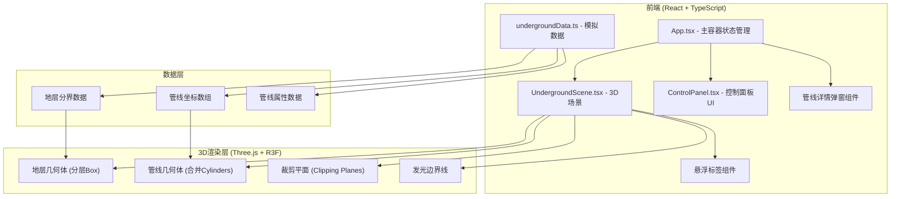
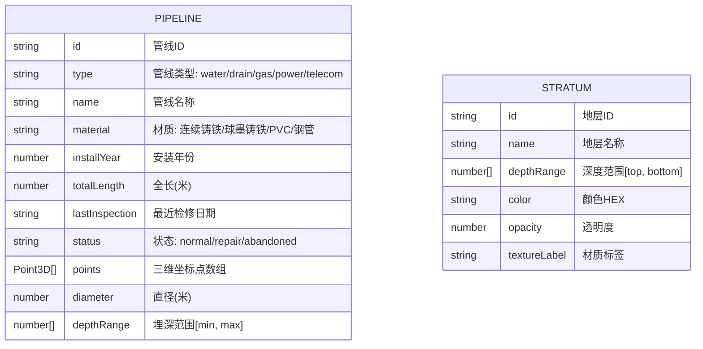

## 1. 架构设计



## 2. 技术说明
- **前端框架**：React@18 + TypeScript
- **3D引擎**：three@0.160 + @react-three/fiber@8 + @react-three/drei@9
- **构建工具**：Vite@5 + @vitejs/plugin-react@4
- **UI增强**：react-hot-toast@2（提示反馈）、react-icons@5（图标）
- **初始化方式**：Vite react-ts模板
- **后端**：无，纯前端应用，使用模拟数据

## 3. 路由定义
| 路由 | 用途 |
|------|------|
| / | 主页面，包含完整3D场景和控制面板 |

## 4. 数据模型

### 4.1 数据模型定义



### 4.2 数据结构说明
- **管线数据**：每条管线由多个三维坐标点[x,y,z]组成路径，y轴表示深度（向下为正），直径随深度变化0.08-0.15米
- **地层数据**：共5层（地表植被+4层地下），每层定义深度范围、颜色、透明度和材质标签
- **管线类型映射**：water(#3B82F6蓝色)、drain(#10B981绿色)、gas(#F59E0B黄色)、power(#EF4444红色)、telecom(#F97316橙色)

## 5. 项目文件结构
```
auto76/
├── package.json
├── index.html
├── tsconfig.json
├── vite.config.ts
└── src/
    ├── App.tsx              # 主应用容器，状态管理中心
    ├── main.tsx             # 应用入口
    ├── index.css            # 全局样式
    ├── Scenes/
    │   └── UndergroundScene.tsx  # 3D地下场景
    ├── Components/
    │   ├── ControlPanel.tsx      # 控制面板
    │   ├── PipelineDetail.tsx    # 管线详情弹窗
    │   └── HoverLabel.tsx        # 悬浮标签
    └── Data/
        └── undergroundData.ts    # 模拟数据
```
