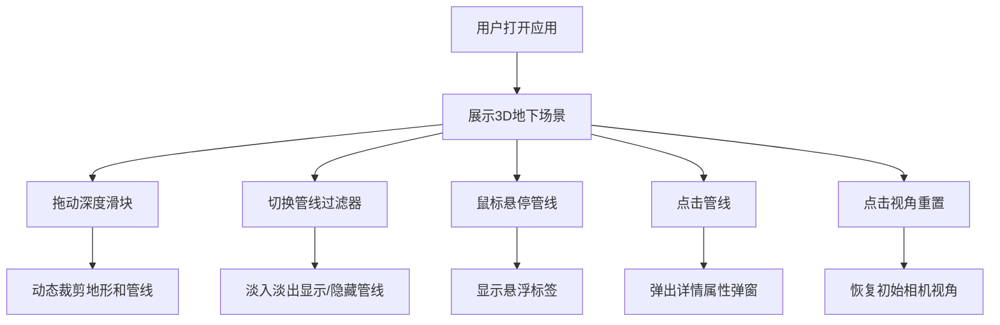

## 1. 产品概述
地下侦探是一款微型地下管线与地质剖面3D交互可视化工具，用于直观展示城市地下5米范围内的管线布局和地质结构。目标用户为城市规划师、市政工程师和管线管理人员，帮助他们快速理解地下空间分布，辅助决策和教学演示。

## 2. 核心功能

### 2.1 用户角色
| 角色 | 注册方式 | 核心权限 |
|------|----------|----------|
| 普通用户 | 无需注册 | 浏览3D场景、调整深度、过滤管线、查看管线详情 |

### 2.2 功能模块
1. **3D地下场景**：地形截面展示、管线可视化、地层着色分层
2. **控制面板**：深度滑块、管线过滤器、视角重置、深度标签
3. **管线详情弹窗**：管线属性卡片展示、状态标签
4. **悬浮标签**：悬停显示管线基本信息

### 2.3 页面详情
| 页面名称 | 模块名称 | 功能描述 |
|----------|----------|----------|
| 主页面 | 3D场景 | 展示10x10x5米地下区域，含地层、管线、裁剪面 |
| 主页面 | 控制面板 | 深度范围调节、管线过滤开关、视角重置按钮 |
| 主页面 | 管线详情弹窗 | 展示管线类型、材质、安装年份、全长、检修日期、状态 |
| 主页面 | 悬浮标签 | 鼠标悬停时显示管线名称、材质、埋深范围 |
| 主页面 | Logo和标题 | 左上角显示应用图标和名称"地下侦探" |

## 3. 核心流程
用户打开应用 → 查看默认3D地下场景 → 拖动深度滑块裁剪场景 → 使用管线过滤器开关切换显示 → 悬停管线查看基本信息 → 点击管线查看详细属性 → 点击视角重置恢复初始视角

## 4. 用户界面设计

### 4.1 设计风格
- **主色调**：深蓝黑色渐变背景（#0f0c29到#302b63）
- **字体颜色**：主色白色，次级浅灰色#AAAAAA
- **管线颜色**：给水蓝(#3B82F6)、排水绿(#10B981)、燃气黄(#F59E0B)、电力红(#EF4444)、通信橙(#F97316)
- **按钮风格**：扁平光效，圆角，悬停缩放1.05倍，点击反馈，过渡0.15s
- **面板风格**：毛玻璃效果，背景透明度0.7，圆角12px
- **字体**：现代无衬线字体，标题醒目，正文清晰

### 4.2 页面设计概览
| 页面名称 | 模块名称 | UI元素 |
|----------|----------|--------|
| 主页面 | 3D场景 | 中央全屏展示，地层分层着色，管线彩色圆柱，发光边界线 |
| 主页面 | Logo区域 | 左上角40px图标+标题"地下侦探"，白色线条风格 |
| 主页面 | 控制面板 | 右下角固定，滑入动画0.3s，含滑块、复选框、按钮 |
| 主页面 | 深度标签 | 右上角悬浮白色16px字体带阴影 |
| 主页面 | 管线详情 | 右侧滑入弹窗，深色半透明遮罩，卡片悬停淡蓝色背景缩放1.02 |
| 主页面 | 悬浮标签 | 管线旁白色半透明气泡，淡蓝色光晕高亮 |

### 4.3 响应式
桌面端优先设计，自适应窗口大小，3D场景随窗口缩放，控制面板固定位置。

### 4.4 3D场景指引
- **环境**：深蓝黑色空间背景，柔和环境光+方向光
- **光照**：AmbientLight强度0.6，DirectionalLight强度0.8
- **相机**：PerspectiveCamera初始位置(8, 6, 8)，看向场景中心，OrbitControls支持旋转缩放平移
- **构图**：10x10x5米长方体区域居中，地层水平分层，管线蜿蜒分布
- **交互**：悬停高亮+标签，点击详情弹窗，深度裁剪动态切片
- **后处理**：管线光泽材质反射，层间发光边界，裁剪面网格线
- **性能**：管线几何体合并减少Draw Call，帧率30FPS以上，裁剪响应<50ms
