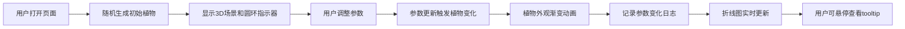

## 1. 产品概述

在线虚拟植物养成与生态模拟应用，用户可以在3D室内花盆场景中种植和照料虚拟植物，通过调整光照、水分、温度参数观察植物的动态生长变化，系统自动记录生长数据并以可视化图表展示。

- 核心价值：提供沉浸式的虚拟植物养成体验，让用户在数字世界中感受植物生长的乐趣，了解环境参数对植物的影响
- 目标用户：喜欢养成类游戏、植物爱好者、对生态模拟感兴趣的用户

## 2. 核心功能

### 2.1 功能模块
1. **3D植物场景**：低多边形风格的室内花盆场景，包含三种植物（多肉、蕨类、薄荷），环境参数圆环指示器
2. **环境参数控制面板**：光照、水分、温度三个圆角滑块，实时显示当前值
3. **生长日志图表**：Canvas绘制的折线图，展示三个参数的历史变化趋势
4. **交互反馈**：参数调整动画、植物生长动画、按钮交互动效

### 2.3 页面详情
| 页面名称 | 模块名称 | 功能描述 |
|-----------|-------------|---------------------|
| 主页面 | 3D植物场景 | 使用Three.js渲染低多边形风格植物，根据环境参数动态改变外观（形态、颜色、叶片角度） |
| 主页面 | 圆环指示器 | 三个半透明圆环分别显示光照（黄）、水分（蓝）、温度（红）的当前值，带1.5s呼吸动画 |
| 主页面 | 参数控制面板 | 右侧卡片式布局，三个圆角滑块控制环境参数，拖动时轨道填充色渐变变化 |
| 主页面 | 生长日志图表 | 底部Canvas折线图，实时记录参数变化，支持tooltip显示，默认展示24小时数据 |
| 主页面 | 操作按钮 | 浇水、施肥按钮，点击后对应参数变化，带0.2s缩放反馈 |

## 3. 核心流程

用户打开页面 → 随机生成初始植物（多肉/蕨类/薄荷）→ 系统显示初始环境参数和圆环指示器 → 用户拖动滑块调整参数或点击浇水/施肥按钮 → 植物在5-10秒内逐渐变化外观（带0.3s抖动动画）→ 系统记录参数变化时间戳 → 底部折线图实时更新 → 用户可以悬停查看具体数值

## 4. 用户界面设计

### 4.1 设计风格
- **主色调**：暖木色#8D6E63和冷灰蓝#546E7A
- **背景色**：暖灰色#F5F0EB
- **陶土色花盆**：#D2B48C带颗粒纹理阴影
- **参数颜色**：光照#FFD700、水分#4FC3F7、温度#FF7043
- **按钮样式**：圆角卡片式，0.2s缩放和阴影变化反馈
- **布局**：整体卡片式布局，卡片间距8px，圆角8px
- **字体**：选用现代无衬线字体，标题稍粗，正文清晰易读

### 4.2 页面设计概述
| 页面名称 | 模块名称 | UI元素 |
|-----------|-------------|-------------|
| 主页面 | 3D场景区域 | 居中显示，暖灰色背景，陶土色花盆，低多边形植物，三个环绕的半透明圆环指示器 |
| 主页面 | 控制面板 | 右侧卡片，包含三个滑块组，每个滑块有标签、当前值显示、圆角轨道（高6px，圆角3px） |
| 主页面 | 操作按钮区 | 浇水、施肥按钮，卡片式布局，点击反馈 |
| 主页面 | 生长日志 | 底部卡片，Canvas折线图，右上角图例，悬停tooltip从下方0.2s滑入 |

### 4.3 响应式
- 桌面端：左右两栏布局（左侧3D场景，右侧控制面板），底部横跨生长日志
- 移动端：单列堆叠布局（3D场景 → 控制面板 → 生长日志）
- 触摸优化：滑块触摸区域扩大，按钮最小触控尺寸48px

### 4.4 3D场景指导
- **环境**：暖灰色背景#F5F0EB，柔和的环境光和方向光
- **光照设置**：环境光+方向光，阴影柔和，营造温馨的室内氛围
- **相机设置**：透视相机，略微俯视角度，自动适配容器大小
- **构图**：花盆居中，植物在花盆中央，圆环指示器环绕植物周围
- **动画**：植物变化过渡动画5-10秒，参数调整时0.3s轻微抖动，圆环1.5s呼吸动画
- **后处理**：轻微抗锯齿，保持低多边形风格清晰
- **性能**：植物渲染更新≤30ms，折线图1000+数据点保持60fps
