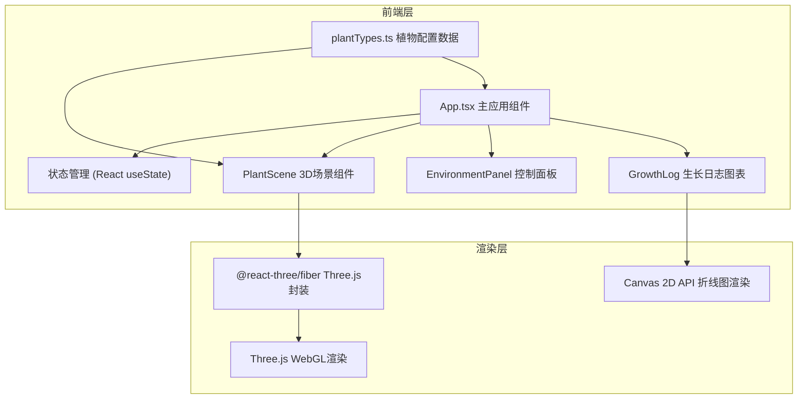

## 1. 架构设计



## 2. 技术描述

- **前端框架**：React@18 + TypeScript@5
- **构建工具**：Vite@5 + @vitejs/plugin-react@4
- **3D渲染**：Three.js@0.160 + @react-three/fiber@8 + @react-three/drei@9
- **图标库**：react-icons@4
- **消息提示**：react-hot-toast@2
- **状态管理**：React useState（轻量级场景，无需额外状态库）
- **样式方案**：CSS Modules / 内联样式（按组件拆分）

## 3. 项目结构

```
d:\Pro\tasks\auto77\
├── package.json
├── index.html
├── vite.config.ts
├── tsconfig.json
└── src/
    ├── App.tsx              # 主应用组件，全局状态管理
    ├── components/
    │   ├── EnvironmentPanel.tsx   # 环境参数控制面板（纯UI）
    │   ├── PlantScene.tsx         # 3D植物场景组件
    │   └── GrowthLog.tsx          # 生长日志折线图组件
    └── data/
        └── plantTypes.ts          # 植物类型配置和生长规则
```

## 4. 数据模型

### 4.1 环境参数类型
```typescript
interface EnvironmentParams {
  light: number;      // 0-100
  water: number;      // 0-100
  temperature: number; // 0-100
}
```

### 4.2 植物类型定义
```typescript
type PlantType = 'succulent' | 'fern' | 'mint';

interface PlantConfig {
  type: PlantType;
  name: string;
  initialParams: EnvironmentParams;
  optimalRange: {
    light: [number, number];
    water: [number, number];
    temperature: [number, number];
  };
  growthRules: {
    // 各参数对植物外观的影响系数
    lightEffect: number;
    waterEffect: number;
    temperatureEffect: number;
  };
}
```

### 4.3 生长日志记录
```typescript
interface GrowthLogEntry {
  timestamp: number;
  params: EnvironmentParams;
}
```

## 5. 核心数据流

1. **App.tsx** 管理全局状态：当前植物类型、环境参数、生长日志数组
2. **EnvironmentPanel** 接收当前参数作为props，用户操作时通过回调通知App更新
3. **PlantScene** 接收环境参数和植物类型作为props，计算并渲染植物外观变化
4. **GrowthLog** 接收日志数组作为props，使用Canvas绘制实时折线图
5. 参数变化时，App记录新的日志条目并传递给GrowthLog

## 6. 性能优化策略

### 6.1 3D渲染性能
- 使用 @react-three/fiber 的自动更新机制，仅在props变化时重渲染
- 植物模型使用低多边形几何体，控制面数
- 使用 useFrame 钩子实现高效动画循环
- 参数变化过渡使用 lerp 线性插值，避免逐帧全量更新

### 6.2 图表渲染性能
- Canvas 2D 直接绘制，避免DOM操作开销
- 数据点超过1000个时启用降采样
- 使用 requestAnimationFrame 同步刷新
- tooltip使用CSS transform提升渲染性能

### 6.3 React 渲染优化
- 使用 React.memo 包裹纯UI组件（EnvironmentPanel）
- 回调函数使用 useCallback 缓存
- 状态更新批量处理，避免频繁重渲染
