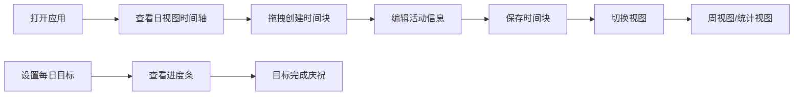

## 1. 产品概述

时间规划微型应用，帮助用户可视化地规划和管理个人每日时间分配，解决用户对时间流逝缺乏直观感受、难以坚持时间规划、无法复盘每日时间去向的问题。

- 主要用途：个人时间管理、每日规划、时间复盘
- 目标用户：需要提升时间管理效率的个人用户
- 产品价值：通过可视化时间轴和多维度统计，让用户直观感知时间分配，培养良好的时间管理习惯

## 2. 核心功能

### 2.1 用户角色
无需注册登录，单机应用，所有数据本地存储。

| 角色 | 注册方式 | 核心权限 |
|------|----------|----------|
| 普通用户 | 无需注册 | 完整使用所有功能 |

### 2.2 功能模块
1. **时间轴模块**：24小时垂直时间轴、拖拽创建时间块、时间块编辑/删除
2. **视图切换模块**：日视图、周视图、统计视图三种展示模式
3. **目标管理模块**：每日时间目标设置、进度追踪、完成庆祝效果
4. **统计分析模块**：饼图展示时间占比、堆叠条形图展示周数据

### 2.3 页面详情
| 页面名称 | 模块名称 | 功能描述 |
|----------|----------|----------|
| 主应用 | 时间轴渲染 | 垂直24小时时间轴，30分钟一格，支持拖拽创建时间块 |
| 主应用 | 时间块交互 | 点击编辑、悬停显示备注、左侧类别图标 |
| 主应用 | 视图切换 | 底部标签栏切换日/周/统计视图 |
| 主应用 | 目标进度 | 顶部进度条展示目标完成情况，底部高亮未完成目标 |
| 统计视图 | 数据可视化 | 饼图+堆叠条形图展示过去7天时间分配 |

## 3. 核心流程

用户打开应用 → 查看当日时间轴 → 拖拽创建时间块 → 编辑活动信息 → 切换视图查看周数据或统计 → 设置每日目标 → 查看完成进度

## 4. 用户界面设计

### 4.1 设计风格
- 深色主题：背景#0F0F23，卡片背景#1E1E3F带毛玻璃效果
- 主色调：紫蓝#6C63FF，强调色：荧光绿#2ECC71、金黄#F1C40F
- 字体：JetBrains Mono（等宽数字时间显示）、Inter（中文）
- 圆角：统一8px
- 过渡动画：所有交互元素0.2s-0.4s平滑过渡

### 4.2 页面设计概述
| 页面名称 | 模块名称 | UI元素 |
|----------|----------|--------|
| 主应用 | 时间轴 | 深蓝灰渐变背景、30分钟刻度、红色当前时间指示器（呼吸动画）、拖拽预览块（半透明蓝色） |
| 主应用 | 时间块 | 彩色标签、类别图标、悬停宽度微增、备注气泡 |
| 主应用 | 编辑卡片 | 弹性放大出现、emoji输入、10色预设色板、闪烁选择效果 |
| 主应用 | 底部标签栏 | 三个扁平图标按钮、滑动指示条动画 |
| 统计视图 | 图表 | 渐变色饼图、悬停外扩效果、堆叠条形图 |
| 主应用 | 目标进度 | 彩色圆点标记、金色闪烁完成动画、彩纸粒子效果 |

### 4.3 响应式
- 桌面端（≥768px）：默认布局
- 移动端（<768px）：时间块宽度80%、底部标签栏可滑动、周视图列宽100%自适应

## 5. 性能要求
- 拖拽创建时间块响应延迟 <16ms
- 视图切换动画保持60fps
- 统计视图数据渲染耗时 <30ms
