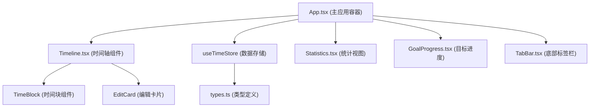

## 1. 架构设计



## 2. 技术描述
- 前端：React@18 + TypeScript + Vite
- 状态管理：React Context + useReducer
- 图表库：recharts
- 动画库：framer-motion
- 图标库：react-icons
- 样式：CSS Modules + 自定义CSS变量

## 3. 文件结构
```
src/
├── App.tsx              # 主应用容器
├── components/
│   ├── Timeline.tsx     # 时间轴组件
│   ├── TimeBlock.tsx    # 时间块组件
│   ├── EditCard.tsx     # 编辑卡片组件
│   ├── Statistics.tsx   # 统计视图组件
│   ├── GoalProgress.tsx # 目标进度组件
│   └── TabBar.tsx       # 底部标签栏
├── data/
│   └── store.ts         # 数据存储与计算
└── types/
    └── types.ts         # 类型定义
```

## 4. 数据模型

### 4.1 核心类型定义
```typescript
enum Category {
  Work = 'work',
  Learning = 'learning',
  Life = 'life',
  Sport = 'sport',
  Social = 'social',
  Other = 'other'
}

type ViewType = 'day' | 'week' | 'statistics';

interface TimeBlock {
  id: string;
  startTime: number; // 分钟数 0-1439
  endTime: number;
  category: Category;
  color: string;
  name: string;
  note: string;
  date: string; // YYYY-MM-DD
}

interface DailyGoal {
  id: string;
  category: Category;
  targetMinutes: number;
  color: string;
}
```

### 4.2 数据存储
- 使用 localStorage 持久化存储
- useTimeStore Hook 提供：
  - blocks: TimeBlock[]
  - goals: DailyGoal[]
  - createBlock(block: Omit<TimeBlock, 'id'>): void
  - updateBlock(id: string, updates: Partial<TimeBlock>): void
  - deleteBlock(id: string): void
  - getBlocksByDate(date: string): TimeBlock[]
  - getWeeklyStats(): WeeklyStats
  - getDailyProgress(date: string): GoalProgress[]

## 5. 核心函数

### 5.1 时间计算函数
```typescript
// 获取当前日期字符串 YYYY-MM-DD
function getCurrentDate(): string;

// 分钟数转时间字符串 HH:MM
function minutesToTime(minutes: number): string;

// 时间字符串转分钟数
function timeToMinutes(time: string): number;

// 计算时间块高度（每30分钟一格，每格高度可配置）
function calculateBlockHeight(startTime: number, endTime: number): number;

// 计算时间块顶部位置
function calculateBlockTop(startTime: number): number;
```

### 5.2 统计计算函数（纯函数，<30ms执行）
```typescript
// 计算每日各类别总时长
function calculateDailyStats(blocks: TimeBlock[], date: string): Record<Category, number>;

// 计算过去7天统计数据
function calculateWeeklyStats(blocks: TimeBlock[]): {
  dates: string[];
  categoryTotals: Record<Category, number>;
  dailyData: Array<{ date: string; [key: string]: number | string }>;
};

// 计算目标完成进度
function calculateGoalProgress(
  blocks: TimeBlock[],
  goals: DailyGoal[],
  date: string
): Array<{ goal: DailyGoal; completed: number; percentage: number }>;
```

## 6. 组件职责

### 6.1 App.tsx
- 管理视图切换状态（day/week/statistics）
- 管理全局主题状态
- 调度时间块数据流
- 组合子组件

### 6.2 Timeline.tsx
- 渲染24小时垂直时间轴
- 处理拖拽创建时间块
- 处理时间块点击编辑
- 根据viewType切换日/周视图
- 渲染当前时间指示器

### 6.3 TimeBlock.tsx
- 渲染单个时间块
- 处理悬停效果和备注气泡
- 显示类别图标
- 弹性动画效果

### 6.4 EditCard.tsx
- 活动名称编辑（支持emoji）
- 颜色标签选择（10种预设色）
- 备注编辑
- 类别选择
- 删除功能

### 6.5 Statistics.tsx
- 饼图展示各类别时间占比
- 堆叠条形图展示周数据
- 悬停交互效果
- 视图切换动画

### 6.6 GoalProgress.tsx
- 顶部进度条展示
- 完成时金色闪烁动画
- 彩纸粒子效果
- 底部未完成目标高亮

### 6.7 TabBar.tsx
- 三个视图切换按钮
- 选中项滑动指示条
- 响应式适配
