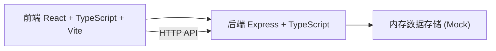
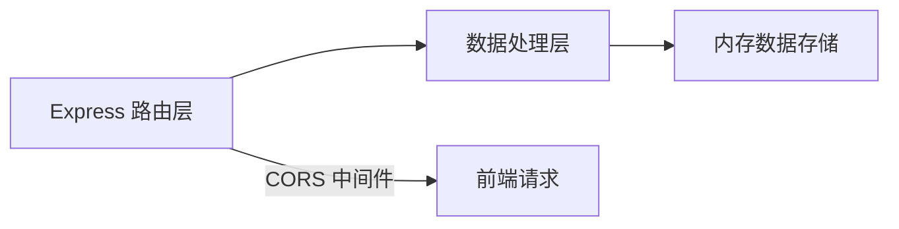
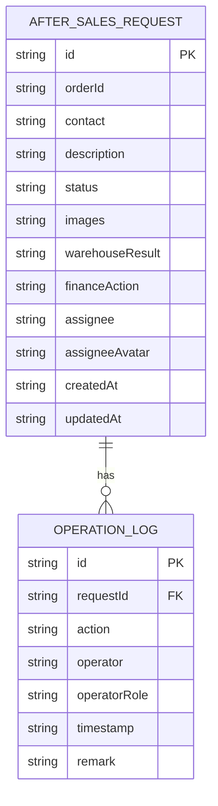

## 1. 架构设计

采用前后端分离架构，前端React负责页面展示和交互，后端Express提供API接口和数据存储。



## 2. 技术描述

- 前端：React 18 + TypeScript + Vite
- 构建工具：Vite
- 后端：Express 4 + TypeScript
- 样式：CSS Modules / 内联样式
- 状态管理：React useState/useReducer
- 图标：lucide-react
- 跨域：cors 中间件
- 数据模拟：内存数据 + uuid 生成ID

## 3. 项目文件结构

```
.
├── package.json
├── vite.config.ts
├── tsconfig.json
├── index.html
├── server/
│   ├── index.ts       # Express服务入口
│   └── data.ts        # 模拟数据
└── src/
    ├── main.tsx       # React入口
    ├── pages/
    │   └── Dashboard.tsx  # 看板主页面
    ├── components/
    │   ├── RequestCard.tsx   # 请求卡片组件
    │   └── StatusColumn.tsx  # 状态列组件
    └── services/
        └── apiService.ts     # API服务层
```

## 4. API 定义

### 4.1 数据类型定义

```typescript
interface AfterSalesRequest {
  id: string;
  orderId: string;
  contact: string;
  description: string;
  status: 'pending' | 'warehouse_check' | 'finance_process' | 'completed';
  images: string[];
  warehouseResult?: 'repairable' | 'exchangeable' | 'refund_suggested';
  financeAction?: 'original_refund' | 'coupon' | 'close';
  assignee?: string;
  assigneeAvatar?: string;
  logs: OperationLog[];
  createdAt: string;
  updatedAt: string;
}

interface OperationLog {
  id: string;
  action: string;
  operator: string;
  operatorRole: 'customer_service' | 'warehouse' | 'finance';
  timestamp: string;
  remark?: string;
}
```

### 4.2 接口列表

| 方法 | 路径 | 描述 |
|------|------|------|
| GET | /api/requests | 获取所有售后请求列表 |
| POST | /api/requests | 创建新的售后请求 |
| PATCH | /api/requests/:id/status | 更新请求状态 |

### 4.3 请求/响应示例

**GET /api/requests**
- 响应：`{ data: AfterSalesRequest[] }`

**POST /api/requests**
- 请求体：`{ orderId, contact, description, images }`
- 响应：`{ data: AfterSalesRequest }`

**PATCH /api/requests/:id/status**
- 请求体：`{ status, ...其他字段 }`
- 响应：`{ data: AfterSalesRequest }`

## 5. 服务器架构



后端采用简单的三层结构：
- 路由层：处理HTTP请求和响应
- 数据处理层：业务逻辑处理
- 数据存储层：内存数据（模拟数据库）

## 6. 数据模型

### 6.1 数据模型定义



### 6.2 状态枚举

| 状态值 | 显示名称 | 进度 |
|--------|---------|------|
| pending | 待处理 | 25% |
| warehouse_check | 仓库检查中 | 50% |
| finance_process | 财务处理中 | 75% |
| completed | 已完成 | 100% |

## 7. 性能指标

- 看板首次渲染时间：< 800ms
- 拖拽操作反馈延迟：< 100ms
- API响应时间：< 200ms（模拟数据）
