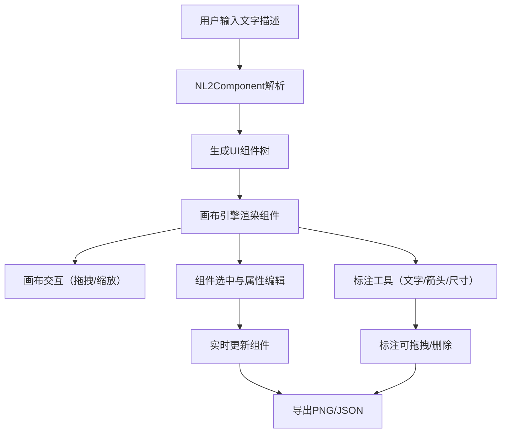

## 1. 产品概述

互动式数字原型图自动生成与标注工具——帮助设计师和产品经理快速将手绘草图或文字描述转化为可交互的模拟界面原型。通过自然语言输入自动解析生成UI组件，支持在无限画布上自由拖拽、缩放、选中编辑属性，并提供文字/箭头/尺寸三种标注工具，最终可导出为PNG图片或JSON组件树。

- 目标用户：UI/UX设计师、产品经理、前端开发者
- 核心价值：从文字描述到可视化原型的极速转换，零门槛上手，秒级出图

## 2. 核心功能

### 2.1 功能模块

1. **主画布页面**：无限画布、组件渲染、标注工具、属性编辑、输入面板

### 2.2 页面详情

| 页面名称 | 模块名称 | 功能描述 |
|----------|----------|----------|
| 主画布页面 | 画布引擎 | 无限画布拖拽平移、鼠标滚轮缩放（以鼠标位置为中心）、淡灰网格线辅助对齐、吸附对齐辅助线、缩放控件（0.25x-4x） |
| 主画布页面 | 自然语言转组件 | 左侧输入面板接收文字描述，解析为标准化UI组件树，支持批量输入自动按列排列（间距20px），组件自动出现在画布中心 |
| 主画布页面 | 组件选中与属性编辑 | 点击选中组件显示浅蓝虚框，右侧滑入属性编辑面板，可编辑位置/大小/颜色/圆角/文字，实时更新无闪烁 |
| 主画布页面 | 标注工具 | 文字标注（双击添加、14px深灰、自动换行）、箭头标注（起止点绘制、等腰三角箭头10px、默认橙色#FF6B35）、尺寸标注（自动测量两组件间水平/垂直距离、蓝色#4A90D9），所有标注可拖拽移动、Delete键删除 |
| 主画布页面 | 导出功能 | 导出PNG（2x分辨率）、导出JSON组件树（文件名prototype_YYYYMMDD_HHmmss.json） |

## 3. 核心流程

用户在左侧输入面板输入自然语言描述 → NL2Component模块解析为组件树 → 画布引擎在画布中心渲染组件 → 用户拖拽/缩放画布查看 → 点击组件选中编辑属性 → 使用标注工具添加标注 → 导出PNG或JSON

## 4. 用户界面设计

### 4.1 设计风格

- 主色调：纯白#FFFFFF背景，浅灰#F0F2F5左侧面板
- 辅助色：浅蓝#4A90D9（选中框/尺寸标注）、橙色#FF6B35（箭头标注）
- 字体：系统默认无衬线字体，标注文字14px深灰#333333
- 布局：三栏布局（左输入面板280px + 中间画布 + 右属性面板300px）
- 图标：lucide-react图标库
- 按钮：圆角按钮，悬停背景#E8E8E8，图标放大1.15倍，点按0.1s按压效果

### 4.2 页面设计概览

| 页面名称 | 模块名称 | UI元素 |
|----------|----------|--------|
| 主画布页面 | 顶部工具栏 | 高48px白底带底部浅阴影，图标按钮组（文字标注/箭头标注/尺寸标注/导出），缩放百分比显示与控件 |
| 主画布页面 | 左侧输入面板 | 宽280px浅灰#F0F2F5背景，文本输入区域，生成按钮，组件列表预览 |
| 主画布页面 | 中间画布区域 | 浅灰#F5F5F5背景，0.5px实线#E0E0E0网格，组件与标注渲染 |
| 主画布页面 | 右侧属性面板 | 宽300px白底带阴影，从右滑入0.4s，属性字段（位置/大小/颜色/圆角/文字） |

### 4.3 响应式设计

- 桌面优先设计，页面宽度≥900px时三栏并排
- 页面宽度<900px时，左侧输入面板自动折叠为底部浮动条，悬浮在画布左下角

### 4.4 动画规范

- 所有交互过渡0.2-0.4s，缓动函数cubic-bezier(0.4, 0, 0.2, 1)
- 组件出现：0.15s淡入 + 0.25s弹性缩放
- 选中框：0.3s出现动画
- 属性面板：0.4s从右滑入
- 缩放动画：0.3s ease-out
- 按钮按压：0.1s下沉效果
