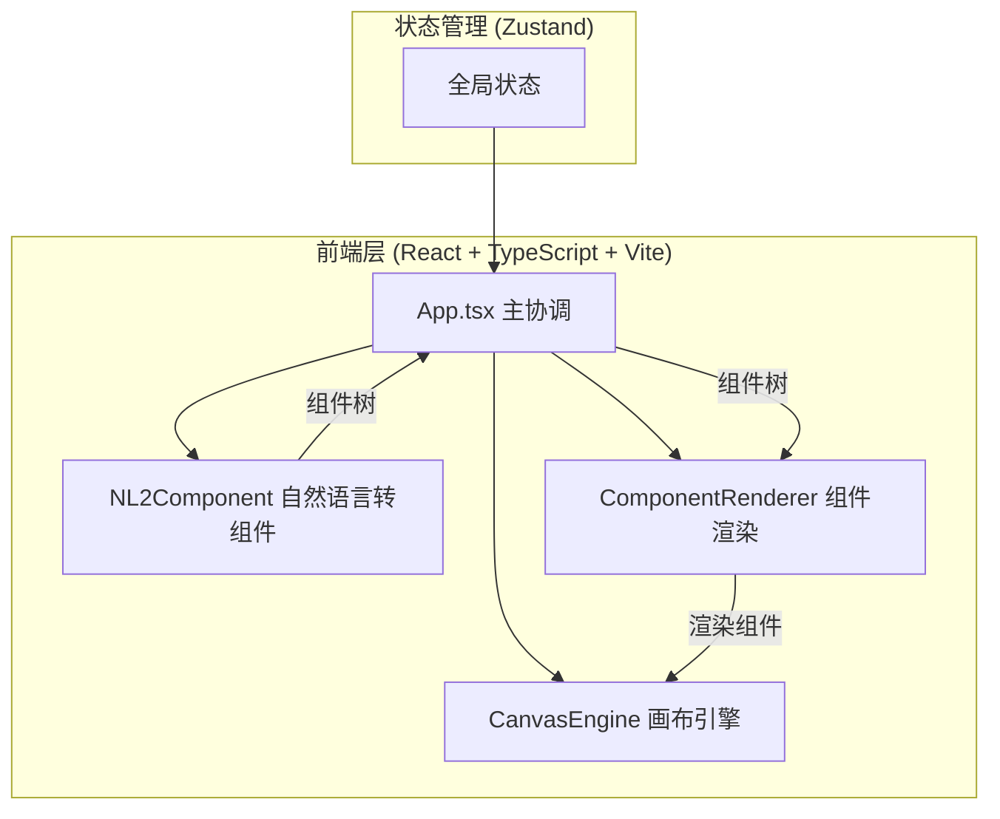

## 1. 架构设计



## 2. 技术说明

- 前端：React@18 + TypeScript + Vite + Tailwind CSS + Zustand
- 初始化工具：vite-init (react-ts模板)
- 后端：无
- 数据库：无
- 状态管理：Zustand
- 动画库：framer-motion
- 图标库：lucide-react
- 提示库：react-hot-toast

## 3. 路由定义

| 路由 | 用途 |
|------|------|
| / | 主画布页面，包含所有功能模块 |

## 4. 文件结构

```
├── package.json
├── index.html
├── tsconfig.json
├── vite.config.ts
├── tailwind.config.js
├── postcss.config.js
├── src/
│   ├── App.tsx                    # 主应用组件，协调三模块数据流
│   ├── main.tsx                   # 入口文件
│   ├── index.css                  # 全局样式
│   ├── types.ts                   # 共享类型定义
│   ├── utils.ts                   # 工具函数
│   ├── store.ts                   # Zustand全局状态
│   ├── engine/
│   │   └── CanvasEngine.tsx       # 画布引擎模块
│   ├── transform/
│   │   └── NL2Component.tsx       # 自然语言转组件模块
│   ├── render/
│   │   └── ComponentRenderer.tsx  # 组件渲染模块
│   ├── components/
│   │   ├── Toolbar.tsx            # 顶部工具栏
│   │   ├── InputPanel.tsx         # 左侧输入面板
│   │   ├── PropertyPanel.tsx      # 右侧属性编辑面板
│   │   ├── AnnotationLayer.tsx    # 标注图层
│   │   └── ZoomControls.tsx       # 缩放控件
│   └── hooks/
│       ├── useCanvas.ts           # 画布交互Hook
│       └── useExport.ts           # 导出Hook
```

## 5. 数据模型

### 5.1 核心类型定义

```typescript
// UI组件树节点
interface UIComponent {
  id: string;
  type: 'button' | 'input' | 'card' | 'navbar' | 'table' | 'text' | 'image' | 'checkbox' | 'select' | 'textarea';
  props: {
    x: number;
    y: number;
    width: number;
    height: number;
    text?: string;
    backgroundColor?: string;
    textColor?: string;
    borderRadius?: number;
    placeholder?: string;
  };
  children?: UIComponent[];
}

// 画布状态
interface CanvasState {
  offsetX: number;
  offsetY: number;
  scale: number;
  isDragging: boolean;
}

// 标注数据
interface Annotation {
  id: string;
  type: 'text' | 'arrow' | 'dimension';
  x: number;
  y: number;
  content?: string;
  endX?: number;
  endY?: number;
  color?: string;
  sourceId?: string;
  targetId?: string;
}
```

## 6. 性能指标

- 画布拖拽和组件选中响应延迟 < 16ms
- 组件树数据处理时间 < 100ms（10个组件以内）
- 导出PNG生成时间 < 1秒
- 画布交互帧率 ≥ 55FPS
- 缩放范围0.25x-4x
