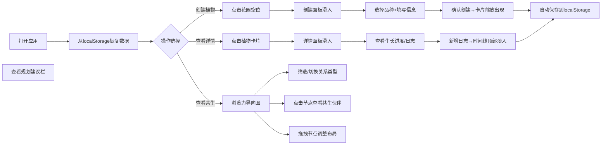

## 1. 产品概述
社区花园作物共生规划与生长记录应用是一款面向社区种植居民的线上工具，帮助用户记录植物生长状态、维护浇水施肥日志，并通过可视化共生关系网络图辅助规划种植布局。
- 主要用途：植物生长记录、日志管理、作物共生关系可视化、种植规划建议
- 目标用户：参与社区花园种植的居民、园艺爱好者
- 产品价值：提升社区花园管理效率，通过科学的作物共生关系提高种植成功率

## 2. 核心功能

### 2.1 用户角色
| 角色 | 注册方式 | 核心权限 |
|------|----------|----------|
| 社区居民 | 无需注册，本地数据存储 | 创建/编辑植物卡片、记录生长日志、查看共生关系图、获取规划建议 |

### 2.2 功能模块
1. **植物卡片管理**：植物创建面板、植物卡片展示、卡片编辑与删除
2. **生长状态记录**：生长进度条（五阶段）、时间线日志管理、日志新增操作
3. **共生关系可视化**：力导向图（d3-force）、品种筛选、关系类型切换、节点交互
4. **种植规划建议**：基于共生数据的搭配推荐、建议卡片列表展示
5. **响应式布局与数据持久化**：多端适配、localStorage数据存储

### 2.3 页面详情
| 页面名称 | 模块名称 | 功能描述 |
|----------|----------|----------|
| 主应用页面 | 植物卡片面板 | 网格布局展示所有植物卡片，支持创建新植物，卡片显示照片/品种/种植日期/生长状态 |
| 主应用页面 | 创建植物面板 | 从底部滑入，选择品种、填写种植日期和备注，创建后卡片缩放出现 |
| 主应用页面 | 植物详情面板 | 从右侧滑入，显示生长进度条、时间线日志、新增日志表单 |
| 主应用页面 | 共生关系力导向图 | d3-force布局，节点拖拽、悬停放大、点击弹出共生伙伴列表、品种与关系筛选 |
| 主应用页面 | 规划建议栏 | 计算有利搭配组合，卡片列表形式展示推荐与理由 |

## 3. 核心流程
用户打开应用 → 从localStorage恢复已有植物数据 → 在花园网格点击空位创建新植物（选择品种→填写信息→确认创建）→ 点击已创建卡片查看详情（查看生长进度→新增日志条目）→ 切换到共生关系图查看网络（筛选品种/切换关系类型→点击节点查看伙伴→拖拽调整布局）→ 查看下方规划建议 → 所有数据自动持久化到localStorage

## 4. 用户界面设计

### 4.1 设计风格
- **主色调**：大地绿 #5B8C5A（悬停变深 #4A7A49）
- **背景色**：浅米色 #FEFAE0，力导向图背景极浅灰绿 #F9FBe7
- **卡片背景**：淡奶油白 #FFFDF7，边框 #E0D5C1（2px圆角）
- **强调色**：番茄红 #E53935、叶绿 #43A047、橙黄 #FF9800、淡紫 #9C27B0、秋菊黄 #FF6F00、薄荷绿 #00BFA5
- **关系色**：有益绿 #4CAF50 实线、有害红 #F44336 虚线、中性灰 #9E9E9E 点线
- **按钮样式**：圆角矩形 border-radius: 8px，悬停向上移动2px（0.2s过渡）
- **字体**：系统字体栈 -apple-system, BlinkMacSystemFont, 'Segoe UI'，正文14px，标题18px
- **阴影**：常规 0 4px 12px rgba(0,0,0,0.08)，悬停加深至 0 8px 24px rgba(0,0,0,0.12)（0.15s过渡）

### 4.2 页面设计概述
| 页面名称 | 模块名称 | UI元素 |
|----------|----------|--------|
| 主应用页面 | 顶部导航栏 | Logo、标题、汉堡菜单按钮（移动端） |
| 主应用页面 | 植物卡片面板 | 花园网格布局、空闲位置占位、植物卡片（照片+品种+日期+进度条） |
| 主应用页面 | 创建植物面板 | 底部滑入、品种图标标签选择器、日期输入、备注输入、确认/取消按钮 |
| 主应用页面 | 详情面板 | 右侧滑入、五段渐变进度条、时间线日志（日期+操作类型+备注）、新增日志表单 |
| 主应用页面 | 共生关系图 | SVG画布、圆形头像节点（30-50px按数量缩放）、三种样式连线、筛选下拉、关系切换单选按钮 |
| 主应用页面 | 规划建议栏 | 浅绿色卡片、左侧品种色竖条、推荐文字+理由、依次0.2s出现动画 |

### 4.3 响应式
- **桌面端（>1024px）**：左右布局，左侧植物面板35%，右侧共生图65%
- **平板端（768-1024px）**：上下布局，植物面板在上，共生图在下
- **移动端（<768px）**：卡片面板可折叠，汉堡图标展开，遮罩层0.5s淡入，单列布局

### 4.4 动画与交互细节
- 卡片创建：scale(0)→scale(1) 0.3s
- 生长进度条：0.4s弹性动画
- 日志条目：从上方滑入 0.3s，新日志追加淡入
- 创建面板：底部滑入 0.35s cubic-bezier(0.22,1,0.36,1)
- 详情面板：右侧滑入 0.4s
- 节点悬停：放大1.2倍+连线加粗
- 节点拖拽：放大1.1倍，连线变虚线，释放弹性弹回0.3s
- 按钮点击：波纹效果ripple 0.4s
- 建议卡片：依次0.2s出现动画
- 连线切换：颜色平滑过渡0.3s
- 遮罩层：淡入0.5s
