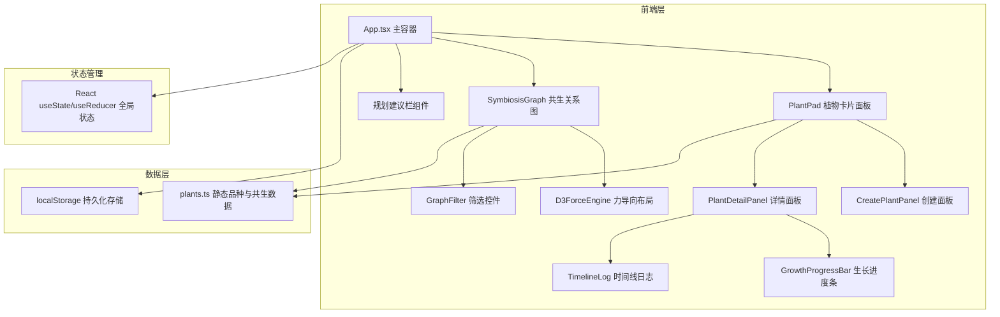
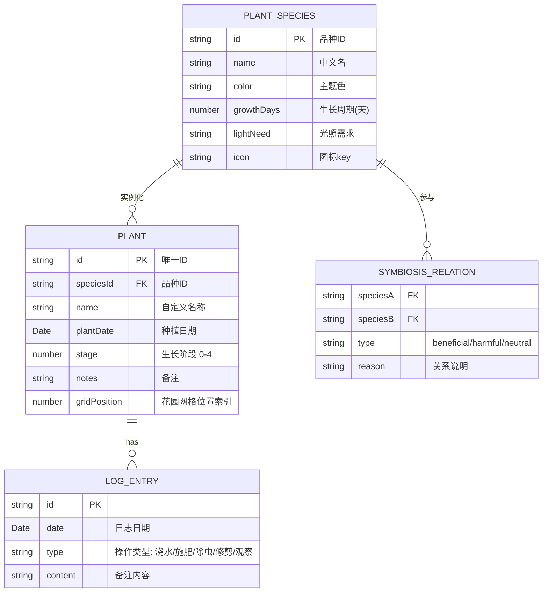

## 1. 架构设计



**文件间调用关系与数据流：**
1. `App.tsx` → 从 `localStorage` 读取初始数据，通过 `useState` 管理 plants 状态，向下传递给 `PlantPad` 和 `SymbiosisGraph`
2. `plants.ts` → 导出静态品种数据（PLANTS）和共生关系数据（SYMBIOSIS_MAP），被 `PlantPad` 创建面板、`SymbiosisGraph`、建议栏共同引用
3. `PlantPad.tsx` → 接收 plants/onCreate/onUpdate/onDelete props，内部渲染植物卡片网格，点击卡片触发详情面板，点击空位触发创建面板
4. `SymbiosisGraph.tsx` → 接收 plants props，内部使用 d3-force 计算布局，根据筛选器展示节点与连线，点击节点展示共生伙伴
5. 数据更新 → `App.tsx` 状态更新 → 立即写入 localStorage → 子组件重新渲染

## 2. 技术描述
- **前端框架**：React 18 + TypeScript 5
- **构建工具**：Vite 5 + @vitejs/plugin-react
- **动画库**：framer-motion（组件级动画）+ CSS transitions（微交互）
- **图形库**：d3-force（力导向图布局计算）
- **UI辅助**：react-icons（图标）、react-hot-toast（轻量通知）
- **数据存储**：浏览器 localStorage（本地持久化，无后端）
- **初始化方式**：手动创建 package.json + 配置文件 + src 源码结构

## 3. 模块职责划分

| 文件路径 | 职责 | 导出内容 |
|----------|------|----------|
| `src/types/index.ts` | 集中定义所有TypeScript类型 | Plant, LogEntry, PlantSpecies, SymbiosisRelation, SymbiosisType 等 |
| `src/data/plants.ts` | 静态品种与共生关系数据 | PLANTS（8个品种详情）, SYMBIOSIS_MAP（品种间关系映射） |
| `src/hooks/useLocalStorage.ts` | localStorage 读写封装 Hook | useLocalStorage(key, defaultValue) |
| `src/hooks/useSymbiosisAdvice.ts` | 种植建议计算逻辑 Hook | 根据当前植物组合计算推荐搭配 |
| `src/components/PlantPad.tsx` | 植物卡片网格面板主组件 | PlantPad (props: plants, onCreate, onUpdate, onDelete) |
| `src/components/PlantCard.tsx` | 单张植物卡片 | PlantCard (props: plant, onClick, onDelete) |
| `src/components/CreatePlantPanel.tsx` | 创建新植物面板 | CreatePlantPanel (props: visible, position, onConfirm, onCancel) |
| `src/components/PlantDetailPanel.tsx` | 植物详情侧滑面板 | PlantDetailPanel (props: plant, visible, onClose, onAddLog, onUpdateProgress, onDelete) |
| `src/components/GrowthProgressBar.tsx` | 五阶段生长进度条 | GrowthProgressBar (props: stage, onChange) |
| `src/components/TimelineLog.tsx` | 时间线日志组件 | TimelineLog (props: logs, onAddLog) |
| `src/components/SymbiosisGraph.tsx` | 共生关系力导向图主组件 | SymbiosisGraph (props: plants) |
| `src/components/PlanningAdvice.tsx` | 规划建议栏 | PlanningAdvice (props: plants) |
| `src/components/Header.tsx` | 顶部导航栏 | Header (props: onToggleMenu) |
| `src/App.tsx` | 主应用容器，路由与全局状态管理 | App (根组件) |
| `src/main.tsx` | React入口挂载点 | 渲染 App 到 DOM |
| `src/index.css` | 全局样式、CSS变量、动画关键帧 | 配色变量、ripple动画、通用工具类 |

## 4. 数据模型

### 4.1 数据模型定义



### 4.2 localStorage 存储键
- `community_garden_plants_v1` → 序列化的 Plant[] 数组

### 4.3 核心类型定义

```typescript
// 生长阶段枚举
type GrowthStage = 0 | 1 | 2 | 3 | 4; // 播种=0, 发芽=1, 幼苗=2, 成熟=3, 收获=4

// 日志操作类型
type LogActionType = '浇水' | '施肥' | '除虫' | '修剪' | '观察';

// 共生关系类型
type SymbiosisType = 'beneficial' | 'harmful' | 'neutral';

// 植物品种
interface PlantSpecies {
  id: string;
  name: string;
  color: string;
  growthDays: number;
  lightNeed: '全日照' | '半日照' | '耐阴';
  icon: string;
}

// 单株植物实例
interface Plant {
  id: string;
  speciesId: string;
  customName?: string;
  plantDate: string; // ISO date
  stage: GrowthStage;
  notes: string;
  gridIndex: number;
  logs: LogEntry[];
}

// 日志条目
interface LogEntry {
  id: string;
  date: string;
  type: LogActionType;
  content: string;
}

// 共生关系
interface SymbiosisRelation {
  speciesA: string;
  speciesB: string;
  type: SymbiosisType;
  reason: string;
}
```

## 5. 性能保障策略

1. **力导向图性能**：
   - d3-force simulation 30节点内 tick 计算节流
   - 仅在节点拖拽时触发 simulation.alpha(0.3)，冷却后自动停止
   - SVG 使用 transform translate 代替重绘节点属性
   - 拖拽时连线样式更新 requestAnimationFrame 节流

2. **动画帧率保障**：
   - framer-motion 使用 transform/opacity 等GPU加速属性
   - 面板滑入使用 will-change: transform 提示浏览器合成层
   - 进度条动画使用 CSS transition 而非 JS 逐帧计算

3. **渲染优化**：
   - 植物卡片 React.memo 包裹，避免无关重渲染
   - localStorage 写入 debounce 300ms，避免频繁IO
   - d3-force 的 tick 回调中批量更新DOM属性

## 6. 配色与样式变量（CSS自定义属性）

```css
:root {
  --color-bg: #FEFAE0;
  --color-card: #FFFDF7;
  --color-card-border: #E0D5C1;
  --color-primary: #5B8C5A;
  --color-primary-hover: #4A7A49;
  --color-graph-bg: #F9FBe7;
  --color-progress-bg: #F5F0EB;
  --color-symbiosis-beneficial: #4CAF50;
  --color-symbiosis-harmful: #F44336;
  --color-symbiosis-neutral: #9E9E9E;
  --color-advice-bg: #E8F5E9;
  --color-advice-border: #C8E6C9;
  --shadow-card: 0 4px 12px rgba(0,0,0,0.08);
  --shadow-card-hover: 0 8px 24px rgba(0,0,0,0.12);
  --radius-btn: 8px;
  --radius-card: 12px;
  --font-family: -apple-system, BlinkMacSystemFont, 'Segoe UI', sans-serif;
}
```
