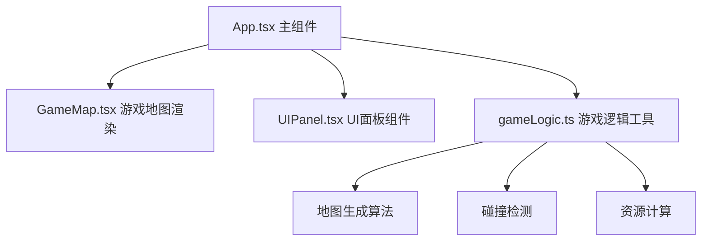

## 1. 架构设计



## 2. 技术栈说明

- 前端框架：React@18 + TypeScript
- 构建工具：Vite@5
- 动画库：framer-motion
- 图标库：react-icons
- 音频：Web Audio API（原生）
- 样式：内联样式 + framer-motion动画

## 3. 文件结构

```
auto84/
├── package.json
├── index.html
├── tsconfig.json
├── vite.config.ts
└── src/
    ├── App.tsx              # 主组件，游戏循环与状态管理
    ├── components/
    │   ├── GameMap.tsx     # 矿洞地图、矿工、矿粒渲染
    │   └── UIPanel.tsx   # 背包栏、熔炼面板、升级按钮
    └── utils/
        └── gameLogic.ts     # 地图生成、碰撞检测、资源计算
```

## 4. 核心数据模型

### 4.1 地图格子类型

```typescript
enum TileType {
  WALL = 0,      // 墙体 #3E2723
  DIGGABLE = 1,  // 可挖掘 #6D4C41
  COAL = 2,        // 煤矿
  IRON = 3,        // 铁矿
  GOLD = 4,        // 金矿
  DIAMOND = 5,      // 钻石矿
  EMPTY = 6          // 已挖空
}
```

### 4.2 玩家状态

```typescript
interface Player {
  x: number;           // 像素坐标X
  y: number;           // 像素坐标Y
  speed: number;         // 移动速度 60px/s
  pickaxeLevel: number;   // 镐头等级
  lampLevel: number;       // 灯等级
  backpackLevel: number;  // 背包等级
}
```

### 4.3 资源背包

```typescript
interface Inventory {
  coal: number;
  iron: number;
  gold: number;
  diamond: number;
  steel: number;      // 钢锭
  ironIngot: number;   // 铁锭
  goldIngot: number;    // 金锭
  diamondRaw: number;  // 钻石原石
}
```

### 4.4 矿粒动画状态

```typescript
interface OreParticle {
  id: string;
  type: 'coal' | 'iron' | 'gold' | 'diamond';
  x: number;
  y: number;
  startX: number;
  startY: number;
  targetX: number;
  targetY: number;
  phase: 'scatter' | 'collect';
  startTime: number;
}
```

## 5. 游戏循环机制

使用requestAnimationFrame驱动60fps游戏循环，每帧处理：
1. 玩家输入处理（WASD移动）
2. 碰撞检测与位置更新
3. 挖掘动画状态更新
4. 矿粒动画更新
5. 渲染画面
