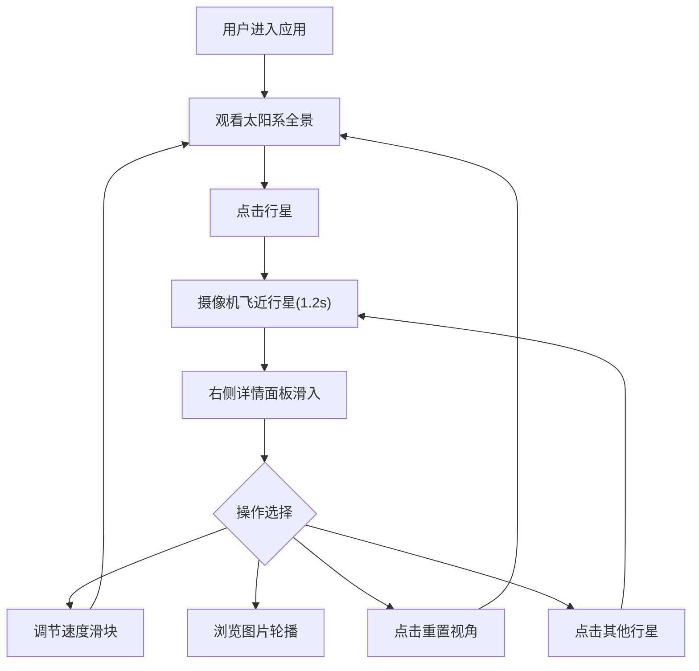

## 1. 产品概述

天文科普馆互动展项——太阳系行星模拟与互动探索应用，通过3D可视化与触摸交互，让参观者直观探索八大行星的轨道运动、自转速度、大小比例和表面纹理等特征，激发青少年对天文学的兴趣。

## 2. 核心功能

### 2.1 功能模块

1. **3D太阳系场景**：太阳自发光渲染、八大行星公转/自转动画、轨道线显示、星空粒子背景
2. **交互控制面板**：行星列表卡片选择、速度滑块控制、缩放按钮
3. **行星详情面板**：行星详细数据展示、图片轮播、重置视角按钮
4. **行星标签系统**：跟随行星的缩写标签，始终面向摄像机

### 2.2 页面详情

| 页面名称 | 模块名称 | 功能描述 |
|---------|---------|---------|
| 主场景 | 3D太阳系 | 太阳+8行星公转/自转动画，轨道线，星空粒子，点击行星飞近，点击空白恢复全景 |
| 左侧面板 | 控制面板 | 行星卡片列表（选中高亮霓虹蓝），速度滑块0x-5x，缩放按钮 |
| 右侧面板 | 详情面板 | 行星名称（颜色随类型）、质量、半径、自转周期、描述、3张轮播图，重置视角按钮 |

## 3. 核心流程

用户进入应用 → 观看太阳系全景 → 点击行星卡片或3D场景中的行星 → 摄像机平滑飞近行星 → 右侧详情面板滑入 → 查看行星信息 → 调节速度滑块 → 点击重置视角恢复全景

## 4. 界面设计

### 4.1 设计风格

- 主色调：深空暗色背景（#0B0E1A → #1A1A3A 径向渐变）
- 强调色：霓虹蓝（#4FC3F7），悬停#81D4FA，点击#0288D1
- 面板风格：半透明磨砂玻璃（rgba(10,14,26,0.75) + backdrop-filter: blur(8px)）
- 字体：Orbitron（标题/数据）+ Source Sans 3（正文/描述）
- 圆角设计：12px面板圆角，按钮圆角
- 动画：CSS过渡0.3-0.35s，摄像机1.2s cubic-bezier过渡

### 4.2 页面设计概览

| 页面名称 | 模块名称 | UI元素 |
|---------|---------|--------|
| 主场景 | 3D太阳系 | 深空渐变背景，星空粒子闪烁，太阳橙光球体，行星彩色球体+轨道环，悬浮标签 |
| 左侧面板 | 控制面板 | 260px宽磨砂玻璃面板，行星卡片列表(50px高)，速度滑块(4px轨道/16px滑块)，缩放按钮 |
| 右侧面板 | 详情面板 | 320px宽磨砂玻璃面板，行星名称+渐变分隔线，数据项，3图轮播，重置按钮(IoRefreshCircle) |

### 4.3 响应式

桌面优先设计，三栏布局：左面板固定260px、中间3D场景填充剩余空间、右面板320px选中时滑入

### 4.4 3D场景指导

- 环境：深空黑色背景，无HDRI，星空粒子系统（1600个随机大小白色点，闪烁0.8-1.5s周期）
- 灯光：半球光+环境光，太阳自发光
- 摄像机：透视摄像机，初始全景位置，点击行星飞近(1.2s cubic-bezier(0.22,1,0.36,1))，行星放大至视野60%
- 行星：标准球体+真实色彩材质，自转50倍加速，公转按轨道半径和周期计算
- 轨道：半透明圆环线
- 标签：Sprite实现，白色文字+半透明黑色圆角背景，始终面向摄像机
- 性能目标：50+ FPS，摄像机响应<200ms
