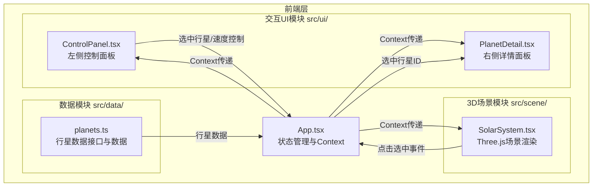

## 1. 架构设计



## 2. 技术说明

- 前端框架：React 18 + TypeScript（严格模式）
- 3D渲染：Three.js + @react-three/fiber + @react-three/drei
- 构建工具：Vite + @vitejs/plugin-react
- 状态管理：React Context + useState/useReducer
- UI图标：react-icons
- 通知：react-hot-toast
- 初始化工具：vite-init (react-ts模板)
- 后端：无
- 数据库：无（使用静态行星数据）

## 3. 路由定义

| 路由 | 用途 |
|------|------|
| / | 主页面，包含3D太阳系场景、控制面板和详情面板 |

## 4. 数据模型

### 4.1 行星数据接口

```typescript
interface PlanetData {
  id: string;
  name: string;
  nameCN: string;
  abbreviation: string;
  mass: number;
  radius: number;
  orbitRadius: number;
  orbitPeriod: number;
  rotationPeriod: number;
  surfaceColor: string;
  nameColor: string;
  description: string;
  images: [string, string, string];
}
```

### 4.2 应用状态接口

```typescript
interface AppState {
  selectedPlanetId: string | null;
  speedMultiplier: number;
  isDetailOpen: boolean;
}
```

## 5. 文件结构与调用关系

```
项目根目录/
├── package.json                    # 依赖与脚本
├── vite.config.ts                  # Vite构建配置
├── tsconfig.json                   # TypeScript严格模式配置
├── index.html                      # 入口HTML
└── src/
    ├── main.tsx                     # 入口，渲染App
    ├── App.tsx                      # 主应用：Context Provider，状态管理，布局
    ├── data/
    │   └── planets.ts              # 行星数据 → 被App.tsx和SolarSystem消费
    ├── scene/
    │   └── SolarSystem.tsx         # 3D场景 → 接收数据+选中ID，发送点击事件
    └── ui/
        ├── ControlPanel.tsx        # 控制面板 → 读取Context，发送控制信号
        └── PlanetDetail.tsx        # 详情面板 → 读取Context中的选中行星数据
```

**数据流向**：
1. `planets.ts` → `App.tsx`（初始化行星数据）
2. `App.tsx` → `SolarSystem.tsx`（通过Context传递行星数据、选中ID、速度倍率）
3. `SolarSystem.tsx` → `App.tsx`（点击行星时回调选中事件）
4. `App.tsx` → `ControlPanel.tsx`（通过Context传递选中行星、当前速度）
5. `ControlPanel.tsx` → `App.tsx`（行星选中、速度调节等控制信号回调）
6. `App.tsx` → `PlanetDetail.tsx`（通过Context传递选中行星数据、详情面板开关状态）
