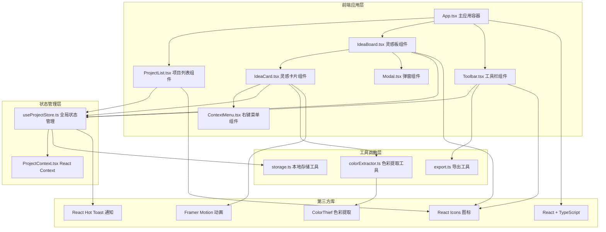
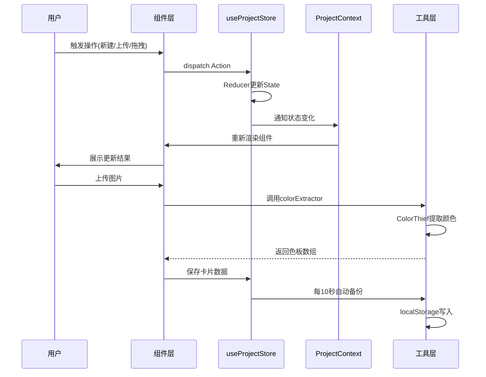

## 1. 架构设计

### 1.1 系统架构图



### 1.2 数据流图



## 2. 技术描述

### 2.1 技术栈

| 层级 | 技术选型 | 版本 | 用途 |
|------|----------|------|------|
| 核心框架 | React | ^18.2.0 | 用户界面构建 |
| 语言 | TypeScript | ^5.3.0 | 类型安全 |
| 构建工具 | Vite | ^5.0.0 | 开发与构建 |
| 状态管理 | useReducer + Context | React内置 | 全局状态管理 |
| 动画库 | Framer Motion | ^10.16.0 | 拖拽、过渡动画 |
| 色彩提取 | ColorThief | ^2.4.0 | 从图片提取主色调 |
| 通知库 | React Hot Toast | ^2.4.0 | 操作反馈提示 |
| 图标库 | React Icons | ^4.12.0 | UI图标 |
| 开发插件 | @vitejs/plugin-react | ^4.2.0 | Vite React支持 |
| 类型定义 | @types/react | ^18.2.0 | React类型 |
| 类型定义 | @types/react-dom | ^18.2.0 | React DOM类型 |

### 2.2 目录结构

```
src/
├── components/           # UI组件层
│   ├── ProjectList.tsx  # 左侧项目列表
│   ├── IdeaBoard.tsx    # 中央灵感板
│   ├── IdeaCard.tsx     # 灵感卡片组件
│   ├── Toolbar.tsx      # 顶部工具栏
│   ├── ContextMenu.tsx  # 右键菜单
│   ├── Modal.tsx        # 弹窗组件
│   └── ColorSwatch.tsx  # 色块展示组件
├── store/               # 状态管理层
│   ├── useProjectStore.ts  # 主状态管理Hook
│   └── ProjectContext.tsx  # React Context
├── utils/               # 工具函数层
│   ├── colorExtractor.ts   # 色彩提取工具
│   ├── storage.ts          # 本地存储工具
│   └── export.ts           # 导出工具
├── types/               # 类型定义
│   └── index.ts
├── hooks/               # 自定义Hooks
│   ├── useDrag.ts       # 拖拽逻辑Hook
│   ├── useAutoSave.ts   # 自动保存Hook
│   └── useUndo.ts       # 撤销操作Hook
├── App.tsx              # 主应用入口
├── main.tsx             # React渲染入口
└── index.css            # 全局样式
```

## 3. 核心数据模型

### 3.1 类型定义

```typescript
// 颜色信息
interface ColorInfo {
  hex: string;
  isReadable: boolean; // 对比度 ≥3 标记为可读
}

// 灵感卡片
interface IdeaCard {
  id: string;
  imageUrl: string;
  imageName: string;
  colors: ColorInfo[];
  note: string;
  position: { x: number; y: number };
  createdAt: number;
}

// 项目
interface Project {
  id: string;
  name: string;
  thumbnail: string;
  cards: IdeaCard[];
  createdAt: number;
  updatedAt: number;
}

// 应用状态
interface AppState {
  projects: Project[];
  currentProjectId: string | null;
  undoStack: { projectId: string; card: IdeaCard }[];
}

// Action类型
type AppAction =
  | { type: 'ADD_PROJECT'; payload: { name: string; thumbnail: string } }
  | { type: 'SET_CURRENT_PROJECT'; payload: string }
  | { type: 'ADD_CARD'; payload: { projectId: string; card: IdeaCard } }
  | { type: 'MOVE_CARD'; payload: { projectId: string; cardId: string; position: { x: number; y: number } } }
  | { type: 'UPDATE_CARD_NOTE'; payload: { projectId: string; cardId: string; note: string } }
  | { type: 'DELETE_CARD'; payload: { projectId: string; cardId: string } }
  | { type: 'RESTORE_CARD'; payload: { projectId: string; card: IdeaCard } }
  | { type: 'CLEAR_BOARD'; payload: string }
  | { type: 'EXTRACT_COLORS'; payload: { cardId: string; colors: ColorInfo[] } }
  | { type: 'LOAD_FROM_STORAGE'; payload: AppState };
```

### 3.2 数据流向说明

1. **初始化**：应用启动时从localStorage加载数据 → `useProjectStore` 初始化状态
2. **项目切换**：`ProjectList` 点击 → dispatch `SET_CURRENT_PROJECT` → 状态更新 → `IdeaBoard` 重新渲染
3. **图片上传**：`Toolbar` 选择文件 → `colorExtractor` 提取颜色 → dispatch `ADD_CARD` → 卡片添加到灵感板
4. **卡片拖拽**：`IdeaCard` 拖拽结束 → dispatch `MOVE_CARD` → 更新卡片坐标 → 相邻卡片避让重排
5. **自动保存**：`useAutoSave` Hook 每10秒触发 → `storage` 工具写入localStorage → 显示保存提示
6. **删除撤销**：右键删除 → dispatch `DELETE_CARD` → 推入undo栈 → toast显示撤销按钮 → 3秒内可撤销

## 4. 性能优化方案

### 4.1 渲染性能

- **虚拟列表**：卡片数量超过30张时启用，仅渲染可视区域内卡片
- **React.memo**：`IdeaCard`、`ProjectList` 等组件使用memo包裹，避免不必要重渲染
- **useCallback**：事件处理函数使用useCallback缓存，减少子组件重渲染
- **拖拽优化**：Framer Motion `DragControls` 启用硬件加速，拖拽帧率保持60FPS

### 4.2 存储性能

- **localStorage读写优化**：使用节流控制写入频率，单次读写控制在3ms内
- **增量备份**：仅备份当前项目状态，而非全量数据
- **数据压缩**：JSON序列化前去除冗余字段

### 4.3 资源限制

- **卡片数量限制**：同时渲染不超过50张，超出部分提示分批管理
- **图片大小限制**：单张图片小于5MB，仅支持jpg/png格式
- **色彩提取优化**：图片缩放到200px宽度后再提取颜色，提升处理速度

## 5. 模块调用关系

| 调用方 | 被调用方 | 调用场景 |
|--------|----------|----------|
| App.tsx | useProjectStore | 获取全局状态和dispatch函数 |
| App.tsx | ProjectContext.Provider | 向下传递状态 |
| ProjectList.tsx | useProjectStore | 读取项目列表，触发项目切换 |
| IdeaBoard.tsx | useProjectStore | 读取当前项目卡片，更新位置 |
| IdeaBoard.tsx | useAutoSave | 自动备份逻辑 |
| IdeaCard.tsx | colorExtractor.ts | 上传图片时提取颜色 |
| IdeaCard.tsx | useDrag | 拖拽交互逻辑 |
| IdeaCard.tsx | useUndo | 删除撤销逻辑 |
| Toolbar.tsx | export.ts | 导出JSON文件 |
| Toolbar.tsx | storage.ts | 清空面板数据 |
| useProjectStore | storage.ts | 初始化加载和持久化存储 |
