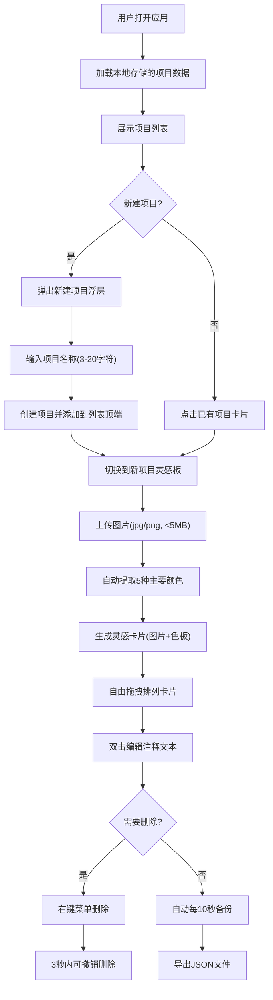

## 1. 产品概述
灵感板管理工具是一款面向独立插画师、设计师等创意从业者的线上助手，用于追踪和整理不同项目中的灵感截图、草图以及色彩样本，并能自动生成可拖拽的灵感情绪板。

- **核心价值**：帮助创意工作者高效组织灵感素材，通过可视化的情绪板激发创作灵感，支持色彩提取、自由拖拽布局、项目分类管理等核心功能
- **目标用户**：独立插画师、平面设计师、UI设计师、创意总监等需要收集和整理视觉灵感的专业人士
- **市场定位**：轻量化、专注于灵感管理的专业工具，替代传统文件夹整理方式，提供更直观的视觉化体验

## 2. 核心特性

### 2.1 用户角色

| 角色 | 注册方式 | 核心权限 |
|------|----------|----------|
| 独立用户 | 无需注册，本地存储 | 完整使用所有功能，数据本地持久化 |

### 2.2 功能模块

1. **项目管理模块**：项目列表展示、新建项目、项目切换、项目缩略图预览
2. **灵感板模块**：图片上传、卡片拖拽排列、卡片注释编辑、卡片删除与撤销
3. **色彩提取模块**：自动从上传图片中提取5种主要颜色，计算对比度标记可读配色
4. **数据管理模块**：localStorage自动备份、导出JSON、状态管理
5. **交互反馈模块**：toast通知、动画过渡、右键菜单、二次确认弹窗

### 2.3 页面详情

| 页面名称 | 模块名称 | 功能描述 |
|-----------|-------------|---------------------|
| 主应用页面 | 左侧项目列表 | 展示所有项目卡片，支持新建项目、点击切换项目 |
| 主应用页面 | 中央灵感板 | 展示当前项目的灵感卡片，支持拖拽、编辑、删除 |
| 主应用页面 | 顶部工具栏 | 添加图片、清空面板、导出JSON功能入口 |
| 主应用页面 | 新建项目浮层 | 从底部滑入的表单，输入项目名称创建新项目 |
| 主应用页面 | 右键菜单 | 删除卡片、编辑卡片注释的快捷操作 |
| 主应用页面 | 二次确认弹窗 | 清空面板前的确认操作 |

## 3. 核心流程

### 3.1 主用户流程

用户打开应用 → 查看现有项目列表 → 点击项目切换灵感板 → 上传灵感图片 → 系统自动提取色彩 → 拖拽排列卡片 → 编辑卡片注释 → 导出JSON或自动保存

### 3.2 流程图

## 4. 用户界面设计

### 4.1 设计风格

- **整体风格**：极简暗色调设计，专业沉稳，突出内容本身
- **主色调**：背景深灰 `#1a1a2e`，左侧面板稍亮 `#16213e`，悬停色 `#2d4a6b`
- **强调色**：按钮渐变 `#667eea` 到 `#764ba2`，用于主要操作按钮
- **中性色**：灵感板背景浅灰 `#e8e8e8`，工具栏背景半透明白色 `#ffffff` 0.95透明度
- **按钮样式**：圆角胶囊形，渐变背景，悬停轻微放大
- **字体**：采用现代无衬线字体，标题清晰，注释易读
- **布局风格**：三栏式布局（左侧项目列表 + 中央灵感板 + 顶部工具栏）
- **图标风格**：线性简约图标，与整体极简风格统一

### 4.2 页面设计概述

| 页面名称 | 模块名称 | UI元素 |
|-----------|-------------|----------|
| 主应用 | 项目列表卡片 | 缩略图、标题、创建日期，悬停过渡0.2s，添加动画0.2s缩放弹出 |
| 主应用 | 灵感卡片 | 200x200px圆角矩形，圆角12px，阴影模糊8px，下方5个20x20px色块 |
| 主应用 | 顶部工具栏 | 高48px固定悬浮，半透明白色，向下阴影8px，胶囊形渐变按钮 |
| 主应用 | 新建项目浮层 | 从底部滑入0.3s `cubic-bezier(0.22, 1, 0.36, 1)`，表单输入验证 |
| 主应用 | 右键菜单 | 白色背景，阴影模糊12px，菜单项悬停浅灰 `#f0f0f0` |
| 主应用 | 色块展示 | 悬停放大1.2倍，显示HEX值，可读配色标记 |

### 4.3 响应式设计

- **桌面端**：左侧固定280px项目列表，中央灵感板自由布局
- **平板端**：视口小于768px时，左侧列表折叠为顶部可展开抽屉
- **移动端**：汉堡菜单触发抽屉从左侧滑出，覆盖中央区域，卡片尺寸自适应
- **触摸优化**：拖拽操作支持触摸手势，双击改为长按编辑

### 4.4 交互与动画

- **卡片添加**：0.2s缩放从0.8到1的弹性弹出动画
- **拖拽效果**：拖拽时放大1.05倍，背景虚线占位框，松开弹性回位0.25s `ease-out`
- **删除动画**：向左缩小至0，0.2s `ease-in`
- **菜单过渡**：所有交互反馈0.15-0.3s过渡动画
- **相邻避让**：卡片移动时相邻卡片0.2s内重新排列
- **自动保存提示**：微弱文字显示1.5s后消失
