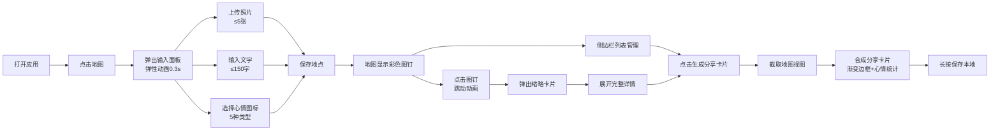

## 1. 产品概述
旅行纪念地图是一款帮助用户记录旅行足迹、分享旅程故事的Web应用。用户在地图上标记到访地点、上传照片、添加文字笔记与心情图标，最终生成精美的可分享旅行卡片。
- 核心目的：让旅行记忆具象化、可视化，创造独特的个人旅行数字纪念物
- 目标用户：热爱旅行、喜欢记录生活点滴的人群
- 产品价值：将零散的旅行照片和故事整合为一张有温度的地图记忆卡

## 2. 核心功能

### 2.1 功能模块
1. **地图交互模块**：Leaflet地图渲染、点击添加标记、图钉展示与交互动画
2. **内容录入模块**：照片上传（拖拽+点击）、文字笔记（150字限制）、心情图标选择
3. **地点管理模块**：地点列表展示、选中预览、详情展开
4. **分享导出模块**：地图截取、卡片合成、心情统计、保存下载

### 2.3 页面详情
| 页面名称 | 模块名称 | 功能描述 |
|-----------|-------------|---------------------|
| 主页面 | 地图容器 | 展示Leaflet地图，占页面80%宽度居中，支持点击添加标记 |
| 主页面 | 侧边栏 | 固定左侧280px宽，显示地点列表或当前选中地点预览 |
| 主页面 | 输入面板 | 点击地图弹出，含照片上传区、文字输入、心情选择器 |
| 主页面 | 图钉标记 | 彩色图钉按心情配色，点击有放大跳动动画 |
| 主页面 | 详情卡片 | 点击图钉弹出缩略卡片，再次点击展开完整详情 |
| 主页面 | 分享按钮 | 生成分享卡片，展示预览并支持长按保存 |

## 3. 核心流程
用户打开应用 → 在地图上点击想要标记的位置 → 弹性弹出输入面板 → 拖拽/选择照片（最多5张）→ 输入文字笔记（≤150字）→ 选择心情图标（5种）→ 保存后地图显示彩色图钉 → 可在侧边栏查看/管理所有地点 → 点击"生成分享卡片" → 截取当前地图视图 → 合成带渐变边框、标题、心情统计的分享图 → 长按保存到本地

## 4. 用户界面设计

### 4.1 设计风格
- **主背景色**：暖白 #FFF8F0，营造温暖的旅行回忆氛围
- **侧边栏背景**：米白 #F5F0EB，与主背景层次分明
- **输入面板**：半透明白色 rgba(255,255,255,0.95)，10px圆角，柔和阴影
- **分享卡片边框**：从左到右渐变 #667eea → #764ba2，16px圆角
- **心情配色**：
  - 开心：#FFD93D（暖黄）
  - 感动：#FF6B6B（珊瑚红）
  - 惊喜：#6BCB77（翠绿）
  - 平静：#4D96FF（天蓝）
  - 疲惫：#A3A3A3（中灰）
- **字体**：系统默认字体族，保持原生观感
- **按钮风格**：圆角柔和，悬浮有过渡动效

### 4.2 页面设计概述
| 页面名称 | 模块名称 | UI Elements |
|-----------|-------------|-------------|
| 主页面 | 地图容器 | 80%宽度居中，leaflet交互地图，响应式适配 |
| 主页面 | 左侧边栏 | 280px固定宽度，列表项hover上移0.2s+背景色变化 |
| 主页面 | 输入面板 | 从点击点弹开（0.2→1倍，0.3s弹性），半透明白色背景 |
| 主页面 | 上传区 | 虚线边框+提示文字"拖拽照片到这里"，支持点击选择 |
| 主页面 | 图钉标记 | 按心情配色，点击放大1.2倍+0.2s跳动 |
| 主页面 | 详情卡片 | 缩略图+标题+心情，点击展开完整内容 |
| 主页面 | 分享卡片 | 16px圆角，渐变边框，底部统计信息区 |

### 4.3 响应式
- **桌面端**：地图容器80%宽度居中，左侧固定280px侧边栏
- **移动端（手机）**：地图容器占满100%宽度，侧边栏收起为右下角浮动按钮，点击展开抽屉式面板
- **触摸优化**：所有交互元素≥44px触摸区域，支持长按保存分享图

### 4.4 性能要求
- 渲染10个标记点后页面操作帧率不低于50fps
- 图片上传使用缩略图预览，避免大图阻塞主线程
- 动画使用transform/opacity保证GPU加速
