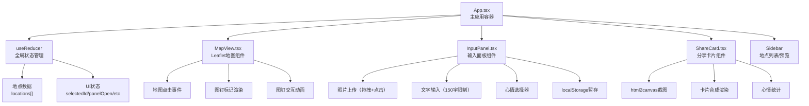

## 1. 架构设计



## 2. 技术描述
- **前端框架**：React@18 + TypeScript（严格模式）
- **构建工具**：Vite + @vitejs/plugin-react
- **地图引擎**：Leaflet + react-leaflet
- **动画库**：framer-motion（弹性动画、跳动效果、过渡）
- **图标库**：react-icons（心情图标、UI图标）
- **图片导出**：html2canvas（地图截图、卡片合成）
- **状态管理**：useReducer（地点数据+UI状态）
- **数据持久化**：localStorage（暂存未完成条目）
- **CSS方案**：CSS Modules + CSS变量（主题色、间距系统）
- **后端**：无（纯前端应用）
- **数据库**：无（使用localStorage可选持久化）

## 3. 目录结构
```
auto89/
├── index.html
├── package.json
├── vite.config.ts
├── tsconfig.json
└── src/
    ├── App.tsx                    # 主应用容器，useReducer全局状态
    ├── main.tsx                   # 入口文件
    ├── index.css                  # 全局样式+CSS变量
    ├── types/
    │   └── index.ts               # 类型定义（Location, Mood, AppState）
    ├── components/
    │   ├── MapView.tsx            # Leaflet地图组件
    │   ├── InputPanel.tsx         # 弹出输入面板
    │   ├── ShareCard.tsx          # 分享卡片生成
    │   ├── LocationPin.tsx        # 自定义图钉组件
    │   ├── LocationCard.tsx       # 地点详情卡片
    │   ├── Sidebar.tsx            # 左侧边栏
    │   └── MoodSelector.tsx       # 心情选择器子组件
    └── hooks/
        └── useLocalStorage.ts     # localStorage自定义Hook
```

## 4. 数据模型

### 4.1 核心类型定义

```typescript
// 心情类型
type MoodType = 'happy' | 'touched' | 'surprised' | 'calm' | 'tired';

// 心情配置
interface MoodConfig {
  type: MoodType;
  label: string;
  icon: string;           // react-icons key
  color: string;          // 背景色/图钉色
  dotColor: string;       // 统计小圆点颜色
}

// 照片数据
interface Photo {
  id: string;
  url: string;            // base64 dataURL
  file?: File;
}

// 地点数据
interface Location {
  id: string;
  lat: number;
  lng: number;
  title: string;          // 从笔记自动生成或手动输入
  photos: Photo[];        // 最多5张
  note: string;           // ≤150字
  mood: MoodType;
  createdAt: number;      // timestamp
}

// 应用状态（useReducer）
interface AppState {
  locations: Location[];
  selectedLocationId: string | null;
  isInputPanelOpen: boolean;
  inputPanelPosition: { lat: number; lng: number } | null;
  isShareCardOpen: boolean;
  sidebarView: 'list' | 'preview';   // 列表视图/预览视图
  draftLocation: Partial<Location> | null;  // localStorage暂存
}

// Action类型
type AppAction =
  | { type: 'ADD_LOCATION'; payload: Location }
  | { type: 'UPDATE_LOCATION'; payload: Location }
  | { type: 'DELETE_LOCATION'; payload: string }
  | { type: 'SELECT_LOCATION'; payload: string | null }
  | { type: 'OPEN_INPUT_PANEL'; payload: { lat: number; lng: number } }
  | { type: 'CLOSE_INPUT_PANEL' }
  | { type: 'OPEN_SHARE_CARD' }
  | { type: 'CLOSE_SHARE_CARD' }
  | { type: 'SET_SIDEBAR_VIEW'; payload: 'list' | 'preview' }
  | { type: 'SET_DRAFT'; payload: Partial<Location> | null };
```

## 5. 关键实现策略

### 5.1 地图交互（MapView.tsx）
- 使用 `useMapEvents` 监听地图 `click` 事件，获取经纬度
- 自定义 `LocationPin` 组件，使用 `divIcon` 渲染带心情色的图钉
- 图钉动画：framer-motion animate={{ scale: [1, 1.2, 1.1, 1.2, 1] }} transition={{ duration: 0.2 }}
- 使用 `Popup` 渲染缩略卡片，点击卡片触发详情展开

### 5.2 输入面板（InputPanel.tsx）
- framer-motion 初始 scale: 0.2，animate: scale: 1，type: "spring"，duration: 0.3
- 照片上传：`useDropzone` 自定义逻辑，`ondragover` 显示虚线边框高亮
- 限制5张，预览使用 ``，FileReader异步读取
- 文字输入：`<textarea maxLength={150}>`，右下角显示字数计数
- 心情选择器：5个圆形按钮，选中放大+边框高亮
- localStorage暂存：`useEffect` 监听draft变化写入 `key: 'travel_draft'`

### 5.3 分享卡片（ShareCard.tsx）
- 创建隐藏的 `#share-card-root` DOM节点，渲染：
  - 地图容器截图（html2canvas截取 `#map-container`）
  - 16px圆角 + 渐变边框（background: linear-gradient + padding实现）
  - 底部信息区：旅程标题、总地点数、心情分布（彩色小圆点数组）
- html2canvas配置：`useCORS: true, scale: 2, backgroundColor: '#FFF8F0'`
- 导出：生成 `<a download>` + dataURL，移动端提示长按保存

### 5.4 性能优化
- 图钉使用 `memo` 包裹，避免不必要重渲染
- 照片上传前压缩/生成缩略图（canvas resize）
- 列表项虚拟滚动（地点数量多时）
- 动画统一使用 transform/opacity，触发GPU合成层

### 5.5 响应式实现
- CSS变量 `--sidebar-width: 280px`，媒体查询 `@media (max-width: 768px)`
- 移动端：侧边栏 transform: translateX(-100%)，浮动按钮 `position: fixed; bottom: 24px; right: 24px;`
- 地图容器：`width: calc(100% - var(--sidebar-width))` 移动端 `width: 100%`
