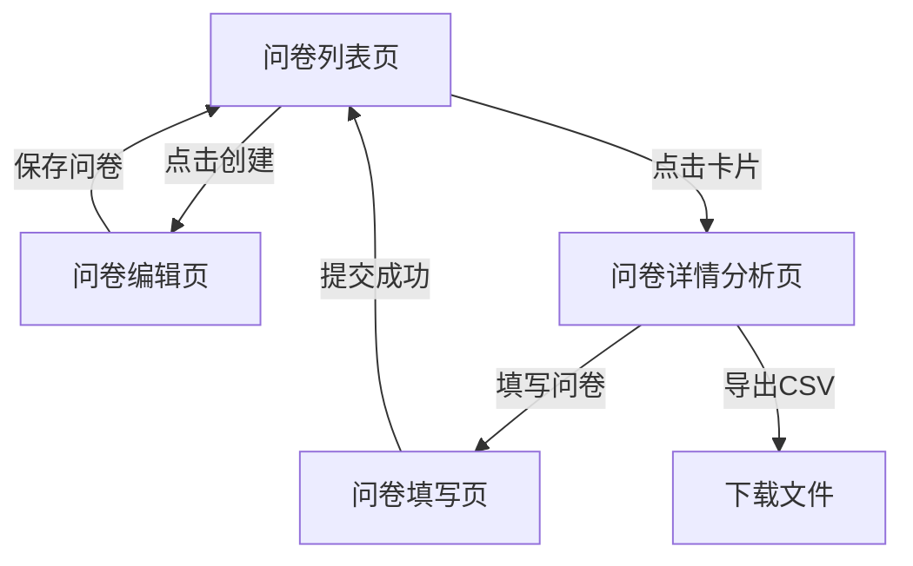

## 1. 产品概述

在线问卷调查创建与响应分析应用，支持用户快速创建自定义问卷、收集回复数据并进行可视化分析。

- 核心用途：提供轻量级问卷制作与数据分析工具，适用于用户调研、反馈收集、投票统计等场景
- 目标价值：降低问卷创建门槛，提供直观的数据统计与导出功能，提升调研工作效率

## 2. 核心功能

### 2.1 用户角色

| 角色 | 说明 | 核心权限 |
|------|------|----------|
| 普通用户 | 无需注册，直接使用 | 创建问卷、填写问卷、查看回复统计、导出数据 |

### 2.2 功能模块

1. **问卷列表页**：问卷卡片展示、搜索筛选、排序功能
2. **问卷创建/编辑页**：问题编辑器、拖拽排序、实时预览
3. **问卷填写页**：题目渲染、必答校验、提交反馈
4. **问卷详情/分析页**：回复列表、图表统计、CSV导出

### 2.3 页面详情

| 页面名称 | 模块名称 | 功能描述 |
|-----------|-------------|---------------------|
| 问卷列表页 | 顶部导航 | 应用名称、"创建问卷"按钮、搜索框、排序下拉 |
| 问卷列表页 | 问卷卡片网格 | 卡片展示问卷标题、问题数、回复数，悬停动画，点击进入详情 |
| 问卷列表页 | 空状态提示 | 无问卷时显示引导文案 |
| 问卷编辑页 | 问题列表区（左侧） | 问题项列表、拖拽排序、增删改查操作 |
| 问卷编辑页 | 问题编辑面板 | 题目类型选择（单选/多选/文本）、题干输入、选项管理、必答开关 |
| 问卷编辑页 | 实时预览区（右侧） | 模拟填写界面、淡入动画、与填写页风格一致 |
| 问卷编辑页 | 问卷信息栏 | 标题输入、描述输入、保存按钮 |
| 问卷填写页 | 问卷标题区 | 显示问卷标题与描述 |
| 问卷填写页 | 问题渲染区 | 根据类型渲染radio/checkbox/textarea |
| 问卷填写页 | 提交按钮 | 校验必答项、提交成功提示、自动跳转 |
| 详情分析页 | 问卷信息卡片 | 标题、描述、创建时间、回复数统计 |
| 详情分析页 | 操作栏 | "填写问卷"按钮、"导出CSV"按钮 |
| 详情分析页 | 统计面板 | 选择题圆环图、文本题回答列表 |

## 3. 核心流程

用户从问卷列表开始，可以选择创建新问卷或查看已有问卷。创建问卷时通过拖拽排序和实时预览完成编辑，保存后返回列表。点击问卷进入详情页可查看回复统计，也可进入填写页收集新回复。

## 4. 用户界面设计

### 4.1 设计风格

- **主色调**：#1E88E5（蓝色），用于按钮、链接、选中状态
- **辅助色**：#F5F5F5（浅灰），用于背景、分隔区域
- **按钮风格**：圆角8px，主按钮蓝色填充白字，次要按钮白底蓝字边框，带涟漪点击效果
- **字体**：现代无衬线字体，标题18-24px加粗，正文14-16px，辅助文字12px
- **布局风格**：卡片式布局，顶部导航栏，列表页网格排列，编辑页左右分栏
- **图标风格**：简洁线性图标，与lucide-react风格一致

### 4.2 页面设计概述

| 页面名称 | 模块名称 | UI元素 |
|-----------|-------------|-------------|
| 问卷列表页 | 问卷卡片 | 圆角12px，阴影0 2px 8px rgba(0,0,0,0.1)，悬停上移4px加深阴影 |
| 问卷列表页 | 搜索框 | 圆角8px，带搜索图标，蓝色聚焦边框 |
| 问卷编辑页 | 左右分栏 | 左侧50%问题列表，右侧50%预览区，带分隔线 |
| 问卷编辑页 | 问题项 | 可拖拽手柄，序号标识，删除按钮，类型徽章 |
| 问卷编辑页 | 预览区域 | 白色背景卡片，内边距24px，淡入动画（opacity 0→1，300ms） |
| 问卷填写页 | 题目区 | 必答题带红色星号，选项间距12px |
| 详情分析页 | 图表容器 | 圆环图居中显示，带图例，响应式尺寸 |
| 详情分析页 | 回复列表 | 逐条展示文本回答，带回复序号和时间戳 |

### 4.3 响应式

- **桌面端**（≥768px）：编辑页左右分栏同时显示
- **移动端**（<768px）：编辑页默认显示预览区，汉堡菜单按钮切换编辑器/预览，卡片改为单列布局
- **触控优化**：按钮最小高度44px，点击区域充足

### 4.4 动效细节

- **卡片悬停**：transform: translateY(-4px)，box-shadow加深，transition: all 0.3s ease
- **按钮涟漪**：CSS ripple效果，点击时从触点扩散圆形波纹
- **预览淡入**：编辑后预览区内容opacity从0到1，300ms缓动
- **页面切换**：路由切换时轻微淡入过渡
