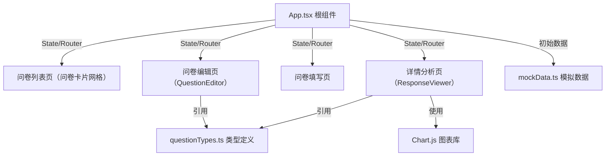
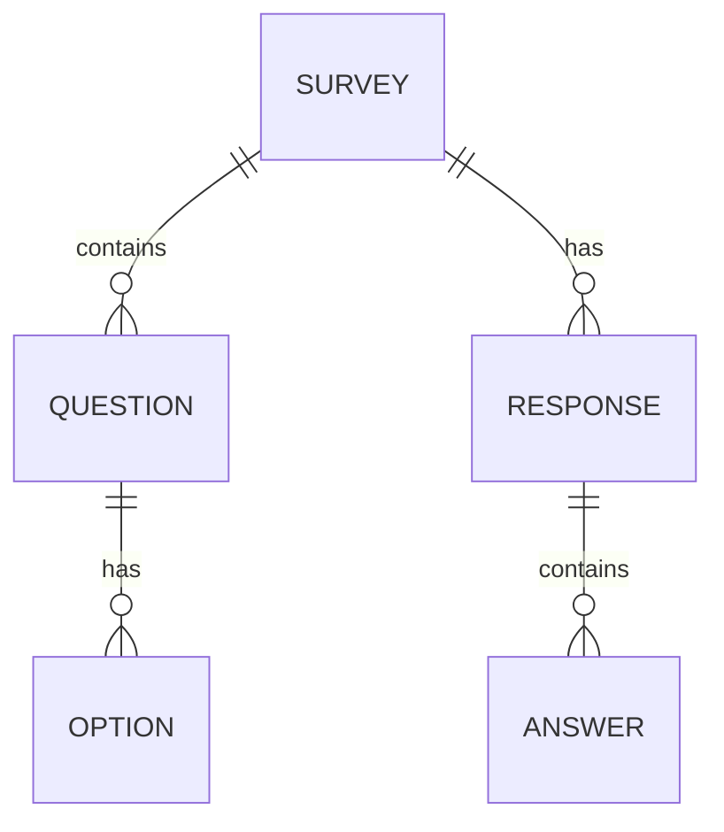

## 1. 架构设计

纯前端单页应用，数据存储于浏览器内存中，通过React状态管理实现各模块通信。



## 2. 技术描述

- **前端框架**：React 18 + TypeScript（严格模式）
- **构建工具**：Vite 5 + @vitejs/plugin-react
- **路由管理**：React Router 6（通过状态模拟路由或使用react-router-dom）
- **拖拽排序**：@dnd-kit/core + @dnd-kit/sortable + @dnd-kit/utilities
- **图表库**：chart.js + react-chartjs-2
- **状态管理**：React useState/useReducer（内存存储，无需持久化）
- **样式方案**：原生CSS + CSS Modules（或全局CSS，CSS变量定义主题）
- **图标库**：lucide-react
- **初始化方式**：npm create vite-init@latest . --template react-ts

## 3. 路由定义

| 路由 | 页面组件 | 用途 |
|-------|---------|------|
| / | SurveyList | 问卷列表页，展示所有问卷卡片、搜索、排序 |
| /create | QuestionEditor | 创建新问卷 |
| /edit/:id | QuestionEditor | 编辑已有问卷 |
| /fill/:id | FillSurvey | 填写问卷页面 |
| /detail/:id | ResponseViewer | 问卷详情与回复分析页 |

## 4. 数据模型

### 4.1 TypeScript 类型定义（questionTypes.ts）

```typescript
// 题目类型枚举
export enum QuestionType {
  SINGLE_CHOICE = 'single_choice',
  MULTIPLE_CHOICE = 'multiple_choice',
  TEXT = 'text',
}

// 选项结构
export interface QuestionOption {
  id: string;
  label: string;
}

// 问题结构
export interface Question {
  id: string;
  type: QuestionType;
  title: string;
  required: boolean;
  options?: QuestionOption[];
}

// 问卷结构
export interface Survey {
  id: string;
  title: string;
  description: string;
  createdAt: Date;
  questions: Question[];
}

// 单个回复结构
export interface SurveyResponse {
  id: string;
  surveyId: string;
  submittedAt: Date;
  answers: {
    questionId: string;
    value: string | string[];
  }[];
}
```

### 4.2 数据关系



## 5. 模块划分

### 5.1 文件结构

```
d:\Pro\tasks\auto9\
├── package.json
├── vite.config.ts
├── tsconfig.json
├── index.html
└── src/
    ├── main.tsx          # 应用入口
    ├── App.tsx           # 根组件：路由、全局状态、问卷列表管理
    ├── components/
    │   ├── QuestionEditor.tsx    # 问卷编辑器（左：问题列表+编辑，右：预览）
    │   ├── ResponseViewer.tsx    # 回复查看器（图表+列表+CSV导出）
    │   ├── SurveyCard.tsx        # 问卷卡片组件
    │   └── FillSurvey.tsx        # 问卷填写组件
    ├── utils/
    │   ├── questionTypes.ts      # 类型定义与枚举
    │   └── mockData.ts           # 生成50份模拟问卷+回复数据
    └── styles/
        └── global.css            # 全局样式、CSS变量、涟漪动画
```

### 5.2 核心功能实现要点

- **拖拽排序**：使用@dnd-kit的DndContext + SortableContext，问题项使用useSortable hook
- **图表统计**：ResponseViewer中遍历问题，选择题提取各选项计数后渲染Doughnut图
- **CSV导出**：构造表头（问题标题），遍历回复逐行生成，使用Blob + URL.createObjectURL下载
- **搜索筛选**：列表页filter按title.includes(keyword)，sort按createdAt比较
- **必答校验**：填写页提交前检查所有required问题的value是否为空
- **涟漪效果**：CSS ::after伪元素 + transform: scale动画，JS捕捉点击坐标
- **移动端适配**：@media (max-width: 768px) 隐藏左栏，按钮控制display切换

## 6. 性能优化

- **模拟数据生成**：mockData.ts使用纯函数批量生成50份问卷，避免重复渲染
- **输入防抖**：搜索框输入使用useMemo/useCallback优化，60FPS流畅
- **组件拆分**：QuestionEditor拆分为问题项子组件，避免全列表重渲染
- **列表渲染**：React key使用稳定id而非索引，提升diff效率
- **加载时间**：模拟50份数据控制在<300ms，Vite HMR优化开发体验
