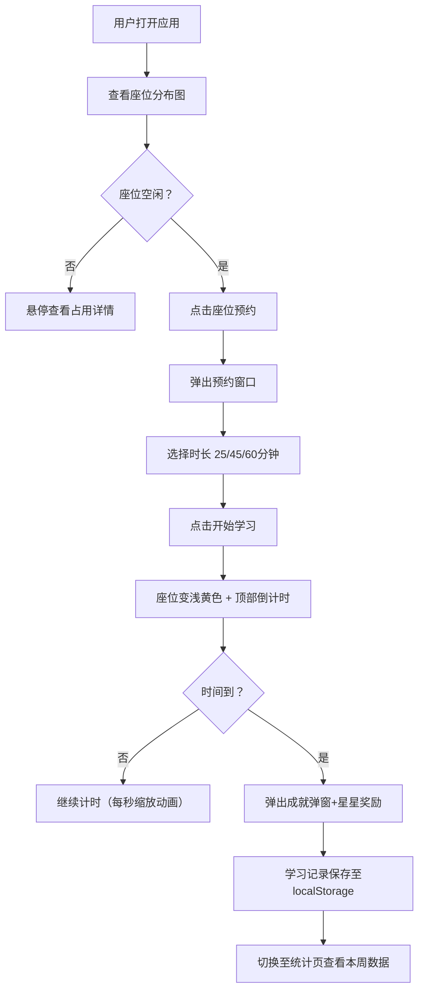

## 1. 产品概述

社区共享自习室实时座位预约与学习状态追踪系统，为用户提供便捷的自习室座位管理、学习计时与数据统计服务。
- 核心价值：解决自习室座位资源分配不均问题，帮助用户高效规划学习时间，提升学习体验
- 目标用户：学生、职场备考人群、自由职业者等需要安静学习空间的群体

## 2. 核心功能

### 2.1 用户角色
| 角色 | 注册方式 | 核心权限 |
|------|---------|---------|
| 普通用户 | 浏览器本地标识生成 | 查看座位图、预约座位、学习计时、查看个人统计 |
| 管理员 | 底部面板入口 | 查看座位概览、清空所有预约 |

### 2.2 功能模块
1. **座位分布图模块**：俯视平面图展示36个座位实时状态，悬停详情卡片，点击预约交互
2. **学习计时器模块**：预约时长选择，倒计时显示，学习成就奖励
3. **个人学习统计模块**：本周学习柱状图，最近学习记录列表
4. **管理员面板模块**：座位状态概览表格，紧急清空功能

### 2.3 页面详情
| 页面名称 | 模块名称 | 功能描述 |
|---------|---------|---------|
| 主页面-座位图 | 座位平面图 | 36个座位俯视布局，空闲/占用/预约状态区分，当前用户座位金色光晕 |
| 主页面-座位图 | 悬停详情卡片 | 弹性展开动画，显示座位编号、状态、使用时长 |
| 主页面-预约窗口 | 预约弹窗 | 从座位位置向上展开，时长选择（25/45/60分钟），开始学习按钮 |
| 主页面-计时器 | 学习计时器 | 顶部居中倒计时，每秒缩放动画，结束成就弹窗 |
| 统计页面 | 本周柱状图 | 蓝紫渐变柱状条，悬停上浮显示分钟数 |
| 统计页面 | 学习记录列表 | 最近5次记录，点击展开详情（时段+座位号） |
| 底部 | 管理员面板 | 可折叠，座位概览表格，清空预约紧急按钮 |

## 3. 核心流程

用户打开应用 → 查看座位分布图（实时状态）→ 悬停查看座位详情 → 点击空闲座位 → 选择预约时长 → 开始学习（座位变为浅黄色+倒计时）→ 计时结束（弹出成就奖励）→ 记录自动保存 → 切换到统计页查看本周学习曲线

## 4. 用户界面设计

### 4.1 设计风格
- **主色调**：奶油白 #FFFDF7
- **辅助色**：柔和蓝灰 #EDF2F7（卡片背景）
- **状态色**：
  - 空闲座位：翠绿 #6BCB77
  - 占用座位：珊瑚红 #FF6B6B
  - 已预约（计时中）：浅黄 #FFEE93
  - 光晕边框：金色 #F4D03F
- **按钮选中色**：蓝色 #4A90D9
- **柱状图渐变**：蓝紫 #667eea → #764ba2
- **文字色**：深灰 #2C3E50
- **按钮/卡片悬停**：0.15s快捷阴影过渡
- **字体**：现代无衬线字体，标题粗体，正文常规

### 4.2 页面设计概述
| 页面模块 | UI元素 | 动画效果 |
|---------|--------|---------|
| 座位图 | 6x6网格，25x25px方框，浅米色#FFF8E7背景 | 金色光晕1.5s呼吸动画（透明度0.3-0.8循环） |
| 悬停卡片 | 小型信息卡片 | 0.2s弹性展开动画（从座位上方弹出） |
| 预约窗口 | 圆角卡片，时长选项按钮组，底部操作按钮 | 0.25s向上展开 cubic-bezier(0.25,0.46,0.45,0.94) |
| 计时器 | 粗体2rem倒计时 | 每秒0.1s轻微缩放动画 |
| 成就弹窗 | 学习时长+星星图标 | 星星0.5s抛物线轨迹飞向角落 |
| 柱状图 | 7条渐变柱（周一至周日） | 悬停0.1s上浮+显示数值 |
| 记录列表 | 浅灰卡片+虚线分隔 | 点击展开详情面板 |
| 管理员面板 | 深灰#2C3E50背景+白色文字 | 可折叠，仅显示窄标题栏 |
| 顶部导航 | 固定60px白底+底部微弱阴影 | 切换页面无刷新 |

### 4.3 响应式设计
- **桌面端（1280px及以上）**：座位图6x6网格居中展示，统计图表完整显示
- **移动端（375px宽度）**：座位图自动换行适配，统计图等比缩小保持可读性
- **触摸优化**：增大座位点击热区，按钮尺寸适配手指操作

### 4.4 性能要求
- 座位图渲染帧率 ≥ 55fps
- 支持最多36个座位实时状态同步更新
- 动画均采用GPU加速属性（transform、opacity）
