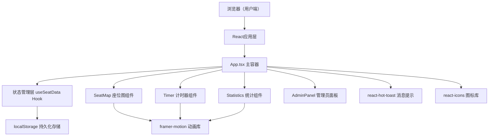

## 1. 架构设计



## 2. 技术描述
- **前端框架**：React 18 + TypeScript（严格模式）
- **构建工具**：Vite 5 + @vitejs/plugin-react
- **状态管理**：自定义Hook useSeatData + localStorage
- **动画库**：framer-motion
- **图标库**：react-icons
- **消息提示**：react-hot-toast
- **样式方案**：CSS-in-JS（styled-jsx/inline style）+ framer-motion 动画
- **数据存储**：浏览器 localStorage（多用户隔离，基于userId命名空间）

## 3. 路由定义
本应用为单页应用（SPA），通过顶部导航切换视图，无实际URL路由。

| 视图名称 | 触发方式 | 目的 |
|---------|---------|------|
| 座位图视图 | 顶部导航"座位预约" | 座位浏览、预约、计时主界面 |
| 统计视图 | 顶部导航"学习统计" | 本周学习柱状图+历史记录查看 |

## 4. 数据模型

### 4.1 核心类型定义

```typescript
// 座位状态枚举
type SeatStatus = 'available' | 'occupied' | 'reserved' | 'studying';

// 座位数据
interface Seat {
  id: string;           // 座位编号 S01-S36
  row: number;          // 行号 0-5
  col: number;          // 列号 0-5
  status: SeatStatus;
  occupiedBy?: User;    // 占用者信息
  reservedBy?: User;    // 预约者（当前用户）
  startTime?: number;   // 开始学习时间戳
  duration?: number;    // 预约时长（分钟）
}

// 用户信息
interface User {
  id: string;           // 用户唯一ID
  nickname: string;     // 昵称
  avatar: string;       // 头像emoji或图标标识
}

// 学习记录
interface StudyRecord {
  id: string;
  seatId: string;       // 座位编号
  startTime: number;    // 开始时间戳
  endTime: number;      // 结束时间戳
  duration: number;     // 实际时长（分钟）
  plannedDuration: number; // 计划时长
}

// 应用全局状态
interface AppState {
  currentUser: User;
  seats: Seat[];
  studyRecords: StudyRecord[];
  currentStudyingSeatId?: string;
  remainingSeconds?: number;
}
```

### 4.2 localStorage 数据结构

```
studyroom_user_{userId} → {
  user: User,
  studyRecords: StudyRecord[]
}

studyroom_seats → Seat[]  (全局共享，模拟多用户)
studyroom_current_userId → string  (当前用户标识)
```

## 5. 文件结构

```
auto92/
├── package.json
├── vite.config.ts
├── tsconfig.json
├── index.html
└── src/
    ├── App.tsx              # 主应用，组合模块+导航
    ├── hooks/
    │   └── useSeatData.ts   # 自定义Hook：座位+记录管理
    └── components/
        ├── SeatMap.tsx      # 座位平面图+预约交互
        ├── Timer.tsx        # 学习计时器+成就弹窗
        ├── Statistics.tsx   # 柱状图+学习记录列表
        └── AdminPanel.tsx   # 管理员面板+清空功能
```

## 6. 核心接口方法（useSeatData）

| 方法名 | 参数 | 返回值 | 描述 |
|-------|------|--------|------|
| getSeats() | 无 | Seat[] | 获取所有座位最新状态 |
| reserveSeat(seatId, duration) | seatId: string, duration: number | boolean | 预约座位并设置学习时长 |
| releaseSeat(seatId) | seatId: string | void | 释放/结束座位使用 |
| startStudy(seatId) | seatId: string | void | 标记座位进入学习中状态 |
| completeStudy(seatId, actualDuration) | seatId: string, actualDuration: number | StudyRecord | 完成学习，生成记录 |
| getStudyRecords(userId) | userId?: string | StudyRecord[] | 获取当前用户学习记录 |
| getWeeklyStats() | 无 | {day: string, minutes: number}[] | 获取本周每日学习统计 |
| clearAllReservations() | 无 | void | 管理员：清空所有座位预约 |
| getCurrentUser() | 无 | User | 获取/初始化当前用户 |
| subscribe(callback) | callback: (seats) => void | unsubscribe | 订阅座位状态更新 |
```

## 7. 性能优化策略

1. **座位渲染优化**：使用 React.memo 包装单个座位组件，避免36个座位全部重渲染
2. **动画性能**：所有动画使用 transform / opacity 属性（GPU加速），不触发重排重绘
3. **localStorage 读写防抖**：高频更新的数据（如倒计时剩余时间）只在内存中维护，定时（每5秒）或关键节点写入存储
4. **状态最小化**：仅将必要状态提升至 useSeatData，组件内部状态本地化
5. **framer-motion 优化**：使用 layout animations 而非全量重渲染，使用 AnimatePresence 控制挂载卸载动画
