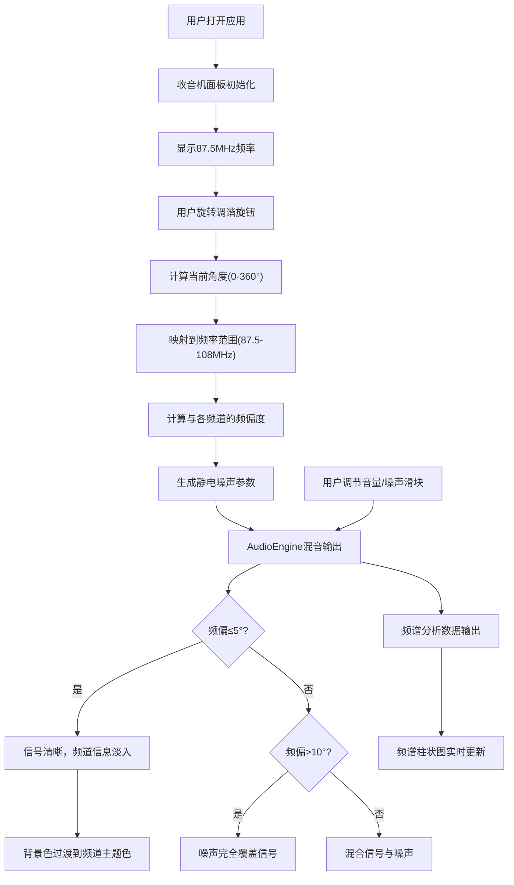

## 1. 产品概述

复古音乐电台调谐应用，让听众沉浸式探索独立音乐风格，通过模拟老式收音机的调谐体验发现声音的细微变化。

- 主要目的：为独立音乐爱好者提供独特的音乐发现体验，通过复古收音机交互形式增强音乐探索的趣味性
- 解决问题：传统音乐播放平台缺乏探索乐趣，用户被动接收推荐而非主动发现
- 目标用户：独立音乐爱好者、复古科技爱好者、追求独特听觉体验的听众
- 产品价值：将音乐探索游戏化，通过调谐过程的仪式感提升用户对音乐细节的感知

## 2. 核心功能

### 2.1 用户角色

| 角色 | 注册方式 | 核心权限 |
|------|----------|----------|
| 访客用户 | 无需注册 | 探索电台频道、调谐收听、调整音量和音效 |

### 2.2 功能模块

1. **复古收音机面板**：调谐旋钮、电子管频率显示屏、信号强度指针、频道信息展示
2. **频道调谐系统**：6个预设音乐频道（爵士、古典、电子、民谣、蓝调、世界音乐），旋钮旋转扫描，频偏噪声模拟
3. **实时频谱可视化**：64条音频频谱柱状图，动态反映音频频率强度
4. **音效控制系统**：音量滑块、噪声混音滑块，实时调节听觉效果
5. **响应式布局**：大屏/平板/手机三种布局模式，自适应显示电台简介和曲目信息

### 2.3 页面详情

| 页面名称 | 模块名称 | 功能描述 |
|---------|----------|----------|
| 主页 | 收音机面板 | 复古收音机UI，包含调谐旋钮、频率显示、信号指针、频谱可视化、音量和噪声控制滑块 |
| 主页 | 背景氛围 | 渐变暗色工作室背景，星点闪烁动画，多层阴影3D效果 |
| 主页 | 响应式侧边栏 | 大屏显示电台简介和曲目信息，平板仅显示曲目，手机隐藏 |

## 3. 核心流程

用户打开应用 → 收音机面板加载完成 → 显示初始频率和噪声 → 用户旋转调谐旋钮 → 系统实时计算频偏度 → 静电噪声强度动态变化 → 接近频道中心时信号清晰 → 频道信息淡入显示 → 背景色过渡到频道主题色 → 用户调节音量和噪声滑块 → 实时音效变化 → 频谱可视化实时更新

## 4. 用户界面设计

### 4.1 设计风格

- **主色调**：深胡桃木色 #4A2C2A（收音机外壳），黑色亚克力 #1A1A1A（面板），深绿色 #0D1F0D（显示屏）
- **频道主题色**：爵士 #D4A56A、古典 #8B7355、电子 #6A0DAD、民谣 #5B8C5A、蓝调 #4169E1、世界音乐 #CD853F
- **字体**：等宽字体用于频率显示，搭配复古风格的正文和标题字体
- **交互元素**：旋钮（直径80px，防滑纹路）、垂直滑块（高120px）、金属螺丝装饰
- **动效风格**：平滑阻尼动画（0.3s信号指针）、弹性弹跳（频谱0.1s）、淡入淡出（频道信息0.5s）、悬停放大（1.05倍0.2s）、点击内缩（0.95倍0.1s）

### 4.2 页面设计概述

| 页面名称 | 模块名称 | UI元素 |
|---------|----------|--------|
| 主页 | 收音机外壳 | 深胡桃木色，600x400px居中，多层3D阴影，四角金属螺丝 |
| 主页 | 黑色亚克力面板 | #1A1A1A背景，10px圆角，2px灰色边框，左右分栏布局 |
| 主页 | 显示区（左50%） | 电子管频率显示、信号强度指针、频道信息、调谐旋钮 |
| 主页 | 控制区（右50%） | 音量滑块、噪声滑块、频道标签列表、频谱可视化 |
| 主页 | 背景氛围 | 深蓝#0B0C10到灰黑#1F2833渐变，星点闪烁动画 |

### 4.3 响应式

- **桌面端（>1024px）**：收音机居中600x400px，左右两侧显示电台简介和曲目信息（#F5E6CC字体）
- **平板端（768-1024px）**：收音机居中，隐藏左侧简介，仅右侧显示曲目信息
- **移动端（<768px）**：收音机宽度95%自适应，隐藏所有侧边信息，优化触控交互

### 4.4 性能约束

- 频谱可视化更新频率 ≥ 30fps
- 调谐响应延迟 ≤ 50ms
- 页面初始加载时间 ≤ 2秒
