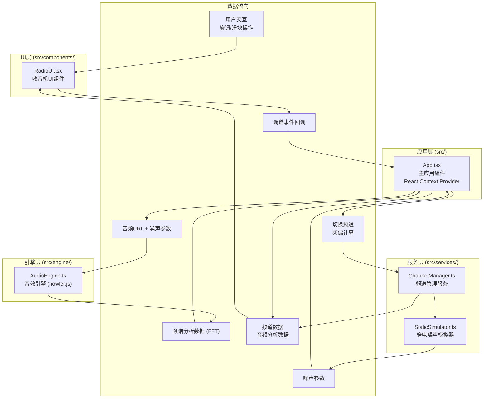

## 1. 架构设计



**模块调用关系**：
- `App.tsx` 作为中央控制器，初始化所有模块并通过 Context 传递状态
- `RadioUI.tsx` 接收用户交互，通过回调将调谐事件发送给 `App.tsx`
- `App.tsx` 调用 `ChannelManager` 处理频道切换和频偏计算
- `ChannelManager` 将频偏数据传给 `StaticSimulator` 生成噪声参数
- `App.tsx` 将音频URL和噪声参数传给 `AudioEngine` 进行混音播放
- `AudioEngine` 实时返回频谱分析数据给 `App.tsx`
- `App.tsx` 将频道数据和音频分析数据传给 `RadioUI` 进行可视化展示

## 2. 技术描述

- **前端框架**：React 18 + TypeScript 5
- **构建工具**：Vite 5
- **状态管理**：React Context + useState/useReducer
- **动画库**：framer-motion 11
- **图标库**：react-icons 5
- **提示组件**：react-hot-toast 2
- **音频引擎**：howler 2.2
- **开发语言**：TypeScript (严格模式)
- **样式方案**：CSS Modules + CSS 变量

### 2.1 依赖版本

```json
{
  "react": "^18.3.0",
  "react-dom": "^18.3.0",
  "vite": "^5.4.0",
  "@vitejs/plugin-react": "^4.3.0",
  "typescript": "^5.4.0",
  "@types/react": "^18.3.0",
  "@types/react-dom": "^18.3.0",
  "framer-motion": "^11.0.0",
  "react-icons": "^5.2.0",
  "react-hot-toast": "^2.4.0",
  "howler": "^2.2.4",
  "@types/howler": "^2.2.11"
}
```

## 3. 项目结构

```
src/
├── App.tsx                    # 主应用组件，Context Provider
├── main.tsx                   # 应用入口
├── index.css                  # 全局样式
├── types/
│   └── index.ts               # TypeScript 类型定义
├── context/
│   └── RadioContext.tsx       # Radio Context 定义
├── components/
│   ├── RadioUI.tsx            # 收音机主UI组件
│   ├── TuningKnob.tsx         # 调谐旋钮组件
│   ├── FrequencyDisplay.tsx   # 频率显示屏组件
│   ├── SignalMeter.tsx        # 信号强度指针组件
│   ├── SpectrumVisualizer.tsx # 频谱可视化组件
│   ├── VolumeSlider.tsx       # 音量滑块组件
│   ├── NoiseSlider.tsx        # 噪声混音滑块组件
│   ├── ChannelInfo.tsx        # 频道信息组件
│   └── ChannelList.tsx        # 频道标签列表组件
├── services/
│   ├── ChannelManager.ts      # 频道管理服务
│   └── StaticSimulator.ts     # 静电噪声模拟器
└── engine/
    └── AudioEngine.ts         # 音效引擎
```

## 4. 核心类型定义

```typescript
// 频道类型
interface Channel {
  id: string;
  name: string;
  genre: string;
  frequency: number; // MHz
  angle: number; // 0-360度
  themeColor: string;
  audioUrl: string;
  description: string;
  currentTrack: string;
}

// 调谐状态
interface TuningState {
  currentAngle: number; // 0-360度
  currentFrequency: number; // 87.5-108 MHz
  signalStrength: number; // 0-100%
  nearestChannel: Channel | null;
  frequencyDeviation: number; // 与最近频道的偏差度
}

// 噪声参数
interface NoiseParams {
  intensity: number; // 0-1
  frequency: number; // 噪声中心频率
  filterQ: number; // 滤波器Q值
}

// 音频引擎状态
interface AudioState {
  isPlaying: boolean;
  volume: number; // 0-1
  noiseMix: number; // 0-1 噪声混合比例
  spectrumData: Uint8Array; // FFT 频谱数据 (64字节)
}

// Radio Context 类型
interface RadioContextType {
  channels: Channel[];
  tuningState: TuningState;
  audioState: AudioState;
  noiseParams: NoiseParams;
  setTuningAngle: (angle: number) => void;
  setVolume: (volume: number) => void;
  setNoiseMix: (mix: number) => void;
}
```

## 5. 核心算法

### 5.1 角度到频率映射

```
频率范围：87.5 - 108 MHz (跨度 20.5 MHz)
角度范围：0 - 360 度
映射公式：frequency = 87.5 + (angle / 360) * 20.5
```

### 5.2 信号强度计算

```
偏差度 = |当前角度 - 频道角度|
如果 偏差度 ≤ 5°：信号强度 = 100%
如果 5° < 偏差度 ≤ 10°：信号强度 = 100 * (10 - 偏差度) / 5
如果 偏差度 > 10°：信号强度 = 0%
```

### 5.3 噪声强度计算

```
噪声强度 = 1 - (信号强度 / 100)
当信号强度为0时，噪声强度为1（完全噪声）
当信号强度为100时，噪声强度为0（纯净信号）
```

### 5.4 频道扫描触发

```
每旋转10度触发一次频道扫描
扫描逻辑：遍历所有6个频道，找到角度最接近的频道
计算与该频道的频偏度，更新调谐状态
```

## 6. 性能优化策略

1. **频谱可视化优化**：
   - 使用 `requestAnimationFrame` 实现60fps更新
   - 复用 `Uint8Array` 避免频繁GC
   - CSS `transform` 硬件加速频谱柱动画

2. **调谐响应优化**：
   - 旋钮事件使用 `debounce` 限制处理频率
   - 音频参数调整直接操作 Web Audio API 节点
   - 状态更新使用 `useTransition` 优先级调度

3. **加载优化**：
   - 音频资源按需加载，预加载当前频道附近的音频
   - 使用 `preload` 预加载关键资源
   - 代码分割，按需加载组件

4. **动画优化**：
   - 使用 `framer-motion` 的硬件加速属性
   - 避免布局抖动（layout thrashing）
   - 使用 `will-change` 提示浏览器优化
