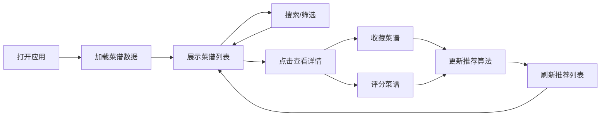

## 1. 产品概述

微型食谱收藏与智能推荐应用，帮助用户管理和发现新菜谱。用户可以浏览菜谱、按条件筛选、收藏喜欢的菜品、对菜品评分，并获得基于个人偏好的智能推荐。

- 目标用户：美食爱好者、家庭厨师
- 产品价值：提供便捷的菜谱管理和个性化推荐体验

## 2. 核心功能

### 2.1 功能模块

1. **菜谱列表**：网格展示菜谱卡片，支持搜索和筛选
2. **菜谱详情**：全屏模态窗展示完整菜谱信息
3. **收藏功能**：心形收藏按钮，右侧收藏侧边栏
4. **评分系统**：五星评分，支持用户打分
5. **智能推荐**：基于评分和收藏历史推荐菜谱
6. **评论功能**：用户可对菜谱发表评论

### 2.2 页面详情

| 页面名称 | 模块名称 | 功能描述 |
|---------|---------|---------|
| 主页面 | 推荐面板 | 左侧固定宽度240px，展示3-5道推荐菜谱 |
| 主页面 | 搜索筛选栏 | 搜索框 + 菜系/难度下拉筛选 |
| 主页面 | 菜谱卡片网格 | 3-4列网格布局，展示菜谱缩略图、名称、描述、评分 |
| 主页面 | 收藏侧边栏 | 右侧滑入，展示收藏的菜谱列表 |
| 详情模态窗 | 菜谱详情 | 大图、食材清单、步骤列表、烹饪时间、评论区 |

## 3. 核心流程

用户打开应用 → 浏览菜谱列表 → 使用搜索/筛选找到感兴趣的菜谱 → 点击卡片查看详情 → 收藏/评分菜谱 → 系统根据偏好更新推荐列表

## 4. 用户界面设计

### 4.1 设计风格

- **主色调**：温暖明亮的配色方案，浅米色背景 #FFF8E7
- **强调色**：橙色 #E67E22（交互元素）、红色 #E74C3C（收藏）
- **文字颜色**：深灰 #2C3E50（标题）、中灰 #7F8C8D（描述）
- **卡片样式**：白色背景 #FFFFFF，4px 圆角，浅灰边框 #E0E0E0
- **动效风格**：流畅过渡，淡入、缩放、滑动动画

### 4.2 页面设计概览

| 页面名称 | 模块名称 | UI 元素 |
|---------|---------|--------|
| 主页面 | 推荐面板 | 固定宽度240px，标题22px加粗，小型推荐卡片 |
| 主页面 | 搜索筛选栏 | 8px圆角输入框，下拉选择器，橙色焦点边框 |
| 主页面 | 菜谱卡片 | 网格布局，悬停时边框变橙色并上移2px，0.2s过渡 |
| 主页面 | 收藏按钮 | 心形图标，灰色/红色状态，放大回弹动画 |
| 详情模态窗 | 全屏遮罩 | 半透明黑色背景，中心缩放弹出 |
| 详情模态窗 | 评论区 | 200字限制输入框，评论上滑进入动画 |

### 4.3 响应式设计

- 桌面端：3-4列网格，左右侧边栏
- 平板端（<768px）：1列网格
- 移动端：收藏栏变为底部抽屉（50%高度，底部滑入）

### 4.4 动效设计

- 搜索结果：0.2s淡入动画
- 筛选重排：0.3s交错上浮动画
- 收藏按钮：0.4s放大回弹（1x → 1.3x → 1x）
- 收藏侧边栏：0.3s从右滑入
- 详情模态窗：0.2s中心缩放弹出
- 评论文字：0.3s上滑进入
