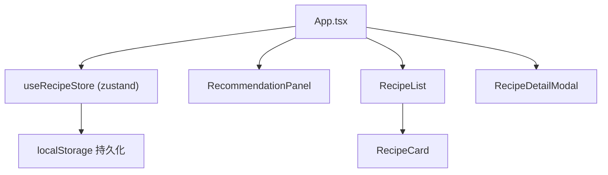

## 1. 架构设计



## 2. 技术说明

- **前端框架**：React 18 + TypeScript
- **构建工具**：Vite
- **状态管理**：zustand
- **动画库**：framer-motion
- **图标库**：react-icons
- **数据存储**：localStorage（本地持久化）

## 3. 文件结构

```
src/
├── App.tsx                      # 主组件，全局状态协调
├── components/
│   ├── RecipeCard.tsx           # 菜谱卡片组件
│   ├── RecipeList.tsx           # 菜谱列表组件
│   ├── RecommendationPanel.tsx  # 推荐面板组件
│   ├── RecipeDetailModal.tsx    # 详情模态窗组件
│   ├── FavoriteSidebar.tsx      # 收藏侧边栏组件
│   └── SearchFilterBar.tsx      # 搜索筛选栏组件
├── store/
│   └── useRecipeStore.ts        # zustand 状态管理
├── types/
│   └── recipe.ts                # 类型定义
├── data/
│   └── mockRecipes.ts           # Mock 菜谱数据
└── utils/
    └── recommendation.ts        # 推荐算法工具
```

## 4. 数据模型

### 4.1 菜谱数据类型

```typescript
interface Recipe {
  id: string;
  name: string;
  image: string;
  description: string;
  cuisine: 'chinese' | 'western' | 'japanese';
  difficulty: 'easy' | 'medium' | 'hard';
  tags: string[];
  rating: number;
  cookTime: number; // 分钟
  ingredients: string[];
  steps: string[];
  comments: Comment[];
}

interface Comment {
  id: string;
  text: string;
  timestamp: number;
}

interface UserRating {
  recipeId: string;
  rating: number;
}
```

### 4.2 Store 状态

```typescript
interface RecipeState {
  recipes: Recipe[];
  favorites: string[];          // 收藏的菜谱ID
  userRatings: UserRating[];    // 用户评分记录
  searchQuery: string;
  cuisineFilter: string;
  difficultyFilter: string;
  selectedRecipe: Recipe | null;
  showFavorites: boolean;
}
```

## 5. 核心算法

### 5.1 搜索防抖

使用 500ms 防抖优化搜索输入性能，确保搜索响应时间低于 200ms。

### 5.2 推荐算法

基于用户评分历史和收藏记录计算推荐权重：
1. 统计高频标签和难度等级
2. 对未评分/未收藏的菜谱计算匹配度
3. 按匹配度排序，取前 3-5 道推荐

### 5.3 本地存储

- 菜谱数据和评分记录存储在 localStorage
- 页面加载时从 localStorage 读取
- 数据变更时同步写入 localStorage
