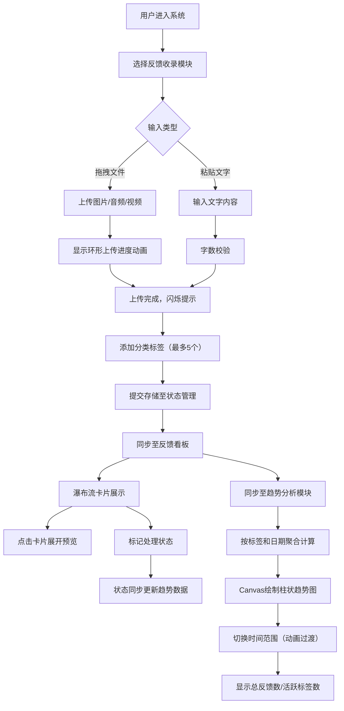

## 1. 产品概述

用户反馈可视化管理系统——帮助独立开发者或小团队快速收集、整理用户反馈并自动生成可视化趋势报告的微型应用。解决用户反馈散落在各处（截图、文字、录屏、语音），难以量化归因和追踪核心痛点的问题。

- 主要用途：统一收集多格式用户反馈、标签化管理、趋势可视化分析
- 目标用户：独立开发者、小型产品团队、创业团队
- 产品价值：将分散的用户反馈转化为可量化、可追踪的产品决策依据

## 2. 核心功能

### 2.1 功能模块

1. **反馈收录模块**：拖拽上传多媒体文件、文字粘贴、标签管理、上传进度动画
2. **反馈看板模块**：瀑布流卡片展示、内容展开预览、处理状态标记、相对时间显示
3. **趋势分析模块**：Canvas柱状趋势图、时间范围切换、统计数据展示、响应式重绘

### 2.2 页面详情

| 页面名称 | 模块名称 | 功能描述 |
|---------|---------|---------|
| 反馈收录 | 文件上传区 | 拖拽上传图片/音频/视频，大小限制（图片<5MB，音频<10MB，视频<30MB） |
| 反馈收录 | 文字输入区 | 直接粘贴文字，不超过2000字 |
| 反馈收录 | 上传进度动画 | 深蓝色#2C3E50到青色#1ABC9C渐变环形进度，动画时长与文件大小成正比，完成闪烁 |
| 反馈收录 | 标签输入 | 每个文件卡片最多5个标签，回车生成，6种柔和背景色随机分配 |
| 反馈看板 | 瀑布流布局 | 两列布局，卡片间距12px，<768px变为单列 |
| 反馈看板 | 卡片交互 | 悬停边框变色动画，点击展开完整内容，媒体预览 |
| 反馈看板 | 状态标记 | 已处理（绿色#27AE60对勾）/待处理（橙色#E67E22圆点）切换 |
| 趋势分析 | Canvas柱状图 | 按标签和日期聚合，横轴日期纵轴数量，柱条按标签分组着色 |
| 趋势分析 | 时间范围切换 | 近7天/近30天/全部，0.4s渐变过渡动画 |
| 趋势分析 | 统计展示 | 总反馈数、活跃标签数实时更新 |

## 3. 核心流程

### 主用户流程

用户登录系统后，在"反馈收录"模块通过拖拽或粘贴方式提交用户反馈并添加分类标签。反馈数据存储后自动同步至"反馈看板"进行瀑布流展示，用户可在看板中逐条查看并标记处理状态。"趋势分析"模块实时聚合所有反馈数据，通过Canvas绘制多维度柱状趋势图，支持按时间范围筛选查看。

## 4. 用户界面设计

### 4.1 设计风格

- **色彩方案**：
  - 主背景色：纯白#FFFFFF
  - 导航栏背景：深灰蓝#2C3E50
  - 主色调：深蓝#2C3E50 / 青#1ABC9C渐变
  - 卡片底色：浅灰蓝#F7F9FC
  - 标签色：暖黄#F1C40F、珊瑚红#E74C3C、翠绿#2ECC71、湖蓝#3498DB、薰衣草#9B59B6、浅灰#95A5A6
  - 状态色：已处理绿#27AE60、待处理橙#E67E22

- **排版风格**：
  - 主标题：20px 加粗 深蓝#2C3E50 左对齐
  - 卡片内容：常规字重，浅色系辅助文字
  - 柱条数字：白色 12px 字体

- **布局风格**：
  - 左侧固定导航栏（220px宽）+ 主内容区
  - 分隔线：1px 浅灰#ECF0F1
  - 卡片：圆角卡片式设计，间距12px

- **动效风格**：
  - 通用过渡：0.3s ease-out
  - 导航选中：下划线0.2s平滑动画
  - 卡片展开：0.25s ease-out 高度动画
  - 图表切换：0.4s渐变过渡

### 4.2 页面设计概览

| 页面名称 | 模块名称 | UI元素 |
|---------|---------|--------|
| 反馈收录 | 顶部标题 | 20px加粗深蓝左对齐标题 |
| 反馈收录 | 上传拖拽区 | 虚线边框，拖入高亮反馈 |
| 反馈收录 | 文件卡片 | 缩略图/图标、文件名、环形进度、标签列表、删除按钮 |
| 反馈收录 | 标签输入 | 输入框+已生成标签胶囊，随机柔和色背景 |
| 反馈看板 | 瀑布流容器 | CSS两列网格，响应式切换单列 |
| 反馈看板 | 反馈卡片 | 浅灰蓝底、悬停边框变深蓝、状态图标右浮 |
| 反馈看板 | 展开内容 | 高度过渡动画，媒体预览区 |
| 趋势分析 | 统计卡片 | 右上角两个数字指标卡 |
| 趋势分析 | 切换按钮组 | 近7天/30天/全部三态切换 |
| 趋势分析 | Canvas图表 | 自适应宽度，柱条顶部位移数字标注 |
| 全局 | 导航栏 | 深灰蓝背景，白色文字，选中下划线动画 |

### 4.3 响应式设计

- **Desktop优先**（>768px）：左侧220px固定导航栏，两列瀑布流
- **Tablet/Mobile**（<768px）：顶部图标栏导航，单列瀑布流布局
- 触控优化：按钮/可点击区域最小44x44px，标签和状态标记增大触控区域

### 4.4 性能指标

- 瀑布流首屏滚动卡顿：≤100ms
- Canvas趋势图重绘（>200数据点）：≥30fps
- 上传动画帧率：流畅无掉帧
