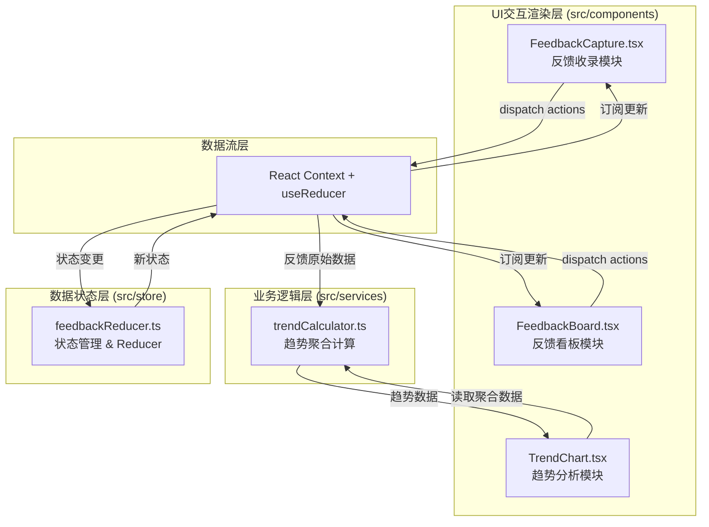
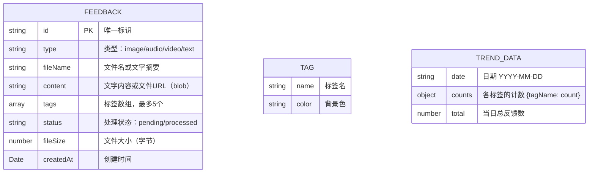

## 1. 架构设计



## 2. 技术描述

- **前端框架**：React@18 + TypeScript（strict模式）
- **构建工具**：Vite + @vitejs/plugin-react
- **状态管理**：React Context + useReducer
- **动画库**：framer-motion
- **图标库**：react-icons
- **图表绘制**：Canvas 2D原生API
- **无后端**：纯前端实现，数据保存在内存中（刷新重置）

## 3. 模块划分

| 模块路径 | 职责 |
|---------|------|
| src/store/feedbackReducer.ts | 定义Feedback状态类型、Action类型、Reducer函数，导出Context和Provider组件 |
| src/services/trendCalculator.ts | 接收反馈数组，按标签和日期聚合统计，输出柱状图所需结构化数据 |
| src/components/FeedbackCapture.tsx | 反馈收录UI：拖拽上传、文件大小校验、环形进度动画、标签输入、状态dispatch |
| src/components/FeedbackBoard.tsx | 反馈看板UI：瀑布流布局、卡片交互、状态切换、媒体预览、相对时间格式化 |
| src/components/TrendChart.tsx | 趋势分析UI：Canvas柱状图绘制、时间范围切换、响应式重绘、动画过渡 |
| src/App.tsx | 根组件：路由切换（模块切换）、Provider包裹、全局布局 |
| src/main.tsx | ReactDOM渲染入口 |

## 4. 数据模型

### 4.1 数据模型定义



### 4.2 TypeScript类型定义

```typescript
// src/store/feedbackReducer.ts 中定义

type FeedbackType = 'image' | 'audio' | 'video' | 'text';
type FeedbackStatus = 'pending' | 'processed';

interface Tag {
  name: string;
  color: string;
}

interface Feedback {
  id: string;
  type: FeedbackType;
  fileName: string;
  content: string;      // text内容或blob URL
  tags: Tag[];
  status: FeedbackStatus;
  fileSize: number;     // bytes
  createdAt: Date;
}

interface FeedbackState {
  feedbacks: Feedback[];
}

type Action =
  | { type: 'ADD_FEEDBACK'; payload: Feedback }
  | { type: 'UPDATE_STATUS'; payload: { id: string; status: FeedbackStatus } }
  | { type: 'DELETE_FEEDBACK'; payload: { id: string } };

// src/services/trendCalculator.ts 中定义
interface TrendPoint {
  date: string;                  // YYYY-MM-DD
  counts: Record<string, number>; // tagName -> count
  total: number;
}

interface TrendResult {
  points: TrendPoint[];
  activeTags: string[];
  totalCount: number;
}
```

## 5. 核心算法与常量

### 5.1 预设颜色常量

```typescript
// 标签背景色（6种柔和色）
const TAG_COLORS = [
  '#F1C40F', // 暖黄
  '#E74C3C', // 珊瑚红
  '#2ECC71', // 翠绿
  '#3498DB', // 湖蓝
  '#9B59B6', // 薰衣草
  '#95A5A6', // 浅灰
];

// 文件大小限制
const FILE_LIMITS = {
  image: 5 * 1024 * 1024,   // 5MB
  audio: 10 * 1024 * 1024,  // 10MB
  video: 30 * 1024 * 1024,  // 30MB
  text: 2000,               // 2000字
};

// 上传环形进度渐变
const PROGRESS_GRADIENT = {
  start: '#2C3E50', // 深蓝
  end: '#1ABC9C',   // 青色
};
```

### 5.2 趋势聚合算法

1. **日期标准化**：将所有`createdAt`转换为YYYY-MM-DD格式
2. **时间范围过滤**：根据选择（7天/30天/全部）截取日期区间
3. **双重循环聚合**：遍历反馈→遍历标签→累加到对应日期和标签
4. **日期补全**：生成连续日期序列，无反馈的日期count=0
5. **活跃标签识别**：在时间范围内出现次数>0的标签

### 5.3 Canvas柱状图绘制

1. 计算图表可用尺寸（减去padding）
2. 计算最大count值，确定Y轴比例尺
3. 按日期为X轴单位，每个日期内按标签分柱
4. 每柱使用标签颜色填充，顶部绘制白色12px数字
5. X轴日期标签旋转45°避免重叠
6. ResizeObserver监听容器变化，自适应重绘
7. 使用requestAnimationFrame实现切换过渡动画

## 6. 性能优化策略

- **瀑布流首屏**：使用CSS columns实现纯布局瀑布流，避免JS计算导致卡顿
- **媒体预览**：图片懒加载，音频/视频仅在卡片展开时初始化
- **Canvas重绘**：使用脏矩形/增量绘制，数据点>200时降低绘制频率
- **动画优化**：使用CSS transform/opacity实现可GPU加速的动画
- **状态订阅**：通过React.memo优化组件重渲染
- **防抖节流**：标签输入、窗口resize等高频操作使用防抖
