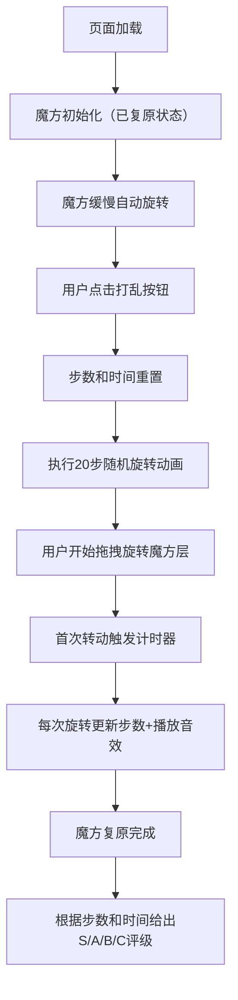

## 1. 产品概述

魔方竞技复原训练工具，在网页上模拟3x3魔方的旋转、打乱和复原过程，帮助玩家练习魔方复原技巧并记录训练数据。
- 主要用户：魔方爱好者、竞速魔方选手
- 产品价值：提供便捷的网页端魔方训练体验，无需实体魔方即可练习手法和观察复原速度

## 2. 核心功能

### 2.1 用户角色
| 角色 | 注册方式 | 核心权限 |
|------|----------|----------|
| 普通玩家 | 无需注册，直接使用 | 使用魔方训练全部功能 |

### 2.2 功能模块
1. **魔方渲染模块**：3x3魔方3D展示、自动旋转、鼠标拖拽交互、层旋转动画
2. **计时计步模块**：步数统计、计时功能、首次转动触发计时
3. **打乱模块**：随机生成20步打乱序列、动画执行打乱过程
4. **评级模块**：根据最终步数和用时综合评分，输出S/A/B/C等级

### 2.3 页面详情
| 页面名称 | 模块名称 | 功能描述 |
|-----------|-------------|---------------------|
| 主页面 | 顶部信息区 | 左侧展示步数和用时，右侧展示打乱/重置按钮 |
| 主页面 | 魔方展示区 | 中央3D魔方，支持拖拽旋转层，自动旋转，悬停暂停 |
| 主页面 | 底部评级区 | 显示当前复原评级（S/A/B/C），不同等级不同边框样式 |

## 3. 核心流程

## 4. 用户界面设计

### 4.1 设计风格
- 主背景色：深灰 #2C2C2C
- 六面色：白 #FFFFFF、黄 #FFD700、红 #C0392B、橙 #E67E22、蓝 #2980B9、绿 #27AE60
- 缝隙线：1px #1A1A1A
- 按钮色：珊瑚红 #E74C3C（打乱），白色字体
- 步数颜色：#FFFFFF（白色），用时颜色：#2ECC71（浅绿）
- 字体：数字使用粗体 monospace
- 按钮样式：圆角 8px，阴影 0 2px 8px rgba(0,0,0,0.2)，点击 0.1s 缩放反馈
- 评级边框：S级金色、A级银灰、B级铜色、C级无边框

### 4.2 页面设计概述
| 页面名称 | 模块名称 | UI元素 |
|-----------|-------------|-------------|
| 主页面 | 顶部信息区 | 左右两栏布局，左侧步数/用时数字展示，右侧两个控制按钮 |
| 主页面 | 魔方展示区 | 固定视角3D魔方，居中展示，支持层拖拽高亮 |
| 主页面 | 底部评级区 | 评级显示卡片，边框根据等级变化 |

### 4.3 响应性
- 桌面端优先，固定视角魔方展示
- 支持鼠标悬停暂停自动旋转
- 拖拽响应延迟 ≤ 16ms

### 4.4 3D场景指导
- 魔方整体绕X/Y轴缓慢自转（0.5度/秒），鼠标悬停时暂停
- 视角固定，从斜上方观察魔方
- 层旋转动画：0.2秒弹性归位，拖拽时被选中层高亮半透明白色边框
- 打乱动画：每步0.1秒间隔，单轴旋转，其他层保持静止
- 动画帧率稳定 60FPS
