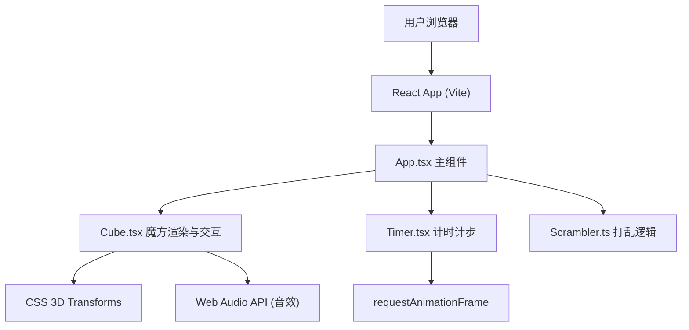

## 1. 架构设计



## 2. 技术说明
- 前端：React@18 + TypeScript + Vite
- 构建工具：Vite
- 状态管理：React Hooks (useState, useRef, useEffect)
- 动画库：framer-motion
- 图标：react-icons
- 3D渲染：CSS 3D Transforms（transform-style: preserve-3d）
- 音效：Web Audio API（1kHz短脉冲）
- 后端：无，纯前端应用

## 3. 路由定义
| 路由 | 用途 |
|-------|---------|
| / | 主页面，魔方训练界面 |

## 4. 核心模块说明

### 4.1 App.tsx - 主组件
- 管理全局游戏状态：当前步数、用时、评级、是否打乱中
- 集成 UI 布局（顶部信息栏 / 中央魔方 / 底部评级区）
- 传递回调给子组件

### 4.2 Cube.tsx - 魔方核心
- 27个小方块(cubies)的3D渲染
- 维护魔方状态（每个小方块的位置和朝向）
- 层旋转逻辑（X/Y/Z轴，每层90度）
- 鼠标拖拽检测（选择层、拖拽方向）
- 高亮选中层、弹性归位动画
- 播放旋转音效（Web Audio API）

### 4.3 Timer.tsx - 计时计步
- 计时器逻辑（第一次转动开始计时）
- 步数统计
- 格式化时间显示（mm:ss.ms）
- 重置功能

### 4.4 Scrambler.ts - 打乱模块
- 生成20步随机合法旋转序列
- 控制动画执行（每步0.1秒间隔）
- 确保旋转不连续同轴（避免无效操作）

## 5. 文件结构
```
src/
├── App.tsx          # 主组件，游戏状态管理
├── Cube.tsx         # 魔方渲染与交互
├── Timer.tsx        # 计时计步逻辑
├── Scrambler.ts     # 打乱序列生成与动画
└── main.tsx         # React入口
```

## 6. 数据模型

### 6.1 魔方状态
```typescript
// 每个小方块的6个面颜色
type FaceColor = 'white' | 'yellow' | 'red' | 'orange' | 'blue' | 'green';

// 27个小方块，每个记录位置(x,y,z)和6面色
interface Cubie {
  x: number; // -1, 0, 1
  y: number; // -1, 0, 1
  z: number; // -1, 0, 1
  faces: {
    up?: FaceColor;
    down?: FaceColor;
    front?: FaceColor;
    back?: FaceColor;
    left?: FaceColor;
    right?: FaceColor;
  };
}
```

### 6.2 旋转动作
```typescript
type Axis = 'x' | 'y' | 'z';
type Layer = -1 | 0 | 1; // 对应每层
type Direction = 1 | -1; // 顺时针/逆时针

interface Move {
  axis: Axis;
  layer: Layer;
  direction: Direction;
}
```

### 6.3 评级定义
```typescript
type Rating = 'S' | 'A' | 'B' | 'C' | null;
```
